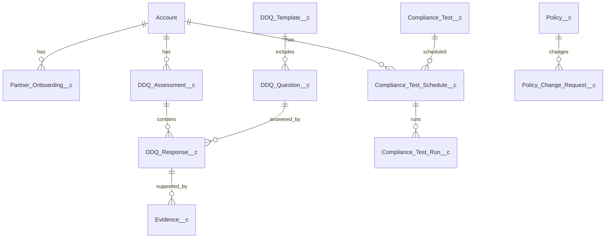

# Solution Design Document (Rough Draft): Sponsor Bank Onboarding, Governance & Compliance Collaboration Platform

**Org/Client:** Bread Financial (Comenity Servicing LLC)  
**Provider:** Aethereus  
**Document status:** Rough / for alignment (not final)  

---

## 1. Executive Summary
Bread Financial acts as Sponsor Bank for multiple FinTech partners and needs a secure, auditable collaboration platform to manage partner onboarding, ongoing governance, and regulatory compliance.

This solution leverages **Experience Cloud** for external partner access, **Service Cloud** for complaints/work management, **Salesforce Platform custom objects** for questionnaires/testing/policy workflows, and **Data Cloud + CRMA** for analytics and threshold-based alerting.

**Key Architectural Decisions (proposed):**
- **Experience Cloud Partner Portal** with strict tenant-style segregation via Partner Account model + sharing
- **Custom data model** for Questionnaire Templates, Responses, Evidence, Testing Schedules, and Policy Change Requests
- **Flow-first automation** with selective **Apex services** for high-volume schedule generation and robust alert processing (hybrid)
- **Data Cloud ingestion from Snowflake** to calculate metrics and trigger alerts into Salesforce operational objects

---

## 2. Requirements Traceability (Initial)
| Req ID | Requirement | Proposed Solution Component | Feasibility |
|---|---|---|---|
| FR-001 | External portal for each FinTech | Experience Cloud site (Partner/Customer Community) | ✅ |
| FR-002 | Due diligence questionnaire with docs/comments | Custom objects + Files + Chatter/Comments | ✅ |
| FR-003 | Stages: DD → Pre-Launch Testing → First Events Validation | Partner Onboarding record + path/stage | ✅ |
| FR-004 | Recurring compliance testing schedule | Custom object + Scheduled Flow / Apex Scheduler | ✅ |
| FR-005 | Policy change tracking with approvals/audit | Custom object + Approval Process + Field History/Files | ✅ |
| FR-006 | Complaint intake/routing/resolution | Case + Omni/Queues + Flows | ✅ |
| FR-007 | CRMA dashboard (3–4 widgets) | CRM Analytics dataset + dashboard | ✅ |
| FR-008 | Snowflake → Data Cloud ingestion | Data Cloud data stream (reuse existing) | ✅ |
| FR-009 | Metrics & threshold-based alerts | Data Cloud calculated insight + activation → Salesforce | ⚠️ |
| NFR-001 | FinTech segmented access | Sharing model + Experience Cloud security | ✅ |
| NFR-002 | WCAG 2.0 AA | Standard components first; LWC only as needed | ⚠️ |

**Notes on ⚠️ items**
- Alerts: confirm expected latency (near-real-time vs daily) and target action (Task/Case/Notification). Data Cloud “activation” patterns vary by edition and licensing.
- WCAG: standard Experience components help; custom LWC must be built/tested for accessibility.

---

## 3. Architecture Overview
```mermaid
graph TB
  subgraph External Users
    U[FinTech Partner Users]
  end

  subgraph Salesforce Org
    P[Experience Cloud Portal]
    SC[Service Cloud: Cases/Complaints]
    CM[Custom Objects: Onboarding, DDQ, Testing, Policy]
    F[Flows + Approvals]
    A[Apex Services (Selective)]
    DC[Data Cloud]
    CRMA[CRM Analytics]
  end

  subgraph External Data
    SFK[Snowflake]
  end

  U --> P
  P --> CM
  P --> SC
  CM --> F
  SC --> F
  F --> A
  SFK --> DC
  DC --> CRMA
  DC -->|Activation/Alert| F
```

---

## 4. Data Model (Proposed)

### 4.1 Core “Partner” Model
Use a tenant-like structure based on **Account** as the FinTech partner anchor.

- **Account (FinTech Partner)**: each FinTech is an Account
- **Contact**: partner users
- **Experience Cloud User**: community user tied to Contact

### 4.2 Custom Objects (initial list)
| Object API Name | Purpose | Key Fields (examples) |
|---|---|---|
| Partner_Onboarding__c | One record per partner onboarding instance | Stage__c, Target_Launch_Date__c, Owner__c, Status__c |
| DDQ_Template__c | Questionnaire template/version | Version__c, Effective_Date__c, Active__c |
| DDQ_Question__c | Question bank | Section__c, Question_Text__c, Response_Type__c, Required__c |
| DDQ_Assessment__c | DDQ instance for a partner | Partner_Account__c, Template__c, Status__c |
| DDQ_Response__c | Response per question | Assessment__c, Question__c, Answer_Text__c, Score__c |
| Evidence__c | Evidence metadata (Files linked) | Related_Response__c, Evidence_Type__c, Status__c |
| Compliance_Test__c | Testing definition | Name, Frequency__c, Description__c |
| Compliance_Test_Schedule__c | Schedule instance for partner | Partner_Account__c, Test__c, Next_Due_Date__c |
| Compliance_Test_Run__c | Actual execution of a scheduled test | Scheduled__c, Run_Date__c, Result__c |
| Policy__c | Policy catalog | Name, Current_Version__c, Owner__c |
| Policy_Change_Request__c | Change request + approvals | Policy__c, Change_Type__c, Status__c, Risk_Impact__c |

**Files strategy**
- Use **Salesforce Files** (ContentDocument/ContentVersion) linked via **ContentDocumentLink** to DDQ_Response__c, Evidence__c, Policy_Change_Request__c, etc.

### 4.3 ERD (high level)


---

## 5. Sharing & Security Model (Proposed)

### 5.1 Experience Cloud user model
Two viable approaches (final choice depends on licensing and partner hierarchy):
- **Partner Community (recommended if you need role hierarchy within each FinTech):**
  - Use Partner Accounts + Partner Roles
  - Enables sharing by role within a partner
- **Customer Community:**
  - Simpler, may reduce complexity but less flexible role hierarchy

### 5.2 Record visibility approach
- Set custom objects’ **OWD = Private**
- Ensure each record has **Partner_Account__c** (lookup to Account) for deterministic sharing.
- Use **criteria-based sharing rules** and/or **Apex-managed sharing**:
  - Share records to partner users associated with the same Partner Account

### 5.3 Permissioning
- Use **Permission Sets** for functional access (DDQ Contributor, DDQ Reviewer, Compliance Manager, Complaints Agent, Portal Admin)
- Enforce **FLS** and CRUD across portal and internal users

---

## 6. Business Logic / Automation (Initial)

### 6.1 Automation matrix
| Process | Trigger | Recommended Implementation | Notes |
|---|---|---|---|
| Create DDQ assessment from template | Onboarding start | Screen Flow / Record-triggered Flow | Clone questions to responses (or generate responses on demand) |
| Enforce required evidence | Response update | Validation Rules + Flow | Avoid heavy cross-object logic in VR if possible |
| Stage progression gates | Onboarding stage change | Before-save Flow | Prevent advancement unless criteria met |
| Recurring compliance schedule generation | Daily/Weekly | Scheduled Flow or Apex | Apex if many partners/tests (volume) |
| Compliance test run reminders | Prior to due date | Scheduled Flow | Create Tasks/Notifications |
| Policy change approval | Submit | Approval Process + Flow | Persist approver decisions and final publish step |
| Complaint intake & routing | Case create | Flow + Omni/Queues | Entitlements/escalations optional |
| Data Cloud threshold alerts | On metric computed | Activation → Flow/Apex | Consider Platform Event for decoupling |

### 6.2 Apex (selective)
Use Apex where volume/complexity warrants it:
- **ComplianceScheduleService**: generates/updates schedules in bulk
- **AlertIngestionHandler**: idempotent processing of alert events/records
- **SharingService** (only if needed): Apex-managed sharing for edge cases

---

## 7. User Experience (Initial)

### 7.1 Experience Cloud pages
- Partner Home (tasks due, onboarding progress)
- Due Diligence Questionnaire (by section)
- Evidence upload/review
- Testing calendar / upcoming tests
- Policy library + policy change requests
- Complaints submission + status tracking

### 7.2 Accessibility
- Prefer standard Lightning components and Experience templates
- If LWC required (e.g., grid-like questionnaire UI), build with:
  - semantic HTML, ARIA where appropriate
  - keyboard navigation
  - color contrast verification
  - automated + manual testing (axe, etc.)

---

## 8. Integrations & Data (Initial)

### 8.1 Snowflake → Data Cloud
- Reuse existing connector/credentials as stated
- Map Application/Loan datasets into Data Cloud Data Model Objects (DMOs) or custom DMOs

### 8.2 Metrics & alerts
Two implementation patterns:
- **Pattern 1 (simpler):** Data Cloud calculated insight produces an “out-of-bounds” dataset → activate into Salesforce custom object (e.g., Out_of_Bounds_Alert__c) → record-triggered Flow creates Task/Case
- **Pattern 2 (more robust):** Activation triggers a Platform Event (or Mule/ETL publishes) → Apex/Flow subscriber creates Task/Case with idempotency

**Need to confirm:** expected alert frequency, volumes, and whether alerts are per application or aggregated daily.

---

## 9. Reporting & Analytics
- Operational reports/dashboards in Salesforce:
  - Onboarding stage progress
  - Overdue DDQ items / missing evidence
  - Upcoming/overdue compliance tests
  - Complaints by status/type/SLA
- **CRMA dashboard** (1) with ~3–4 widgets using Data Cloud-fed datasets

---

## 10. Governor Limits & Scale Considerations (Early)
- DDQ generation and schedule generation must be bulk-safe (avoid per-record SOQL/DML loops)
- Large file uploads: rely on Files; avoid copying blobs in Apex
- Alert creation: prefer async/event-driven if alert volume is high

---

## 11. Deployment / DevOps (Rough)
- Environments: Dev → UAT → Full Copy/Pre-Prod (if available) → Prod
- Use DevOps Center or CI/CD (Git + Salesforce CLI) depending on current org maturity
- Testing:
  - Flow tests via scenario-based UAT scripts
  - Apex tests for services/handlers (75%+ coverage)

---

## 12. Open Items / Decisions Needed
1. **Dates:** SOW effective date 2025 vs kickoff 2026 mismatch
2. **Community license type:** Partner vs Customer (impacts sharing model)
3. **Identity/SSO:** Okta confirmation + provisioning approach
4. **Questionnaire design:** template versioning, scoring, required evidence rules
5. **Alerting latency & action:** real-time vs batch; Case vs Task vs Notification
6. **Data volumes:** # partners, # questions, expected files, # alerts/day
7. **Complaints intake channels:** portal-only vs email/other channels
