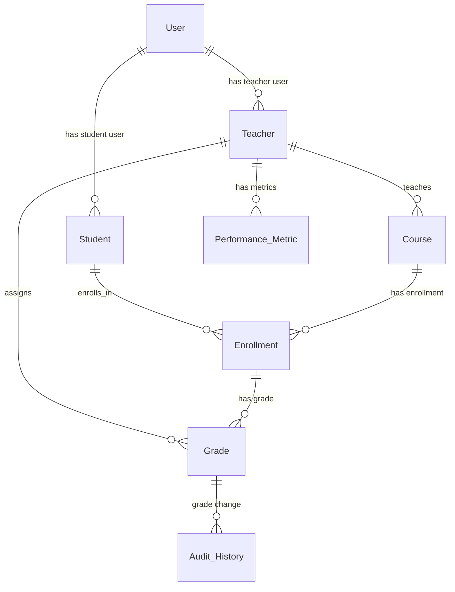

# Solution Design Document: University Management App - Backend Phase 1

## 1. Executive Summary
- **Problem Statement**: The university currently lacks a centralized, role-based system for managing student academic records and analyzing teacher performance, leading to disparate data sources, manual processes, and inefficiencies in information retrieval and reporting.
- **Proposed Solution**: Implement an Apex-centric Salesforce backend to centralize academic data, streamline administrative tasks, and enable foundational performance analysis. This phase focuses on the robust data model and business logic, deferring external portals (Experience Cloud) and advanced UI until a later stage.
- **Key Architectural Decisions**: Prioritize Apex for complex business logic, utilize a comprehensive custom data model, and rely on standard Salesforce UI for internal staff in this initial phase.

## 2. Requirements Traceability
| Requirement ID | Requirement | Solution Component (Backend Focus) | Feasibility |
|----------------|-------------|------------------------------------|-------------|
| FR-001 | Students view academic records | Student__c Object, Enrollment__c Object, Grade__c Object, Apex for data retrieval | ✅ |
| FR-002 | Teachers enter/update grades | Teacher__c Object, Course__c Object, Enrollment__c Object, Grade__c Object, Apex Services for grade management & audit | ✅ |
| FR-003 | Office Staff manage student records | Student__c Object, Course__c Object, Enrollment__c Object, Apex Services for data validation | ✅ |
| FR-004 | Admin analyze teacher performance | Teacher__c Object, Performance_Metric__c Object, Apex for data aggregation & calculation | ✅ |
| NFR-001 | Role-based access | Salesforce Profiles & Permission Sets, OWD | ✅ |
| NFR-002 | Data Security | FLS, OWD | ✅ |
| NFR-003 | Audit Trail | Apex triggers, Custom History Objects | ✅ |
| NFR-004 | Scalability (100k records, 500 concurrent) | Apex bulkification, efficient SOQL | ✅ |

## 3. Architecture Overview
```mermaid
graph TB
    subgraph "Salesforce Org (Backend Focus)"
        A[Internal Staff (Standard UI)] --> B[Apex Controllers/Services]
        B --> C[Custom Objects & Fields]
        C --> D[Standard Objects (e.g., User)]
        B --> E[Apex Triggers & Handlers]
        E --> C
    end
```
*Note: This diagram focuses on the internal backend architecture for this phase. External systems and Experience Cloud will be added in future iterations.*

## 4. Data Model

### 4.1 Objects
| Object API Name | Type | Purpose | Key Fields (Initial) | Relationships |
|-----------------|------|---------|----------------------|---------------|
| **User** | Standard | Salesforce User records for internal staff and future portal users | Name, Email, ProfileId, IsActive | |
| **Account** | Standard | Could be used for University Departments or Partner Institutions (TBD) | Name, Type | |
| **Contact** | Standard | Represents individuals; could be related to Students/Teachers for contact info | FirstName, LastName, Email, Phone | |
| **Course__c** | Custom | Represents a specific course offered by the university | Name (Auto-number or Text), Course_Code__c (Text), Description__c (Long Text Area), Credits__c (Number), Department__c (Picklist), Is_Active__c (Checkbox) | |
| **Teacher__c** | Custom | Represents a university teacher | Name (Auto-number or Text), First_Name__c (Text), Last_Name__c (Text), Email__c (Email), Employee_ID__c (Text), Department__c (Picklist), User__c (Lookup to User) | |
| **Student__c** | Custom | Represents a university student | Name (Auto-number or Text), First_Name__c (Text), Last_Name__c (Text), Student_ID__c (Text), Email__c (Email), Date_of_Birth__c (Date), User__c (Lookup to User) | |
| **Enrollment__c** | Custom | Links a Student to a Course for a specific academic period | Name (Auto-number), Student__c (Master-Detail to Student), Course__c (Master-Detail to Course), Academic_Year__c (Text), Semester__c (Picklist), Status__c (Picklist: Enrolled, Completed, Dropped), Enrollment_Date__c (Date) | Student__c (M-D), Course__c (M-D) |
| **Grade__c** | Custom | Stores the grade a Student received in an Enrollment | Name (Auto-number), Enrollment__c (Master-Detail to Enrollment), Teacher__c (Lookup to Teacher), Score__c (Number), Letter_Grade__c (Picklist), Grade_Date__c (Date), Audit_Trail__c (Long Text Area - for changes) | Enrollment__c (M-D), Teacher__c (Lookup) |
| **Performance_Metric__c** | Custom | Stores metrics for teacher performance analysis | Name (Auto-number), Teacher__c (Master-Detail to Teacher), Metric_Type__c (Picklist), Metric_Value__c (Number), Academic_Year__c (Text), Semester__c (Picklist), Last_Calculated_Date__c (Date) | Teacher__c (M-D) |
| **Audit_History__c** | Custom | Generic object to track significant changes (e.g., grade changes) | Parent_Record_Id__c (Text), Parent_Record_Type__c (Text), Field_Changed__c (Text), Old_Value__c (Text), New_Value__c (Text), Changed_By__c (Lookup to User), Change_Date__c (DateTime) | Changed_By__c (Lookup) |

### 4.2 Entity Relationship Diagram


### 4.3 Sharing Model (Internal Staff Focus for this Phase)
| Object | Organization-Wide Defaults (OWD) | Sharing Rules | Apex Sharing | Notes |
|--------|-----------------------------------|---------------|--------------|-------|
| **Course__c** | Public Read Only | N/A | N/A | All staff can see course catalog. |
| **Teacher__c** | Public Read Only | N/A | N/A | All staff can see teacher directory. |
| **Student__c** | Private | Role-based (e.g., Registrar can see all, Admin can see assigned) | Potentially for specific ad-hoc record access | Default to Private for student data privacy. |
| **Enrollment__c** | Private | Based on Student owner or Course owner | Potentially for specific ad-hoc record access | Protect student enrollment details. |
| **Grade__c** | Private | Based on Enrollment or Student owner | Potentially for specific ad-hoc record access | Highly sensitive data, strict access control. |
| **Performance_Metric__c** | Private | Role-based (e.g., Admin/Dean can see all) | N/A | Sensitive performance data, restricted to relevant administrators. |
| **Audit_History__c** | Private | Read-Only for Admins | N/A | Only system administrators should view audit logs directly. |

## 5. Business Logic

### 5.1 Automation Matrix (Apex-Centric)
| Process | Trigger Object | Implementation (Primary) | Bulkified | Notes |
|---------|----------------|--------------------------|-----------|-------|
| **Student ID Generation** | Student__c | Before Insert Flow (Simple auto-number logic) | ✅ | Use Flow for simple, non-critical field update. |
| **Enrollment Status Management** | Enrollment__c | Apex Trigger (After Insert/Update) | ✅ | Complex validation (e.g., prereqs, capacity), update related records. |
| **Grade Entry & Validation** | Grade__c | Apex Trigger (Before Insert/Update), Apex Service | ✅ | Validate score ranges, letter grade conversion, audit trail. |
| **Grade Change Audit** | Grade__c | Apex Trigger (After Update), Apex Service | ✅ | Log changes to `Audit_History__c` (or custom history fields). |
| **Teacher Performance Metric Aggregation** | Performance_Metric__c (or Schedule) | Scheduled Apex Batch or Apex Service (invoked via Flow/Scheduler) | ✅ | Calculate metrics (e.g., average grade, completion rate) on a schedule. |
| **Student Record Validation** | Student__c | Apex Trigger (Before Insert/Update) | ✅ | Ensure data integrity (e.g., unique Student ID, valid email format). |

### 5.2 Apex Components (Core Backend Services)

We will follow a robust Apex architecture including:
*   **Trigger Handlers:** To decouple trigger logic from the trigger itself.
*   **Service Layer:** Contains the core business logic, validation, and DML operations.
*   **Selector Layer:** Centralizes SOQL queries for efficient and secure data retrieval.
*   **Domain Layer (Optional but Recommended):** For object-specific logic and validation (e.g., `Student.canEnrollInCourse()`).

| Class | Type | Purpose | Test Class |
|-------|------|---------|------------|
| `StudentTriggerHandler` | Trigger Handler | Manages `Student__c` DML events | `StudentTriggerHandler_Test` |
| `StudentService` | Service | Business logic for Student records (create, update, validate) | `StudentService_Test` |
| `StudentSelector` | Selector | SOQL queries for `Student__c` records | `StudentSelector_Test` |
| `EnrollmentTriggerHandler` | Trigger Handler | Manages `Enrollment__c` DML events | `EnrollmentTriggerHandler_Test` |
| `EnrollmentService` | Service | Business logic for Enrollment records (create, update, status changes) | `EnrollmentService_Test` |
| `EnrollmentSelector` | Selector | SOQL queries for `Enrollment__c` records | `EnrollmentSelector_Test` |
| `GradeTriggerHandler` | Trigger Handler | Manages `Grade__c` DML events | `GradeTriggerHandler_Test` |
| `GradeService` | Service | Business logic for Grade records (create, update, validation, audit) | `GradeService_Test` |
| `GradeSelector` | Selector | SOQL queries for `Grade__c` records | `GradeSelector_Test` |
| `TeacherPerformanceService` | Service | Logic for calculating and aggregating teacher performance metrics | `TeacherPerformanceService_Test` |
| `TeacherPerformanceBatch` | Batch Apex | Scheduled job to run `TeacherPerformanceService` for all teachers | `TeacherPerformanceBatch_Test` |
| `AuditService` | Service | Handles creation/updates of `Audit_History__c` records | `AuditService_Test` |

### 5.3 Flows (Limited to Internal, Simple Processes)
| Flow API Name | Type | Trigger | Purpose |
|---------------|------|---------|---------|
| `Student_Auto_Generate_ID` | Record-Triggered | Before Save (Student__c, on Create) | Auto-generate `Student_ID__c` for new students. |
| `Grade_Validation_Alert` | Record-Triggered | After Save (Grade__c, on Update) | Send email alert to admin if grade changed significantly. |
| `Teacher_Performance_Scheduler` | Scheduled Flow | Daily/Weekly | Invokes `TeacherPerformanceBatch` Apex job. |

## 6. User Interface (Future Phase for Experience Cloud & Custom LWCs)

### 6.1 Lightning Pages (Internal Staff)
For this backend-focused phase, internal staff will primarily use standard Lightning Record Pages, relying on out-of-the-box Salesforce functionality.
| Page | Object | Components |
|------|--------|------------|
| Student Record Page | Student__c | Standard Details, Related Lists (Enrollments, Grades) |
| Teacher Record Page | Teacher__c | Standard Details, Related Lists (Courses, Performance Metrics) |
| Course Record Page | Course__c | Standard Details, Related Lists (Enrollments) |
| Enrollment Record Page | Enrollment__c | Standard Details, Related Lists (Grades) |

### 6.2 LWC Components (Future Phase - None for this backend phase)
*Note: Custom LWCs will be introduced in a later phase for Experience Cloud portals or highly specialized internal UI requirements. None are planned for this initial backend phase.*

## 7. Integrations (Future Phase - None for this backend phase)
*Note: Integrations with external LMS/SIS systems are explicitly out of scope for this initial backend phase and will be designed in a future iteration.*

## 8. Security (Internal Salesforce Focus)

### 8.1 Profiles & Permission Sets
We will define custom profiles or leverage standard profiles with permission sets to implement the role-based security model for internal staff.
| Profile/Permission Set | Objects (CRUD) | Fields (FLS) | Purpose |
|------------------------|----------------|---------------|---------|
| **University Admin** | All (CRUD) | All (Edit) | Full system access, maintenance, setup. |
| **Registrar Staff** | Student__c (CRUD), Enrollment__c (CRUD), Course__c (R), Grade__c (R) | Specific fields (Edit) | Manage student enrollments, academic records, view grades. |
| **Teacher Internal** | Teacher__c (R), Course__c (R), Enrollment__c (R), Grade__c (CUD - for their courses) | Specific fields (Edit) | Internal view for teachers, manage grades for their courses. |
| **General Office Staff** | Student__c (R), Contact (CRU) | Specific fields (Read) | General student inquiries, contact info updates. |
| **Academic Affairs Admin** | Teacher__c (R), Performance_Metric__c (CRUD), Course__c (CRU) | Specific fields (Edit) | Manage teacher data, analyze performance metrics. |

### 8.2 Field-Level Security (FLS)
FLS will be strictly enforced to ensure that sensitive data is only visible and editable by authorized roles. Examples:
| Object | Field | University Admin | Registrar Staff | Teacher Internal | General Office Staff | Academic Affairs Admin |
|--------|-------|------------------|-----------------|------------------|----------------------|------------------------|
| Student__c | Student_ID__c | Edit | Edit | Read | Read | Read |
| Student__c | Date_of_Birth__c | Edit | Edit | - | Read | - |
| Grade__c | Score__c | Edit | Read | Edit (their courses) | - | Read |
| Grade__c | Letter_Grade__c | Edit | Read | Edit (their courses) | - | Read |
| Performance_Metric__c | Metric_Value__c | Edit | - | - | - | Edit |

## 9. Governor Limits Analysis
Given the Apex-centric approach, careful attention will be paid to governor limits.
| Operation | Expected Volume | Limit | Mitigation Strategy |
|-----------|-----------------|-------|---------------------|
| SOQL Queries | Bulk DML (e.g., 200 records) | 100 per transaction | Use Selector layer, ensure queries are outside loops, query once. |
| DML Statements | Bulk DML | 150 per transaction | Consolidate DML operations, use lists for inserts/updates. |
| CPU Time | Complex grade calculations, performance metric aggregation | 10 seconds (sync), 60 seconds (async) | Optimize Apex code, use Batch Apex for large data sets, defer complex calculations to async. |
| Heap Size | Large data processing in memory | 6 MB | Process records in chunks (Batch Apex), avoid large data structures. |

## 10. Deployment & DevOps
- **Sandbox Strategy**: Utilize Developer, Developer Pro, Partial Copy, and Full sandboxes for development, testing, and staging.
- **CI/CD Approach**: Implement a robust CI/CD pipeline using Salesforce DX, version control (Git), and automated deployment tools (e.g., Azure DevOps, Jenkins, GitHub Actions).
- **Testing Requirements**: Minimum 75% Apex code coverage. Comprehensive unit, integration, and user acceptance testing (UAT) for all features.

## 11. Open Items / TBD
- [ ] Finalize specific picklist values for `Department__c`, `Semester__c`, `Status__c` (Enrollment), `Letter_Grade__c`, `Metric_Type__c`.
- [ ] Detailed requirements for `Audit_Trail__c` field on `Grade__c` (e.g., specific format, data to capture).
- [ ] Confirmation on auto-number format for `Student__c`, `Teacher__c`, `Course__c`, `Enrollment__c`, `Grade__c`, `Performance_Metric__c`.
- [ ] Specific reporting requirements for Office Staff and Academic Affairs Admin.
- [ ] Define the exact trigger points and frequency for `TeacherPerformanceBatch`.
