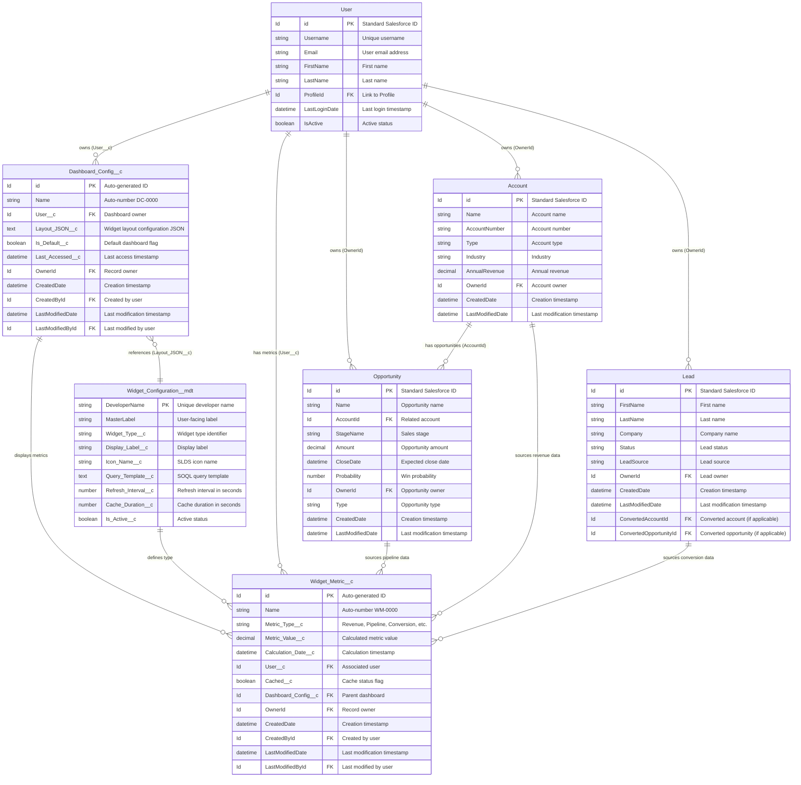
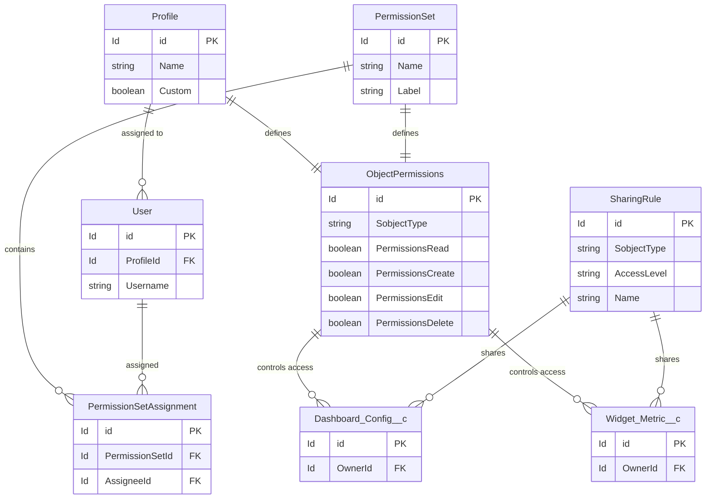

# Entity Relationship Diagram - Sales Cloud Dashboard Solution
**Version:** 1.0  
**Date:** 2026-03-01  
**Related Document:** solution_design_document_v1.md

---

## 1. Overview

This document provides detailed Entity Relationship Diagrams (ERDs) for the Sales Cloud Dashboard implementation, including standard Salesforce objects, custom objects, and custom metadata types.

---

## 2. Complete ERD with All Relationships



---

## 3. Custom Object Details

### 3.1 Dashboard_Config__c

#### 3.1.1 Object Configuration
- **API Name:** `Dashboard_Config__c`
- **Label:** Dashboard Configuration
- **Plural Label:** Dashboard Configurations
- **Record Name:** Dashboard Config Name
- **Data Type:** Auto Number
- **Display Format:** DC-{0000}
- **Starting Number:** 1

#### 3.1.2 Sharing Model
- **Default Internal Access:** Private
- **Default External Access:** Private
- **Grant Access Using Hierarchies:** Yes

#### 3.1.3 Field Definitions

| Field Label | API Name | Data Type | Length | Required | Unique | Default | Description |
|-------------|----------|-----------|--------|----------|--------|---------|-------------|
| Dashboard Config Name | Name | Auto Number | - | Yes | Yes | DC-{0000} | Unique identifier |
| User | User__c | Lookup(User) | - | Yes | No | - | Dashboard owner |
| Layout JSON | Layout_JSON__c | Long Text Area | 131,072 | Yes | No | - | Stores widget layout configuration |
| Is Default | Is_Default__c | Checkbox | - | No | No | false | Indicates default dashboard |
| Last Accessed | Last_Accessed__c | Date/Time | - | No | No | - | Last access timestamp |

#### 3.1.4 Validation Rules

**VR_Only_One_Default_Per_User:**
```
AND(
    Is_Default__c = TRUE,
    ISCHANGED(Is_Default__c),
    NOT(ISBLANK(User__c))
)
```
**Error Message:** "Only one default dashboard allowed per user. Please uncheck other default dashboards first."

**VR_Valid_Layout_JSON:**
```
AND(
    NOT(ISBLANK(Layout_JSON__c)),
    NOT(CONTAINS(Layout_JSON__c, "{")),
    NOT(CONTAINS(Layout_JSON__c, "}"))
)
```
**Error Message:** "Layout JSON must be valid JSON format."

#### 3.1.5 Workflow Rules / Process Builder

**Process: Update_Last_Accessed**
- **Trigger:** Record is viewed
- **Action:** Update Last_Accessed__c to NOW()

#### 3.1.6 Indexes

**Custom Index 1:**
- Fields: `User__c`, `Is_Default__c`
- Type: Composite
- Purpose: Optimize default dashboard lookup

---

### 3.2 Widget_Metric__c

#### 3.2.1 Object Configuration
- **API Name:** `Widget_Metric__c`
- **Label:** Widget Metric
- **Plural Label:** Widget Metrics
- **Record Name:** Widget Metric Name
- **Data Type:** Auto Number
- **Display Format:** WM-{0000}
- **Starting Number:** 1

#### 3.2.2 Sharing Model
- **Default Internal Access:** Private
- **Default External Access:** Private
- **Grant Access Using Hierarchies:** Yes

#### 3.2.3 Field Definitions

| Field Label | API Name | Data Type | Length/Precision | Required | Default | Description |
|-------------|----------|-----------|------------------|----------|---------|-------------|
| Widget Metric Name | Name | Auto Number | - | Yes | WM-{0000} | Unique identifier |
| Metric Type | Metric_Type__c | Picklist | - | Yes | - | Type of metric |
| Metric Value | Metric_Value__c | Number | 18,2 | Yes | - | Calculated value |
| Calculation Date | Calculation_Date__c | Date/Time | - | Yes | - | Calculation timestamp |
| User | User__c | Lookup(User) | - | No | - | Associated user |
| Cached | Cached__c | Checkbox | - | No | false | Cache status |
| Dashboard Config | Dashboard_Config__c | Lookup(Dashboard_Config__c) | - | No | - | Parent dashboard |
| Source Object Type | Source_Object_Type__c | Picklist | - | No | - | Source object (Account, Opportunity, Lead) |
| Source Record ID | Source_Record_Id__c | Text | 18 | No | - | Source record ID |

#### 3.2.4 Picklist Values

**Metric_Type__c:**
- Total Revenue
- Monthly Revenue
- Quarterly Revenue
- Annual Revenue
- Open Pipeline
- Closed Won Pipeline
- Win Rate
- Average Deal Size
- Sales Cycle Length
- Lead Conversion Rate
- Opportunity Count
- Lead Count

**Source_Object_Type__c:**
- Account
- Opportunity
- Lead
- Custom Calculation

#### 3.2.5 Validation Rules

**VR_Positive_Metric_Value:**
```
Metric_Value__c < 0
```
**Error Message:** "Metric value cannot be negative."

**VR_Calculation_Date_Not_Future:**
```
Calculation_Date__c > NOW()
```
**Error Message:** "Calculation date cannot be in the future."

#### 3.2.6 Indexes

**Custom Index 1:**
- Fields: `User__c`, `Calculation_Date__c`
- Type: Composite
- Purpose: Optimize user metric queries with date filtering

**Custom Index 2:**
- Fields: `Metric_Type__c`
- Type: Single
- Purpose: Optimize metric type filtering

**Custom Index 3:**
- Fields: `Dashboard_Config__c`
- Type: Single
- Purpose: Optimize dashboard-specific queries

---

## 4. Custom Metadata Type Details

### 4.1 Widget_Configuration__mdt

#### 4.1.1 Metadata Type Configuration
- **API Name:** `Widget_Configuration__mdt`
- **Label:** Widget Configuration
- **Plural Label:** Widget Configurations
- **Visibility:** Public

#### 4.1.2 Field Definitions

| Field Label | API Name | Data Type | Length | Required | Description |
|-------------|----------|-----------|--------|----------|-------------|
| Widget Configuration Name | MasterLabel | Text | 40 | Yes | User-facing label |
| Widget Configuration API Name | DeveloperName | Text | 40 | Yes | Unique API name |
| Widget Type | Widget_Type__c | Text | 50 | Yes | Widget type identifier |
| Display Label | Display_Label__c | Text | 80 | Yes | Display label for UI |
| Icon Name | Icon_Name__c | Text | 50 | No | SLDS icon name |
| Query Template | Query_Template__c | Long Text Area | 131,072 | Yes | SOQL query template |
| Refresh Interval | Refresh_Interval__c | Number | 5,0 | No | Auto-refresh interval (seconds) |
| Cache Duration | Cache_Duration__c | Number | 5,0 | No | Cache duration (seconds) |
| Is Active | Is_Active__c | Checkbox | - | No | Active status flag |
| Widget Category | Widget_Category__c | Text | 50 | No | Category for grouping |
| Sort Order | Sort_Order__c | Number | 3,0 | No | Display sort order |

#### 4.1.3 Sample Records

**Record 1: Revenue Widget**
```
MasterLabel: Total Revenue Widget
DeveloperName: Total_Revenue_Widget
Widget_Type__c: revenue_total
Display_Label__c: Total Revenue
Icon_Name__c: standard:currency
Query_Template__c: SELECT SUM(Amount) total FROM Opportunity WHERE StageName = 'Closed Won' AND OwnerId = '{userId}'
Refresh_Interval__c: 300
Cache_Duration__c: 600
Is_Active__c: true
Widget_Category__c: Revenue
Sort_Order__c: 1
```

**Record 2: Pipeline Widget**
```
MasterLabel: Open Pipeline Widget
DeveloperName: Open_Pipeline_Widget
Widget_Type__c: pipeline_open
Display_Label__c: Open Pipeline
Icon_Name__c: standard:opportunity
Query_Template__c: SELECT SUM(Amount) total FROM Opportunity WHERE IsClosed = false AND OwnerId = '{userId}'
Refresh_Interval__c: 180
Cache_Duration__c: 300
Is_Active__c: true
Widget_Category__c: Pipeline
Sort_Order__c: 2
```

**Record 3: Win Rate Widget**
```
MasterLabel: Win Rate Widget
DeveloperName: Win_Rate_Widget
Widget_Type__c: win_rate
Display_Label__c: Win Rate
Icon_Name__c: standard:metrics
Query_Template__c: SELECT COUNT(Id) total, SUM(CASE WHEN IsWon = true THEN 1 ELSE 0 END) won FROM Opportunity WHERE OwnerId = '{userId}'
Refresh_Interval__c: 600
Cache_Duration__c: 900
Is_Active__c: true
Widget_Category__c: Performance
Sort_Order__c: 3
```

---

## 5. Standard Object Extensions

### 5.1 User Object (No Custom Fields)
- Leverage standard fields: Username, Email, FirstName, LastName, ProfileId, IsActive
- No custom fields required for this implementation

### 5.2 Account Object (No Custom Fields)
- Leverage standard fields: Name, AnnualRevenue, Industry, OwnerId
- No custom fields required for this implementation

### 5.3 Opportunity Object (No Custom Fields)
- Leverage standard fields: Name, Amount, StageName, CloseDate, Probability, AccountId, OwnerId
- No custom fields required for this implementation

### 5.4 Lead Object (No Custom Fields)
- Leverage standard fields: FirstName, LastName, Company, Status, LeadSource, OwnerId
- No custom fields required for this implementation

---

## 6. Relationship Cardinality Summary

| Parent Object | Child Object | Relationship Type | Cascade Delete | Field Name |
|---------------|--------------|-------------------|----------------|------------|
| User | Dashboard_Config__c | 1:M (Lookup) | No | User__c |
| User | Widget_Metric__c | 1:M (Lookup) | No | User__c |
| Dashboard_Config__c | Widget_Metric__c | 1:M (Lookup) | No | Dashboard_Config__c |
| Account | Opportunity | 1:M (Lookup) | No | AccountId |
| User | Account | 1:M (Lookup) | No | OwnerId |
| User | Opportunity | 1:M (Lookup) | No | OwnerId |
| User | Lead | 1:M (Lookup) | No | OwnerId |

---

## 7. Data Volume Estimates

### 7.1 Initial Volume (Year 1)

| Object | Estimated Records | Growth Rate | Notes |
|--------|------------------|-------------|-------|
| User | 500 | 10%/year | Sales team size |
| Dashboard_Config__c | 750 | 15%/year | 1.5 dashboards per user avg |
| Widget_Metric__c | 50,000 | 100%/year | ~100 metrics per user, historical data |
| Account | 10,000 | 20%/year | Customer base |
| Opportunity | 25,000 | 30%/year | Sales pipeline |
| Lead | 50,000 | 50%/year | Marketing leads |

### 7.2 Storage Impact

| Object | Record Size (KB) | Total Size (MB) | % of Org Storage |
|--------|------------------|-----------------|------------------|
| Dashboard_Config__c | 2 | 1.5 | <1% |
| Widget_Metric__c | 1 | 50 | ~5% |

**Recommendation:** Monitor storage quarterly; archive Widget_Metric__c records older than 2 years.

---

## 8. Data Dictionary Export Format

### 8.1 Dashboard_Config__c Data Dictionary

```csv
Object API Name,Field API Name,Field Label,Data Type,Length,Required,Unique,External ID,Description
Dashboard_Config__c,Name,Dashboard Config Name,Auto Number,-,Yes,Yes,No,Unique identifier for dashboard configuration
Dashboard_Config__c,User__c,User,Lookup(User),-,Yes,No,No,Owner of the dashboard configuration
Dashboard_Config__c,Layout_JSON__c,Layout JSON,Long Text Area,131072,Yes,No,No,JSON structure defining widget layout and configuration
Dashboard_Config__c,Is_Default__c,Is Default,Checkbox,-,No,No,No,Indicates if this is the user's default dashboard
Dashboard_Config__c,Last_Accessed__c,Last Accessed,Date/Time,-,No,No,No,Timestamp of last dashboard access
```

### 8.2 Widget_Metric__c Data Dictionary

```csv
Object API Name,Field API Name,Field Label,Data Type,Length,Required,Unique,External ID,Description
Widget_Metric__c,Name,Widget Metric Name,Auto Number,-,Yes,Yes,No,Unique identifier for widget metric
Widget_Metric__c,Metric_Type__c,Metric Type,Picklist,-,Yes,No,No,Type of metric (Revenue, Pipeline, etc.)
Widget_Metric__c,Metric_Value__c,Metric Value,Number,18.2,Yes,No,No,Calculated metric value
Widget_Metric__c,Calculation_Date__c,Calculation Date,Date/Time,-,Yes,No,No,Timestamp when metric was calculated
Widget_Metric__c,User__c,User,Lookup(User),-,No,No,No,User associated with this metric
Widget_Metric__c,Cached__c,Cached,Checkbox,-,No,No,No,Indicates if metric is currently cached
Widget_Metric__c,Dashboard_Config__c,Dashboard Config,Lookup(Dashboard_Config__c),-,No,No,No,Parent dashboard configuration
Widget_Metric__c,Source_Object_Type__c,Source Object Type,Picklist,-,No,No,No,Source object for metric calculation
Widget_Metric__c,Source_Record_Id__c,Source Record ID,Text,18,No,No,No,ID of source record
```

---

## 9. ERD for Security Model



---

## 10. Change Log

| Version | Date | Author | Changes |
|---------|------|--------|---------|
| 1.0 | 2026-03-01 | Principal SA AI | Initial ERD creation |

---

**END OF ENTITY RELATIONSHIP DIAGRAM DOCUMENT**
