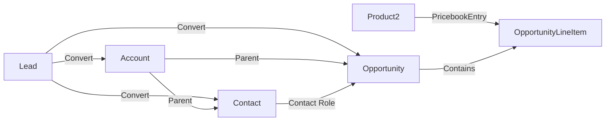
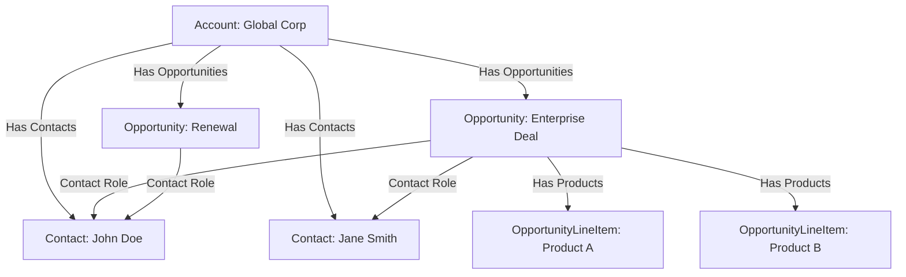
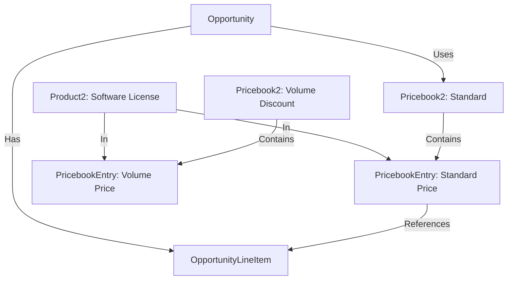

# Entity Relationship Diagram (ERD)
## Sales Cloud Implementation

---

## Document Control

| Item | Details |
|------|---------|
| **Project Name** | Sales Cloud Implementation |
| **Document Version** | 1.0 |
| **Date** | March 3, 2026 |
| **Prepared By** | Principal Salesforce Solution Architect |
| **Related Document** | Solution Design Document v1.0 |

---

## Table of Contents

1. [ERD Overview](#1-erd-overview)
2. [Complete Entity Relationship Diagram](#2-complete-entity-relationship-diagram)
3. [Object Relationships](#3-object-relationships)
4. [Field-Level Details](#4-field-level-details)
5. [Cardinality & Relationship Types](#5-cardinality--relationship-types)

---

## 1. ERD Overview

This Entity Relationship Diagram illustrates the data model for the Sales Cloud implementation. The design uses standard Salesforce objects with custom fields to meet business requirements.

**Key Design Principles:**
- Leverage standard Salesforce data model
- Minimize custom objects (Phase 1: zero custom objects)
- Use standard relationships (Lookup, Master-Detail)
- Follow Salesforce best practices for data modeling

**Objects in Scope:**
- **Lead**: Prospective customers (not yet qualified)
- **Account**: Companies/Organizations
- **Contact**: Individual people associated with Accounts
- **Opportunity**: Sales deals in progress
- **Product2**: Product catalog
- **Pricebook2**: Price books for products
- **PricebookEntry**: Products in price books with pricing
- **OpportunityLineItem**: Products on opportunities
- **Task**: Activities (calls, emails, to-dos)
- **Event**: Calendar events (meetings)
- **User**: Salesforce users (sales reps, managers)
- **Queue**: Lead assignment queues

---

## 2. Complete Entity Relationship Diagram

```mermaid
erDiagram
    %% Core Sales Objects
    LEAD ||--o{ TASK : "has activities"
    LEAD ||--o{ EVENT : "has events"
    LEAD }o--|| USER : "owned by"
    LEAD }o--o| QUEUE : "assigned to"
    
    ACCOUNT ||--o{ CONTACT : "has contacts"
    ACCOUNT ||--o{ OPPORTUNITY : "has opportunities"
    ACCOUNT }o--|| USER : "owned by"
    ACCOUNT ||--o{ TASK : "has activities"
    ACCOUNT ||--o{ EVENT : "has events"
    
    CONTACT ||--o{ OPPORTUNITY : "influences (Contact Role)"
    CONTACT }o--|| ACCOUNT : "belongs to"
    CONTACT }o--|| USER : "owned by"
    CONTACT ||--o{ TASK : "has activities"
    CONTACT ||--o{ EVENT : "has events"
    
    OPPORTUNITY ||--o{ OPPORTUNITYLINEITEM : "contains products"
    OPPORTUNITY }o--|| ACCOUNT : "belongs to"
    OPPORTUNITY }o--|| USER : "owned by"
    OPPORTUNITY ||--o{ TASK : "has activities"
    OPPORTUNITY ||--o{ EVENT : "has events"
    OPPORTUNITY }o--o| LEAD : "converted from"
    
    %% Product & Pricing Objects
    PRODUCT2 ||--o{ PRICEBOOKENTRY : "has pricing"
    PRICEBOOK2 ||--o{ PRICEBOOKENTRY : "contains products"
    PRICEBOOKENTRY ||--o{ OPPORTUNITYLINEITEM : "added to opportunity"
    OPPORTUNITYLINEITEM }o--|| OPPORTUNITY : "belongs to"
    OPPORTUNITYLINEITEM }o--|| PRODUCT2 : "references"
    
    %% User & Queue
    USER ||--o{ LEAD : "owns"
    USER ||--o{ ACCOUNT : "owns"
    USER ||--o{ CONTACT : "owns"
    USER ||--o{ OPPORTUNITY : "owns"
    USER }o--|| USER : "reports to (Role Hierarchy)"
    
    QUEUE ||--o{ LEAD : "contains"

    %% Lead Object
    LEAD {
        string Id PK
        string FirstName
        string LastName
        string Email
        string Company
        string Phone
        string LeadSource
        string Status
        string Rating
        string OwnerId FK
        datetime CreatedDate
        datetime ConvertedDate
        boolean IsConverted
        number Lead_Score__c "Custom: 0-100"
        string Lead_Temperature__c "Custom: Hot/Warm/Cold"
        string Territory__c "Custom: Formula"
        number Engagement_Score__c "Custom"
        number Days_Since_Last_Activity__c "Custom: Formula"
        string Original_Lead_Source__c "Custom"
    }
    
    %% Account Object
    ACCOUNT {
        string Id PK
        string Name
        string Website
        string Phone
        string Industry
        number NumberOfEmployees
        currency AnnualRevenue
        string BillingStreet
        string BillingCity
        string BillingState
        string BillingPostalCode
        string BillingCountry
        string OwnerId FK
        datetime CreatedDate
        string Territory__c "Custom: Formula"
        date Customer_Since__c "Custom"
    }
    
    %% Contact Object
    CONTACT {
        string Id PK
        string FirstName
        string LastName
        string Email
        string Phone
        string AccountId FK
        string Title
        string OwnerId FK
        datetime CreatedDate
        boolean Primary_Contact__c "Custom"
    }
    
    %% Opportunity Object
    OPPORTUNITY {
        string Id PK
        string Name
        string AccountId FK
        currency Amount
        date CloseDate
        string StageName
        number Probability
        string LeadSource
        string OwnerId FK
        datetime CreatedDate
        boolean IsClosed
        boolean IsWon
        string ForecastCategory
        string Type
        string Competitor_Name__c "Custom: Multi-Select"
        string Competitive_Position__c "Custom: Picklist"
        string Original_Lead_Source__c "Custom"
        number Days_in_Current_Stage__c "Custom: Formula"
        date Previous_Close_Date__c "Custom"
        number Close_Date_Change_Count__c "Custom"
        text Stage_History_JSON__c "Custom: Long Text"
        datetime LastStageChangeDate
        number LineItemCount "Rollup"
    }
    
    %% Product2 Object
    PRODUCT2 {
        string Id PK
        string Name
        string ProductCode
        text Description
        string Family
        boolean IsActive
        datetime CreatedDate
    }
    
    %% Pricebook2 Object
    PRICEBOOK2 {
        string Id PK
        string Name
        text Description
        boolean IsActive
        boolean IsStandard
        datetime CreatedDate
    }
    
    %% PricebookEntry Object
    PRICEBOOKENTRY {
        string Id PK
        string Pricebook2Id FK
        string Product2Id FK
        currency UnitPrice
        boolean IsActive
        datetime CreatedDate
    }
    
    %% OpportunityLineItem Object
    OPPORTUNITYLINEITEM {
        string Id PK
        string OpportunityId FK
        string PricebookEntryId FK
        string Product2Id FK
        number Quantity
        currency UnitPrice
        number Discount
        currency TotalPrice "Formula"
        text Description
        datetime CreatedDate
    }
    
    %% Task Object
    TASK {
        string Id PK
        string WhoId FK "Lead or Contact"
        string WhatId FK "Account or Opportunity"
        string Subject
        string Status
        string Priority
        date ActivityDate
        boolean IsClosed
        string OwnerId FK
        datetime CreatedDate
    }
    
    %% Event Object
    EVENT {
        string Id PK
        string WhoId FK "Lead or Contact"
        string WhatId FK "Account or Opportunity"
        string Subject
        datetime StartDateTime
        datetime EndDateTime
        string Location
        text Description
        string OwnerId FK
        datetime CreatedDate
    }
    
    %% User Object
    USER {
        string Id PK
        string Name
        string Email
        string Username
        string ProfileId FK
        string UserRoleId FK
        string ManagerId FK
        boolean IsActive
        datetime CreatedDate
    }
    
    %% Queue Object
    QUEUE {
        string Id PK
        string Name
        string Type
        string Email
    }
```



---

## 3. Object Relationships

### 3.1 Lead Relationships

| Related Object | Relationship Type | Field Name | Cardinality | Description |
|----------------|------------------|------------|-------------|-------------|
| User | Lookup | OwnerId | Many-to-One | Lead owner (sales rep or manager) |
| Queue | Lookup | OwnerId | Many-to-One | Alternative to User owner (unassigned leads) |
| Task | Polymorphic Lookup | WhoId | One-to-Many | Activities related to lead |
| Event | Polymorphic Lookup | WhoId | One-to-Many | Calendar events related to lead |
| Account | Conversion | N/A | One-to-One | Created when lead is converted |
| Contact | Conversion | N/A | One-to-One | Created when lead is converted |
| Opportunity | Conversion | N/A | One-to-One | Created when lead is converted |

**Conversion Process:**
- When a Lead is converted, Salesforce creates:
  1. Account (or links to existing)
  2. Contact (always creates new)
  3. Opportunity (optional, but required per BRD)
- Original lead data is preserved in converted objects
- Lead becomes read-only after conversion

---

### 3.2 Account Relationships

| Related Object | Relationship Type | Field Name | Cardinality | Description |
|----------------|------------------|------------|-------------|-------------|
| Contact | Master-Detail | AccountId | One-to-Many | Contacts belong to accounts |
| Opportunity | Lookup | AccountId | One-to-Many | Opportunities belong to accounts |
| User | Lookup | OwnerId | Many-to-One | Account owner |
| Task | Polymorphic Lookup | WhatId | One-to-Many | Activities related to account |
| Event | Polymorphic Lookup | WhatId | One-to-Many | Events related to account |

**Notes:**
- Account is the parent object in the Account-Contact-Opportunity hierarchy
- Deleting an Account does NOT delete related Opportunities (Lookup relationship)
- Deleting an Account DOES delete related Contacts (Master-Detail relationship)

---

### 3.3 Contact Relationships

| Related Object | Relationship Type | Field Name | Cardinality | Description |
|----------------|------------------|------------|-------------|-------------|
| Account | Master-Detail | AccountId | Many-to-One | Contact belongs to account |
| User | Lookup | OwnerId | Many-to-One | Contact owner |
| Opportunity | Many-to-Many | OpportunityContactRole | Many-to-Many | Contact roles on opportunities |
| Task | Polymorphic Lookup | WhoId | One-to-Many | Activities related to contact |
| Event | Polymorphic Lookup | WhoId | One-to-Many | Events related to contact |

**OpportunityContactRole Junction Object:**
- Links Contacts to Opportunities
- Captures role (Decision Maker, Influencer, etc.)
- Allows multiple contacts per opportunity
- Allows one Primary Contact per opportunity

---

### 3.4 Opportunity Relationships

| Related Object | Relationship Type | Field Name | Cardinality | Description |
|----------------|------------------|------------|-------------|-------------|
| Account | Lookup | AccountId | Many-to-One | Opportunity belongs to account |
| User | Lookup | OwnerId | Many-to-One | Opportunity owner |
| Contact | Many-to-Many | OpportunityContactRole | Many-to-Many | Contacts influencing opportunity |
| OpportunityLineItem | Master-Detail | OpportunityId | One-to-Many | Products on opportunity |
| Task | Polymorphic Lookup | WhatId | One-to-Many | Activities related to opportunity |
| Event | Polymorphic Lookup | WhatId | One-to-Many | Events related to opportunity |
| Lead | Conversion | ConvertedOpportunityId | One-to-One | Original lead (if converted) |

**Opportunity Amount Calculation:**
- If OpportunityLineItems exist: Amount = SUM(TotalPrice of all line items)
- If no line items: Amount is manually entered
- Recommendation: Always use line items for accurate product tracking

---

### 3.5 Product & Pricing Relationships

| Parent Object | Child Object | Relationship Type | Field Name | Cardinality | Description |
|---------------|--------------|------------------|------------|-------------|-------------|
| Product2 | PricebookEntry | Master-Detail | Product2Id | One-to-Many | Product can be in multiple price books |
| Pricebook2 | PricebookEntry | Master-Detail | Pricebook2Id | One-to-Many | Price book contains multiple products |
| PricebookEntry | OpportunityLineItem | Lookup | PricebookEntryId | One-to-Many | Price book entry added to opportunities |
| Opportunity | OpportunityLineItem | Master-Detail | OpportunityId | One-to-Many | Opportunity contains products |
| Product2 | OpportunityLineItem | Lookup | Product2Id | One-to-Many | Direct reference to product |

**Pricing Flow:**
1. Product2 created (e.g., "Software License - Enterprise")
2. PricebookEntry created linking Product2 to Standard Price Book with price
3. When adding to Opportunity, user selects PricebookEntry
4. OpportunityLineItem created with quantity, unit price, discount

---

### 3.6 Activity Relationships

**Task Object Relationships:**

| Related Object | Relationship Type | Field Name | Cardinality | Description |
|----------------|------------------|------------|-------------|-------------|
| Lead/Contact | Polymorphic Lookup | WhoId | Many-to-One | Person task is related to |
| Account/Opportunity | Polymorphic Lookup | WhatId | Many-to-One | Record task is related to |
| User | Lookup | OwnerId | Many-to-One | Task owner (assigned to) |

**Event Object Relationships:**

| Related Object | Relationship Type | Field Name | Cardinality | Description |
|----------------|------------------|------------|-------------|-------------|
| Lead/Contact | Polymorphic Lookup | WhoId | Many-to-One | Person event is related to |
| Account/Opportunity | Polymorphic Lookup | WhatId | Many-to-One | Record event is related to |
| User | Lookup | OwnerId | Many-to-One | Event owner (organizer) |

**Activity Timeline:**
- All Tasks and Events display in unified Activity Timeline on Lead/Contact/Account/Opportunity records
- Einstein Activity Capture automatically creates Tasks/Events from Gmail/Calendar

---

### 3.7 User & Ownership Relationships

| Related Object | Relationship Type | Field Name | Cardinality | Description |
|----------------|------------------|------------|-------------|-------------|
| User | Lookup | ManagerId | Many-to-One | Reports-to relationship (role hierarchy) |
| User | Lookup | UserRoleId | Many-to-One | User's role in role hierarchy |
| User | Lookup | ProfileId | Many-to-One | User's profile (permissions) |
| Lead | Lookup | OwnerId | One-to-Many | Leads owned by user |
| Account | Lookup | OwnerId | One-to-Many | Accounts owned by user |
| Contact | Lookup | OwnerId | One-to-Many | Contacts owned by user |
| Opportunity | Lookup | OwnerId | One-to-Many | Opportunities owned by user |

**Role Hierarchy:**
- VP Sales (top)
  - Sales Manager - East
    - Sales Rep - East 1, 2, 3
  - Sales Manager - West
    - Sales Rep - West 1, 2, 3
  - Sales Manager - Central
    - Sales Rep - Central 1, 2, 3

**Sharing Implications:**
- Users can see records owned by subordinates in role hierarchy
- Private OWD + Role Hierarchy = Manager visibility into team records

---

## 4. Field-Level Details

### 4.1 Lead Object Fields

**Standard Fields:**

| Field API Name | Label | Type | Required | Unique | Description |
|----------------|-------|------|----------|--------|-------------|
| Id | Lead ID | ID | Auto | Yes | Unique record identifier |
| FirstName | First Name | Text(40) | No | No | Lead's first name |
| LastName | Last Name | Text(80) | Yes | No | Lead's last name |
| Email | Email | Email | Yes | No | Lead's email address |
| Company | Company | Text(255) | Yes | No | Lead's company name |
| Phone | Phone | Phone | No | No | Lead's phone number |
| LeadSource | Lead Source | Picklist | No | No | Source of lead (Web, Referral, etc.) |
| Status | Status | Picklist | Yes | No | Lead status (New, Contacted, Qualified, etc.) |
| Rating | Rating | Picklist | No | No | Lead rating (Hot, Warm, Cold) |
| OwnerId | Owner | Lookup(User) | Yes | No | Lead owner |
| CreatedDate | Created Date | DateTime | Auto | No | Record creation timestamp |
| ConvertedDate | Converted Date | DateTime | Auto | No | Lead conversion timestamp |
| IsConverted | Converted | Checkbox | Auto | No | Whether lead is converted |
| NumberOfEmployees | Employees | Number | No | No | Company size |
| Industry | Industry | Picklist | No | No | Company industry |
| Website | Website | URL | No | No | Company website |
| Street | Street | Text(255) | No | No | Lead address |
| City | City | Text(40) | No | No | Lead city |
| State | State/Province | Text(80) | No | No | Lead state |
| PostalCode | Zip/Postal Code | Text(20) | No | No | Lead postal code |
| Country | Country | Text(80) | No | No | Lead country |

**Custom Fields:**

| Field API Name | Label | Type | Length | Required | Description |
|----------------|-------|------|--------|----------|-------------|
| Lead_Score__c | Lead Score | Number | 3,0 | No | Calculated score 0-100 |
| Lead_Temperature__c | Lead Temperature | Picklist | N/A | No | Hot, Warm, Cold |
| Territory__c | Territory | Formula(Text) | 255 | No | Calculated territory based on state |
| Engagement_Score__c | Engagement Score | Number | 3,0 | No | Activity-based engagement metric |
| Days_Since_Last_Activity__c | Days Since Last Activity | Formula(Number) | 0 | No | Days since last touch |
| Original_Lead_Source__c | Original Lead Source | Text | 255 | No | Preserved for reporting |

**Picklist Values:**

*LeadSource:*
```
- Web
- Referral
- Trade Show
- Partner
- Cold Call
- LinkedIn
- Advertisement
- Other
```

*Status:*
```
- New (default)
- Contacted
- Qualified
- Unqualified
- Converted
```

*Rating:*
```
- Hot
- Warm
- Cold
```

*Lead_Temperature__c:*
```
- Hot (Red)
- Warm (Orange)
- Cold (Blue)
```

---

### 4.2 Opportunity Object Fields

**Standard Fields:**

| Field API Name | Label | Type | Required | Description |
|----------------|-------|------|----------|-------------|
| Id | Opportunity ID | ID | Auto | Unique record identifier |
| Name | Opportunity Name | Text(120) | Yes | Name of the deal |
| AccountId | Account Name | Lookup(Account) | Yes | Related account |
| Amount | Amount | Currency | No | Total opportunity value |
| CloseDate | Close Date | Date | Yes | Expected close date |
| StageName | Stage | Picklist | Yes | Current sales stage |
| Probability | Probability (%) | Percent | Auto | Win probability (auto-set by stage) |
| LeadSource | Lead Source | Picklist | No | Original lead source |
| OwnerId | Owner | Lookup(User) | Yes | Opportunity owner |
| CreatedDate | Created Date | DateTime | Auto | Record creation timestamp |
| IsClosed | Closed | Checkbox | Auto | Whether opportunity is closed |
| IsWon | Won | Checkbox | Auto | Whether opportunity is won |
| ForecastCategory | Forecast Category | Picklist | Auto | Pipeline, Best Case, Commit, Closed |
| Type | Type | Picklist | No | New Business, Renewal, Upsell |
| Description | Description | Long Text | No | Opportunity details |
| NextStep | Next Step | Text(255) | No | Next action to take |
| LastStageChangeDate | Last Stage Change Date | DateTime | Auto | When stage last changed |
| LineItemCount | Product Count | Number | Rollup | Count of line items |

**Custom Fields:**

| Field API Name | Label | Type | Length | Required | Description |
|----------------|-------|------|--------|----------|-------------|
| Competitor_Name__c | Competitor Name | Multi-Select Picklist | N/A | No | Competing vendors |
| Competitive_Position__c | Competitive Position | Picklist | N/A | No | Ahead, Even, Behind |
| Original_Lead_Source__c | Original Lead Source | Text | 255 | No | From converted lead |
| Days_in_Current_Stage__c | Days in Current Stage | Formula(Number) | 0 | No | Days in current stage |
| Previous_Close_Date__c | Previous Close Date | Date | N/A | No | Track close date changes |
| Close_Date_Change_Count__c | Close Date Change Count | Number | 3,0 | No | Times close date was pushed |
| Stage_History_JSON__c | Stage History | Long Text | 32000 | No | JSON array of stage changes |
| Loss_Reason__c | Loss Reason | Picklist | N/A | No | Reason for Closed Lost |

**Picklist Values:**

*StageName:*
```
- Qualification (10%)
- Discovery (25%)
- Proposal (50%)
- Negotiation (75%)
- Closed Won (100%)
- Closed Lost (0%)
```

*ForecastCategory:*
```
- Pipeline (auto-set for Qualification, Discovery)
- Best Case (auto-set for Proposal)
- Commit (auto-set for Negotiation)
- Closed (auto-set for Closed Won)
- Omitted (auto-set for Closed Lost)
```

*Type:*
```
- New Business
- Renewal
- Upsell
- Cross-Sell
```

*Competitor_Name__c:*
```
- Competitor A
- Competitor B
- Competitor C
- Competitor D
- Other
```

*Competitive_Position__c:*
```
- Ahead
- Even
- Behind
- Not Applicable
```

*Loss_Reason__c:*
```
- Price
- Competition
- No Budget
- Timing
- No Decision
- Product Fit
- Other
```

---

### 4.3 Account Object Fields

**Standard Fields:**

| Field API Name | Label | Type | Required | Description |
|----------------|-------|------|----------|-------------|
| Id | Account ID | ID | Auto | Unique record identifier |
| Name | Account Name | Text(255) | Yes | Company name |
| Website | Website | URL | No | Company website |
| Phone | Phone | Phone | No | Main phone number |
| Industry | Industry | Picklist | No | Company industry |
| NumberOfEmployees | Employees | Number | No | Company size |
| AnnualRevenue | Annual Revenue | Currency | No | Company revenue |
| BillingStreet | Billing Street | Text(255) | No | Billing address |
| BillingCity | Billing City | Text(40) | No | Billing city |
| BillingState | Billing State/Province | Text(80) | No | Billing state |
| BillingPostalCode | Billing Zip/Postal Code | Text(20) | No | Billing postal code |
| BillingCountry | Billing Country | Text(80) | No | Billing country |
| OwnerId | Owner | Lookup(User) | Yes | Account owner |
| CreatedDate | Created Date | DateTime | Auto | Record creation timestamp |
| Type | Type | Picklist | No | Prospect, Customer, Partner |
| Description | Description | Long Text | No | Account details |

**Custom Fields:**

| Field API Name | Label | Type | Length | Required | Description |
|----------------|-------|------|--------|----------|-------------|
| Territory__c | Territory | Formula(Text) | 255 | No | Based on BillingState |
| Customer_Since__c | Customer Since | Date | N/A | No | First closed won date |

**Formula for Territory__c:**
```
CASE(
  BillingState,
  "CA", "West",
  "OR", "West",
  "WA", "West",
  "NV", "West",
  "AZ", "West",
  "NY", "East",
  "NJ", "East",
  "PA", "East",
  "MA", "East",
  "CT", "East",
  "VT", "East",
  "NH", "East",
  "ME", "East",
  "RI", "East",
  "TX", "Central",
  "OK", "Central",
  "AR", "Central",
  "LA", "Central",
  "NM", "Central",
  "Other"
)
```

---

### 4.4 Contact Object Fields

**Standard Fields:**

| Field API Name | Label | Type | Required | Description |
|----------------|-------|------|----------|-------------|
| Id | Contact ID | ID | Auto | Unique record identifier |
| FirstName | First Name | Text(40) | No | Contact's first name |
| LastName | Last Name | Text(80) | Yes | Contact's last name |
| Email | Email | Email | No | Contact's email |
| Phone | Phone | Phone | No | Contact's phone |
| AccountId | Account Name | Master-Detail(Account) | Yes | Related account |
| Title | Title | Text(128) | No | Job title |
| OwnerId | Owner | Lookup(User) | Yes | Contact owner |
| CreatedDate | Created Date | DateTime | Auto | Record creation timestamp |
| MailingStreet | Mailing Street | Text(255) | No | Mailing address |
| MailingCity | Mailing City | Text(40) | No | Mailing city |
| MailingState | Mailing State/Province | Text(80) | No | Mailing state |
| MailingPostalCode | Mailing Zip/Postal Code | Text(20) | No | Mailing postal code |
| MailingCountry | Mailing Country | Text(80) | No | Mailing country |

**Custom Fields:**

| Field API Name | Label | Type | Required | Description |
|----------------|-------|------|----------|-------------|
| Primary_Contact__c | Primary Contact | Checkbox | No | Indicates primary decision maker |

---

### 4.5 Product & Pricing Fields

**Product2 Object:**

| Field API Name | Label | Type | Required | Description |
|----------------|-------|------|----------|-------------|
| Id | Product ID | ID | Auto | Unique record identifier |
| Name | Product Name | Text(255) | Yes | Product name |
| ProductCode | Product Code | Text(255) | No | SKU or product code |
| Description | Description | Long Text | No | Product description |
| Family | Product Family | Picklist | No | Product category |
| IsActive | Active | Checkbox | Yes | Whether product is active |
| CreatedDate | Created Date | DateTime | Auto | Record creation timestamp |

**Pricebook2 Object:**

| Field API Name | Label | Type | Required | Description |
|----------------|-------|------|----------|-------------|
| Id | Price Book ID | ID | Auto | Unique record identifier |
| Name | Price Book Name | Text(255) | Yes | Price book name |
| Description | Description | Long Text | No | Price book description |
| IsActive | Active | Checkbox | Yes | Whether price book is active |
| IsStandard | Standard Price Book | Checkbox | Auto | Whether this is the standard price book |
| CreatedDate | Created Date | DateTime | Auto | Record creation timestamp |

**PricebookEntry Object:**

| Field API Name | Label | Type | Required | Description |
|----------------|-------|------|----------|-------------|
| Id | Price Book Entry ID | ID | Auto | Unique record identifier |
| Pricebook2Id | Price Book | Master-Detail(Pricebook2) | Yes | Related price book |
| Product2Id | Product | Master-Detail(Product2) | Yes | Related product |
| UnitPrice | List Price | Currency | Yes | Product price |
| IsActive | Active | Checkbox | Yes | Whether entry is active |
| CreatedDate | Created Date | DateTime | Auto | Record creation timestamp |

**OpportunityLineItem Object:**

| Field API Name | Label | Type | Required | Description |
|----------------|-------|------|----------|-------------|
| Id | Line Item ID | ID | Auto | Unique record identifier |
| OpportunityId | Opportunity | Master-Detail(Opportunity) | Yes | Related opportunity |
| PricebookEntryId | Price Book Entry | Lookup(PricebookEntry) | Yes | Related price book entry |
| Product2Id | Product | Lookup(Product2) | Auto | Related product (auto-populated) |
| Quantity | Quantity | Number | Yes | Quantity ordered |
| UnitPrice | Sales Price | Currency | Yes | Unit price (can differ from list price) |
| Discount | Discount | Percent | No | Discount percentage |
| TotalPrice | Total Price | Currency | Formula | Quantity × UnitPrice × (1 - Discount) |
| Description | Description | Long Text | No | Line item details |
| CreatedDate | Created Date | DateTime | Auto | Record creation timestamp |

---

## 5. Cardinality & Relationship Types

### 5.1 Relationship Type Definitions

**Lookup Relationship:**
- Loosely coupled relationship
- Child record can exist without parent
- Deleting parent does NOT delete children
- Does not affect sharing or security
- Example: Opportunity → Account

**Master-Detail Relationship:**
- Tightly coupled relationship
- Child record CANNOT exist without parent
- Deleting parent DELETES children (cascade delete)
- Child inherits sharing and security from parent
- Rollup summary fields possible
- Example: Account → Contact

**Many-to-Many Relationship:**
- Implemented via junction object
- Each record can relate to multiple records on other side
- Example: Contact ↔ Opportunity (via OpportunityContactRole)

**Polymorphic Relationship:**
- Relationship to multiple object types
- Example: Task.WhoId can reference Lead OR Contact

---

### 5.2 Cardinality Matrix

| Parent Object | Child Object | Relationship Type | Cardinality | Delete Behavior |
|---------------|--------------|------------------|-------------|-----------------|
| User | Lead | Lookup | 1:N | No cascade |
| User | Account | Lookup | 1:N | No cascade |
| User | Contact | Lookup | 1:N | No cascade |
| User | Opportunity | Lookup | 1:N | No cascade |
| Account | Contact | Master-Detail | 1:N | Cascade delete |
| Account | Opportunity | Lookup | 1:N | No cascade |
| Contact | Opportunity | Many-to-Many | M:N | No cascade (junction) |
| Opportunity | OpportunityLineItem | Master-Detail | 1:N | Cascade delete |
| Product2 | PricebookEntry | Master-Detail | 1:N | Cascade delete |
| Pricebook2 | PricebookEntry | Master-Detail | 1:N | Cascade delete |
| PricebookEntry | OpportunityLineItem | Lookup | 1:N | No cascade |
| Lead | Task | Polymorphic Lookup | 1:N | No cascade |
| Contact | Task | Polymorphic Lookup | 1:N | No cascade |
| Account | Task | Polymorphic Lookup | 1:N | No cascade |
| Opportunity | Task | Polymorphic Lookup | 1:N | No cascade |
| Lead | Event | Polymorphic Lookup | 1:N | No cascade |
| Contact | Event | Polymorphic Lookup | 1:N | No cascade |
| Account | Event | Polymorphic Lookup | 1:N | No cascade |
| Opportunity | Event | Polymorphic Lookup | 1:N | No cascade |

**Legend:**
- **1:N** = One-to-Many (one parent, many children)
- **M:N** = Many-to-Many (many-to-many via junction)
- **Cascade delete** = Deleting parent deletes children
- **No cascade** = Deleting parent does NOT delete children

---

### 5.3 Key Relationship Notes

**Lead Conversion:**
- Lead → Account: One-to-One (creates or links to existing)
- Lead → Contact: One-to-One (always creates new)
- Lead → Opportunity: One-to-One (optional, but required per BRD)
- After conversion, Lead record becomes read-only
- Original lead data preserved in converted objects via field mapping

**Account Hierarchy:**
- Account can have parent Account (ParentId field)
- Supports multi-level organizational hierarchy
- Not implemented in Phase 1 (future consideration)

**Opportunity Products:**
- Opportunity can have multiple OpportunityLineItems (products)
- Each line item references one PricebookEntry
- Opportunity.Amount auto-calculates from line items (if any exist)
- Recommendation: Always use line items for product tracking

**Activity Relationships:**
- Task/Event can relate to ONE person (WhoId: Lead or Contact)
- Task/Event can relate to ONE record (WhatId: Account or Opportunity)
- Both relationships optional but recommended for tracking
- Einstein Activity Capture automatically creates Task/Event from Gmail/Calendar

**Sharing Model Impact:**
- Master-Detail relationships: Child inherits parent's sharing
- Lookup relationships: Child has independent sharing
- Private OWD + Sharing Rules = Territory-based access
- Role Hierarchy: Managers see subordinate records

---

## 6. Data Model Best Practices

### 6.1 Implemented Best Practices

✅ **Standard Objects First**: Use standard Salesforce objects before creating custom objects  
✅ **Meaningful API Names**: Custom fields use descriptive API names with `__c` suffix  
✅ **Formula Fields for Calculations**: Use formula fields for derived values (Days_in_Current_Stage__c)  
✅ **Rollup Summary Fields**: Use for aggregations (Opportunity.LineItemCount)  
✅ **Validation Rules**: Enforce data quality at field level  
✅ **Picklists for Controlled Values**: Use picklists instead of free text where possible  
✅ **Required Fields**: Mark critical fields as required (Email, Company, Close Date)  
✅ **Field-Level Security**: Restrict sensitive fields (Discount, Competitor info)  
✅ **Audit Fields**: Enable field history tracking for key fields  

### 6.2 Scalability Considerations

**Current Design Supports:**
- 50,000 leads/year
- 10,000 opportunities/year
- 500 active users
- Standard Salesforce storage limits

**Future Scalability:**
- Archive strategy for old records (Closed Lost > 2 years)
- Consider Big Objects for historical data (Phase 2+)
- Index custom fields used in filters (External ID)
- Monitor data storage usage

### 6.3 Maintenance Considerations

**Documentation:**
- All custom fields documented with descriptions
- Help text provided for user guidance
- Field dependency matrix maintained

**Change Management:**
- Field changes require impact analysis
- Deprecate unused fields (don't delete immediately)
- Version control for all metadata changes

---

## 7. Visual Reference: Key Relationships

### 7.1 Lead-to-Opportunity Flow



### 7.2 Account Hierarchy



### 7.3 Product & Pricing Model



---

## Document Approval

| Role | Name | Signature | Date |
|------|------|-----------|------|
| Solution Architect | Principal SA | _________________ | _______ |
| Operations Manager | Sarah | _________________ | _______ |
| IT Lead | Mike | _________________ | _______ |

---

**END OF ENTITY RELATIONSHIP DIAGRAM**

*This ERD document provides a comprehensive view of the data model for the Sales Cloud implementation. All relationships and field definitions are based on the Solution Design Document v1.0 and Business Requirements Document v1.0.*
