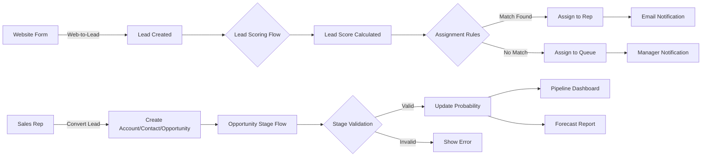
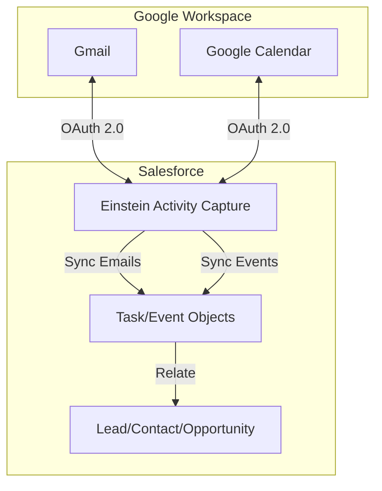
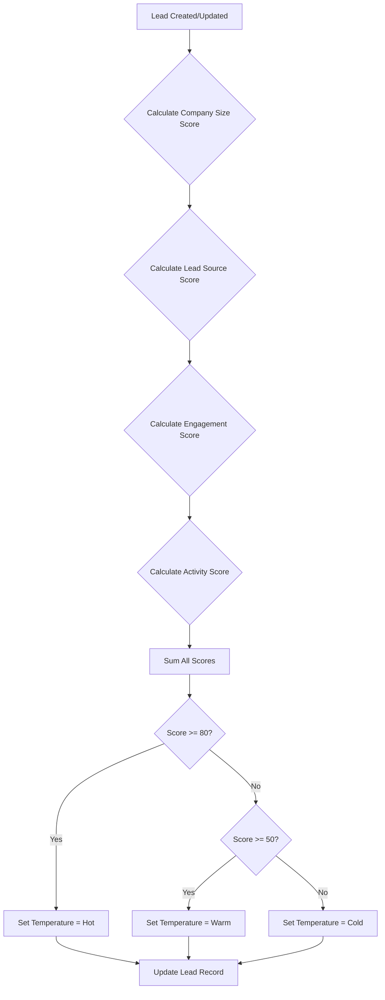
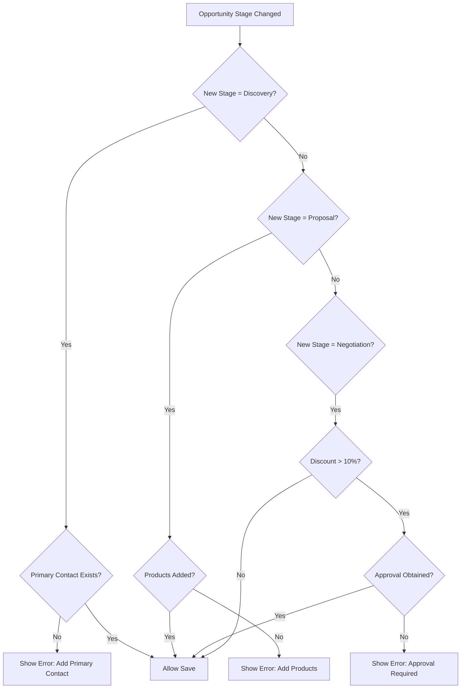
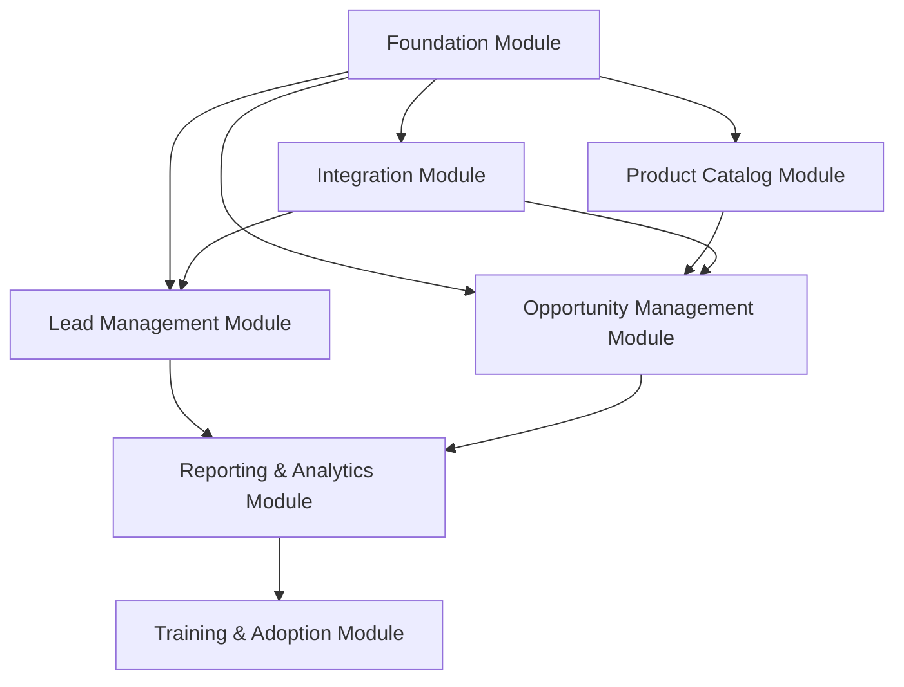
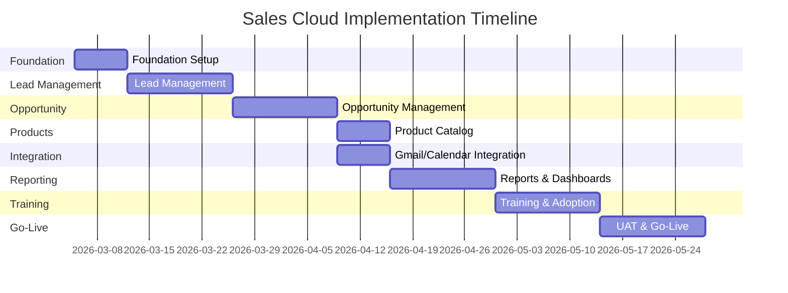

# Solution Design Document (SDD)
## Sales Cloud Implementation

---

## Document Control

| Item | Details |
|------|---------|
| **Project Name** | Sales Cloud Implementation |
| **Document Version** | 1.0 |
| **Date** | March 3, 2026 |
| **Prepared By** | Principal Salesforce Solution Architect |
| **Status** | Draft for Review |
| **Last Updated** | March 3, 2026 |
| **Based on BRD** | v1.0 (March 1, 2026) |

## Document Revision History

| Version | Date | Author | Description |
|---------|------|--------|-------------|
| 1.0 | March 3, 2026 | Solution Architect | Initial Solution Design based on approved BRD |

---

## Table of Contents

1. [Executive Summary & Key Decisions](#1-executive-summary--key-decisions)
2. [High-Level Architecture](#2-high-level-architecture)
3. [Data Model & Entity Relationship Diagram](#3-data-model--entity-relationship-diagram)
4. [Business Logic Design](#4-business-logic-design)
5. [User Interface Components](#5-user-interface-components)
6. [Integration Architecture](#6-integration-architecture)
7. [Security & Access Control](#7-security--access-control)
8. [Governor Limits & Async Strategy](#8-governor-limits--async-strategy)
9. [DevOps & Deployment Strategy](#9-devops--deployment-strategy)
10. [Module Breakdown](#10-module-breakdown)
11. [Technical Specifications](#11-technical-specifications)
12. [Testing Strategy](#12-testing-strategy)
13. [Risks & Technical Considerations](#13-risks--technical-considerations)

---

## 1. Executive Summary & Key Decisions

### 1.1 Solution Overview

This Solution Design Document outlines the technical architecture for implementing Salesforce Sales Cloud to support automated lead management, opportunity tracking, and sales analytics. The solution leverages **declarative-first** development principles, utilizing Flows, validation rules, and standard Salesforce features to minimize technical debt and maximize maintainability.

### 1.2 Key Architectural Decisions

| Decision Area | Decision | Rationale |
|--------------|----------|-----------|
| **Development Approach** | Declarative-first (Flows, Process Builder alternatives) | Minimize custom code, reduce maintenance overhead, enable admin configuration |
| **Automation Platform** | Flow Builder for all automation | Unified automation platform, better debugging, future-proof (Process Builder deprecated) |
| **Lead Assignment** | Assignment Rules + Flow (hybrid) | Assignment Rules for simple territory logic, Flow for complex scoring |
| **Email Integration** | Einstein Activity Capture + Gmail Integration | Native Salesforce solution, no third-party tools, bi-directional sync |
| **Sharing Model** | Private (OWD) + Territory-based sharing rules | Supports territory-based access while maintaining data security |
| **Trigger Framework** | Not required in Phase 1 (declarative only) | BRD constraint: no custom code in initial phase |
| **API Strategy** | Standard REST API for future integrations | Prepare for Phase 2 integrations while maintaining flexibility |
| **Reporting Platform** | Standard Reports & Dashboards | Meets current requirements, CRM Analytics (Tableau CRM) for Phase 2 if needed |

### 1.3 Technology Stack

| Component | Technology | Version/Edition |
|-----------|-----------|-----------------|
| **Salesforce Edition** | Enterprise Edition (minimum) | Required for API access, advanced workflow |
| **User Interface** | Lightning Experience | Standard Lightning components, no custom LWC in Phase 1 |
| **Automation** | Flow Builder | Record-Triggered Flows, Screen Flows, Scheduled Flows |
| **Integration** | Einstein Activity Capture, Gmail Integration | Native Salesforce |
| **Mobile** | Salesforce Mobile App | Standard mobile app |
| **Development Environment** | Developer Sandbox | Provided by IT |
| **Version Control** | Git (GitHub/Bitbucket) | For metadata backup and change tracking |
| **Deployment** | Salesforce CLI + Change Sets | Hybrid approach for flexibility |

### 1.4 Scope Confirmation

**In Scope:**
- Lead Management (capture, scoring, assignment)
- Opportunity Management (5-stage sales process)
- Product & Price Book configuration
- Gmail/Calendar integration
- Reports & Dashboards (8 reports, 3 dashboards)
- Security model (profiles, permission sets, sharing rules)
- Data validation & quality rules

**Out of Scope:**
- Custom Apex development (Phase 1 constraint)
- Lightning Web Components (Phase 1)
- Data migration from legacy systems
- Marketing Cloud integration
- Service Cloud features
- Advanced CPQ
- Predictive AI/Einstein features (beyond Activity Capture)

---

## 2. High-Level Architecture

### 2.1 System Architecture Diagram

```mermaid
graph TB
    subgraph "User Layer"
        A[Sales Reps]
        B[Sales Managers]
        C[VP Sales/Executives]
        D[Operations Manager]
    end
    
    subgraph "Salesforce Sales Cloud"
        E[Lightning Experience UI]
        F[Mobile App]
        
        subgraph "Data Layer"
            G[Lead Object]
            H[Account Object]
            I[Contact Object]
            J[Opportunity Object]
            K[Product2 Object]
            L[Pricebook2 Object]
            M[OpportunityLineItem]
        end
        
        subgraph "Automation Layer"
            N[Web-to-Lead]
            O[Lead Assignment Rules]
            P[Lead Scoring Flow]
            Q[Opportunity Stage Flow]
            R[Validation Rules]
            S[Email Alerts]
        end
        
        subgraph "Analytics Layer"
            T[Reports]
            U[Dashboards]
            V[List Views]
        end
    end
    
    subgraph "External Systems"
        W[Gmail]
        X[Google Calendar]
        Y[Company Website]
    end
    
    A --> E
    B --> E
    C --> E
    D --> E
    A --> F
    
    E --> G
    E --> H
    E --> I
    E --> J
    E --> K
    E --> L
    E --> M
    
    N --> G
    O --> G
    P --> G
    Q --> J
    R --> G
    R --> J
    S --> A
    S --> B
    
    E --> T
    E --> U
    E --> V
    
    Y --> N
    W -.Einstein Activity Capture.-> G
    W -.Einstein Activity Capture.-> I
    W -.Einstein Activity Capture.-> J
    X -.Einstein Activity Capture.-> G
    X -.Einstein Activity Capture.-> I
    X -.Einstein Activity Capture.-> J
```



### 2.2 Data Flow Architecture



### 2.3 Integration Architecture



---

## 3. Data Model & Entity Relationship Diagram

### 3.1 Entity Relationship Diagram

See separate file: `entity_relationship_diagram.md`

### 3.2 Standard Objects Configuration

#### 3.2.1 Lead Object

**Purpose**: Capture and qualify prospective customers before conversion to Account/Contact/Opportunity.

**Standard Fields Used:**
- `FirstName` (Text)
- `LastName` (Text, Required)
- `Email` (Email, Required)
- `Phone` (Phone)
- `Company` (Text, Required)
- `LeadSource` (Picklist)
- `Status` (Picklist)
- `Rating` (Picklist)
- `OwnerId` (Lookup to User)
- `CreatedDate` (DateTime)
- `ConvertedDate` (DateTime)
- `IsConverted` (Checkbox)

**Custom Fields:**

| API Name | Label | Type | Description | Required | Default |
|----------|-------|------|-------------|----------|---------|
| `Lead_Score__c` | Lead Score | Number(3,0) | Calculated score 0-100 based on engagement | No | 0 |
| `Lead_Temperature__c` | Lead Temperature | Picklist | Hot (80-100), Warm (50-79), Cold (0-49) | No | Cold |
| `Territory__c` | Territory | Formula(Text) | Calculated based on State/Region | No | N/A |
| `Engagement_Score__c` | Engagement Score | Number(3,0) | Activity-based engagement metric | No | 0 |
| `Days_Since_Last_Activity__c` | Days Since Last Activity | Formula(Number) | Days since last touch | No | N/A |
| `Original_Lead_Source__c` | Original Lead Source | Text(255) | Preserved for reporting after conversion | No | N/A |

**Picklist Values:**

*LeadSource:*
- Web
- Referral
- Trade Show
- Partner
- Cold Call
- LinkedIn
- Advertisement
- Other

*Status:*
- New
- Contacted
- Qualified
- Unqualified
- Converted

*Rating:*
- Hot
- Warm
- Cold

*Lead_Temperature__c:*
- Hot (Red)
- Warm (Orange)
- Cold (Blue)

#### 3.2.2 Account Object

**Purpose**: Store company/organization information.

**Standard Fields Used:**
- Standard Account fields (minimal customization in Phase 1)
- `Name` (Text, Required)
- `Website` (URL)
- `Phone` (Phone)
- `Industry` (Picklist)
- `NumberOfEmployees` (Number)
- `AnnualRevenue` (Currency)
- `BillingAddress` (Address)
- `OwnerId` (Lookup to User)

**Custom Fields:**

| API Name | Label | Type | Description | Required |
|----------|-------|------|-------------|----------|
| `Territory__c` | Territory | Formula(Text) | Based on BillingState | No |
| `Customer_Since__c` | Customer Since | Date | First closed won date | No |

#### 3.2.3 Contact Object

**Purpose**: Store individual person information related to Accounts.

**Standard Fields Used:**
- Standard Contact fields (minimal customization in Phase 1)
- `FirstName`, `LastName` (Text)
- `Email` (Email)
- `Phone` (Phone)
- `AccountId` (Lookup to Account)
- `Title` (Text)
- `OwnerId` (Lookup to User)

**Custom Fields:**

| API Name | Label | Type | Description | Required |
|----------|-------|------|-------------|----------|
| `Primary_Contact__c` | Primary Contact | Checkbox | Indicates primary decision maker | No |

#### 3.2.4 Opportunity Object

**Purpose**: Track sales deals through the pipeline.

**Standard Fields Used:**
- `Name` (Text, Required)
- `AccountId` (Lookup to Account, Required)
- `Amount` (Currency)
- `CloseDate` (Date, Required)
- `StageName` (Picklist, Required)
- `Probability` (Percent)
- `LeadSource` (Picklist)
- `OwnerId` (Lookup to User)
- `CreatedDate` (DateTime)
- `IsClosed` (Checkbox)
- `IsWon` (Checkbox)
- `ForecastCategory` (Picklist)
- `Type` (Picklist)

**Custom Fields:**

| API Name | Label | Type | Description | Required |
|----------|-------|------|-------------|----------|
| `Competitor_Name__c` | Competitor Name | Multi-Select Picklist | Competing vendors | No |
| `Competitive_Position__c` | Competitive Position | Picklist | Ahead, Even, Behind | No |
| `Original_Lead_Source__c` | Original Lead Source | Text(255) | From converted lead | No |
| `Days_in_Current_Stage__c` | Days in Current Stage | Formula(Number) | `TODAY() - LastStageChangeDate` | No |
| `Previous_Close_Date__c` | Previous Close Date | Date | Track close date changes | No |
| `Close_Date_Change_Count__c` | Close Date Change Count | Number(3,0) | Times close date was pushed | No |
| `Stage_History_JSON__c` | Stage History | Long Text Area | Track stage progression for analytics | No |

**Picklist Values:**

*StageName:*
- Qualification (10%)
- Discovery (25%)
- Proposal (50%)
- Negotiation (75%)
- Closed Won (100%)
- Closed Lost (0%)

*Competitor_Name__c:*
- Competitor A
- Competitor B
- Competitor C
- Competitor D
- Other

*Competitive_Position__c:*
- Ahead
- Even
- Behind
- Not Applicable

#### 3.2.5 Product2 Object

**Purpose**: Define product catalog.

**Standard Fields Used:**
- `Name` (Text, Required)
- `ProductCode` (Text)
- `Description` (Long Text Area)
- `Family` (Picklist)
- `IsActive` (Checkbox)

**Product Families** (to be defined by Operations):
- Software
- Services
- Training
- Support
- Hardware
- Other

#### 3.2.6 Pricebook2 Object

**Purpose**: Manage product pricing.

**Configuration:**
- **Standard Price Book**: Default pricing for all products
- **Custom Price Books** (Phase 2): Region-specific or customer-specific pricing

#### 3.2.7 PricebookEntry Object

**Purpose**: Link products to price books with pricing.

**Standard Fields Used:**
- `Pricebook2Id` (Lookup to Pricebook2)
- `Product2Id` (Lookup to Product2)
- `UnitPrice` (Currency)
- `IsActive` (Checkbox)

#### 3.2.8 OpportunityLineItem Object

**Purpose**: Track products/services on opportunities.

**Standard Fields Used:**
- `OpportunityId` (Lookup to Opportunity)
- `PricebookEntryId` (Lookup to PricebookEntry)
- `Product2Id` (Lookup to Product2)
- `Quantity` (Number)
- `UnitPrice` (Currency)
- `Discount` (Percent)
- `TotalPrice` (Currency, Formula)
- `Description` (Long Text Area)

### 3.3 Sharing Model

**Organization-Wide Defaults (OWD):**

| Object | Internal Access | External Access | Rationale |
|--------|----------------|-----------------|-----------|
| Lead | Private | N/A | Reps own their leads, territory sharing via rules |
| Account | Private | N/A | Territory-based access model |
| Contact | Controlled by Parent | N/A | Inherits Account sharing |
| Opportunity | Private | N/A | Territory-based access model |
| Product2 | Public Read Only | N/A | All users can view product catalog |
| Pricebook2 | Use | N/A | Standard Salesforce behavior |

**Sharing Rules:**

Territory-based sharing rules will be configured once territory definitions are finalized by Sales Leadership (dependency noted in BRD).

**Role Hierarchy:**

```
VP Sales
├── Sales Manager - East
│   ├── Sales Rep - East 1
│   ├── Sales Rep - East 2
│   └── Sales Rep - East 3
├── Sales Manager - West
│   ├── Sales Rep - West 1
│   ├── Sales Rep - West 2
│   └── Sales Rep - West 3
└── Sales Manager - Central
    ├── Sales Rep - Central 1
    ├── Sales Rep - Central 2
    └── Sales Rep - Central 3
```

*Note: Actual role hierarchy will be defined based on organizational structure provided by stakeholders.*

---

## 4. Business Logic Design

### 4.1 Automation Strategy

**Declarative-First Approach:**
All automation will be implemented using Flow Builder to maintain consistency, enable admin maintenance, and avoid custom Apex code (per Phase 1 constraint).

### 4.2 Lead Management Automation

#### 4.2.1 Web-to-Lead Configuration

**Objective**: Capture leads from company website automatically.

**Implementation:**
- **Tool**: Standard Salesforce Web-to-Lead
- **Form Fields**:
  - FirstName (Optional)
  - LastName (Required)
  - Email (Required)
  - Company (Required)
  - Phone (Optional)
  - LeadSource (Hidden field, set to "Web")
  - oid (Organization ID, hidden)
  - retURL (Return URL, hidden)

**Configuration Steps:**
1. Setup → Lead Settings → Web-to-Lead → Enable
2. Generate HTML form with required fields
3. Provide HTML to web team for integration
4. Configure reCAPTCHA for spam prevention (recommended)
5. Set up auto-response email template

**Auto-Response Email:**
- Template: "Thank you for your interest"
- Sent immediately upon form submission
- Includes expected response time (2 hours for hot leads)

**Security Considerations:**
- Enable reCAPTCHA to prevent spam
- Limit to 500 submissions per day (Salesforce default)
- Monitor for duplicate submissions

#### 4.2.2 Lead Scoring Flow

**Flow Name**: `Lead_Scoring_Automation`  
**Flow Type**: Record-Triggered Flow (After Save)  
**Object**: Lead  
**Trigger**: When a lead is created or updated

**Scoring Logic:**

| Criteria | Points | Field/Condition |
|----------|--------|-----------------|
| **Company Size** | | |
| 1000+ employees | 25 | `NumberOfEmployees >= 1000` |
| 500-999 employees | 20 | `NumberOfEmployees >= 500` |
| 100-499 employees | 15 | `NumberOfEmployees >= 100` |
| < 100 employees | 5 | `NumberOfEmployees < 100` |
| **Lead Source** | | |
| Referral | 20 | `LeadSource = 'Referral'` |
| Trade Show | 15 | `LeadSource = 'Trade Show'` |
| Web | 10 | `LeadSource = 'Web'` |
| Partner | 15 | `LeadSource = 'Partner'` |
| Other | 5 | Other sources |
| **Engagement** | | |
| Has phone number | 10 | `Phone != null` |
| Has company website | 10 | `Website != null` |
| Title contains "Director" or higher | 15 | `Title CONTAINS 'Director' OR 'VP' OR 'Chief'` |
| **Activity** | | |
| Completed task in last 7 days | 10 | `Tasks.ActivityDate >= TODAY()-7` |
| Open task exists | 5 | `Tasks.IsClosed = false` |

**Total Score Calculation:**
- Sum of all applicable criteria
- Maximum score: 100
- Stored in `Lead_Score__c` field

**Temperature Classification:**
- **Hot** (80-100): `Lead_Temperature__c = 'Hot'`
- **Warm** (50-79): `Lead_Temperature__c = 'Warm'`
- **Cold** (0-49): `Lead_Temperature__c = 'Cold'`

**Flow Design:**



**Flow Elements:**
1. **Start**: After Save, when Lead is created or updated
2. **Decision**: Calculate Company Size Score (nested decisions)
3. **Decision**: Calculate Lead Source Score
4. **Decision**: Calculate Engagement Score
5. **Get Records**: Query related Tasks for activity score
6. **Assignment**: Sum all scores into variable
7. **Decision**: Determine temperature based on total score
8. **Update Records**: Update `Lead_Score__c` and `Lead_Temperature__c`

**Optimization:**
- Use fast field updates (same record, no additional DML)
- Avoid loops for Phase 1 (simple scoring)
- Consider bulkification for future enhancements

#### 4.2.3 Lead Assignment Rules

**Assignment Rule Name**: `Territory_Based_Lead_Assignment`

**Assignment Logic:**

| Order | Criteria | Assigned To | Notification |
|-------|----------|-------------|--------------|
| 1 | State = CA, OR, WA, NV, AZ | Sales Rep - West 1 (Round Robin) | Email |
| 2 | State = NY, NJ, PA, MA, CT, VT, NH, ME, RI | Sales Rep - East 1 (Round Robin) | Email |
| 3 | State = TX, OK, AR, LA, NM | Sales Rep - Central 1 (Round Robin) | Email |
| 4 | Industry = Technology AND Company Size > 500 | Enterprise Sales Team Queue | Email |
| 5 | Lead Temperature = Hot | Hot Leads Queue (Manager review) | Email + SMS |
| 6 | Default | General Sales Queue | Email |

**Implementation:**
1. Setup → Lead Settings → Assignment Rules
2. Create rule entries in order of priority
3. Configure email templates for notifications
4. Set up queues for unmatched leads

**Queues:**
- `Hot_Leads_Queue`: Owned by Sales Managers for immediate review
- `Enterprise_Sales_Queue`: For large enterprise opportunities
- `General_Sales_Queue`: Default catch-all

**Round Robin Logic:**
- Phase 1: Manual round robin (assign to specific rep)
- Phase 2: Consider Flow-based round robin for dynamic assignment

**Email Notifications:**
- Template: "New Lead Assigned to You"
- Includes: Lead Name, Company, Score, Temperature, Source
- Link to Lead record

#### 4.2.4 Lead Conversion Process

**Process**: Standard Salesforce Lead Conversion

**Configuration:**
- **Convert to**: Account, Contact, Opportunity (always create opportunity)
- **Field Mapping**:
  - `Lead.LeadSource` → `Opportunity.LeadSource`
  - `Lead.Lead_Score__c` → `Opportunity.Original_Lead_Source__c` (via custom mapping)
  - `Lead.Company` → `Account.Name`
  - `Lead.FirstName`, `LastName` → `Contact.FirstName`, `LastName`

**Post-Conversion Flow**: `Lead_Conversion_Cleanup`
- **Trigger**: After Lead Conversion
- **Actions**:
  - Copy `Lead.Lead_Score__c` to Opportunity custom field (if needed)
  - Update `Original_Lead_Source__c` on Opportunity
  - Create initial task for new opportunity ("Discovery Call")

**Validation:**
- Lead must have Status = "Qualified" before conversion (validation rule)
- Lead must have valid Email and Company (validation rule)

### 4.3 Opportunity Management Automation

#### 4.3.1 Opportunity Stage Validation Flow

**Flow Name**: `Opportunity_Stage_Validation`  
**Flow Type**: Record-Triggered Flow (Before Save)  
**Object**: Opportunity  
**Trigger**: When opportunity is created or updated (stage changes)

**Stage Requirements:**

| Stage | Required Fields | Validation Logic |
|-------|----------------|------------------|
| Qualification | Account, Close Date, Amount | All must be populated |
| Discovery | + Primary Contact identified | `Contact.Primary_Contact__c = true` |
| Proposal | + Products added (Line Items) | `OpportunityLineItems.size() > 0` |
| Negotiation | + Discount % documented (if > 10%) | If discount > 10%, approval required |
| Closed Won | + All previous requirements | All fields complete |
| Closed Lost | + Loss Reason (custom field) | `Loss_Reason__c != null` |

**Flow Logic:**



**Error Messages:**
- "Please add a Primary Contact before moving to Discovery stage"
- "Please add at least one product before moving to Proposal stage"
- "Discounts greater than 10% require manager approval"

#### 4.3.2 Probability Auto-Update Flow

**Flow Name**: `Opportunity_Probability_Update`  
**Flow Type**: Record-Triggered Flow (Before Save)  
**Object**: Opportunity  
**Trigger**: When Stage changes

**Probability Mapping:**

| Stage | Probability | Forecast Category |
|-------|------------|-------------------|
| Qualification | 10% | Pipeline |
| Discovery | 25% | Pipeline |
| Proposal | 50% | Best Case |
| Negotiation | 75% | Commit |
| Closed Won | 100% | Closed |
| Closed Lost | 0% | Omitted |

**Implementation:**
- Simple assignment based on Stage value
- Overrides manual probability changes (business rule)
- Updates `ForecastCategory` automatically

#### 4.3.3 Close Date Monitoring Flow

**Flow Name**: `Close_Date_Change_Alert`  
**Flow Type**: Record-Triggered Flow (After Save)  
**Object**: Opportunity  
**Trigger**: When Close Date is changed

**Logic:**
1. Check if `CloseDate` changed from previous value
2. If changed, increment `Close_Date_Change_Count__c`
3. Store previous close date in `Previous_Close_Date__c`
4. If pushed > 30 days, send alert to Sales Manager
5. If pushed > 60 days, send alert to VP Sales

**Alert Email Template:**
- Subject: "Opportunity Close Date Pushed: [Opportunity Name]"
- Body: Includes opportunity details, old date, new date, reason (if provided)

#### 4.3.4 Stage History Tracking Flow

**Flow Name**: `Opportunity_Stage_History`  
**Flow Type**: Record-Triggered Flow (After Save)  
**Object**: Opportunity  
**Trigger**: When Stage changes

**Purpose**: Track stage progression for analytics (average days in stage, stage regression, etc.)

**Implementation:**
- Append stage change to `Stage_History_JSON__c` field
- Format: `{"stage": "Discovery", "date": "2026-03-15", "user": "John Doe"}`
- Use for reporting on sales cycle metrics

### 4.4 Data Quality Automation

#### 4.4.1 Validation Rules

**Lead Object Validation Rules:**

| Rule Name | Error Condition | Error Message | Field |
|-----------|----------------|---------------|-------|
| `Lead_Email_Format` | `NOT(REGEX(Email, "[a-zA-Z0-9._%+-]+@[a-zA-Z0-9.-]+\\.[a-zA-Z]{2,}"))` | "Please enter a valid email address" | Email |
| `Lead_Phone_Format` | `NOT(ISBLANK(Phone)) && LEN(Phone) < 10` | "Phone number must be at least 10 digits" | Phone |
| `Lead_Conversion_Required_Fields` | `Status = "Qualified" && (ISBLANK(Email) OR ISBLANK(Company))` | "Email and Company are required before qualification" | Status |

**Opportunity Object Validation Rules:**

| Rule Name | Error Condition | Error Message | Field |
|-----------|----------------|---------------|-------|
| `Opportunity_Amount_Positive` | `Amount <= 0` | "Opportunity amount must be greater than zero" | Amount |
| `Opportunity_Close_Date_Future` | `CloseDate < TODAY() && NOT(ISPICKVAL(StageName, "Closed Won")) && NOT(ISPICKVAL(StageName, "Closed Lost"))` | "Close date cannot be in the past for open opportunities" | CloseDate |
| `Opportunity_Products_Required_Proposal` | `ISPICKVAL(StageName, "Proposal") && LineItemCount = 0` | "Please add products before moving to Proposal stage" | StageName |
| `Opportunity_Closed_Lost_Reason` | `ISPICKVAL(StageName, "Closed Lost") && ISBLANK(Loss_Reason__c)` | "Please provide a reason for losing this opportunity" | StageName |

**Account Object Validation Rules:**

| Rule Name | Error Condition | Error Message | Field |
|-----------|----------------|---------------|-------|
| `Account_Website_Format` | `NOT(ISBLANK(Website)) && NOT(BEGINS(Website, "http"))` | "Website must start with http:// or https://" | Website |

#### 4.4.2 Duplicate Management

**Duplicate Rules:**

**Lead Duplicate Rule:**
- **Rule Name**: `Lead_Duplicate_Email`
- **Matching Rule**: Standard Matching Rule - Leads (Email exact match)
- **Action**: Alert user, allow save
- **Report**: Generate duplicate report for cleanup

**Account Duplicate Rule:**
- **Rule Name**: `Account_Duplicate_Name_Website`
- **Matching Rule**: Custom matching rule (Name fuzzy match + Website exact match)
- **Action**: Alert user, allow save
- **Report**: Generate duplicate report for cleanup

**Implementation:**
1. Setup → Duplicate Management
2. Activate standard matching rules
3. Create duplicate rules with alert action
4. Schedule weekly duplicate reports for Operations Manager

### 4.5 Email Alerts & Notifications

**Email Alert Configuration:**

| Alert Name | Trigger | Recipients | Template |
|------------|---------|-----------|----------|
| `New_Lead_Assignment` | Lead assigned via assignment rules | Lead Owner | New_Lead_Assigned_Template |
| `Hot_Lead_Alert` | Lead Temperature = Hot | Lead Owner + Manager | Hot_Lead_Alert_Template |
| `Opportunity_Close_Date_Pushed` | Close Date pushed > 30 days | Opportunity Owner + Manager | Close_Date_Alert_Template |
| `Stage_Stuck_Alert` | Opportunity in same stage > 30 days | Opportunity Owner | Stage_Stuck_Template |
| `Welcome_New_User` | New user created | New User | Welcome_Template |

**Email Templates:**

All email templates will use Lightning Email Templates with merge fields for personalization.

---

## 5. User Interface Components

### 5.1 Lightning Experience Customization

**Approach**: Standard Lightning Experience with custom page layouts, compact layouts, and Lightning App configuration. No custom LWC development in Phase 1.

### 5.2 Lightning Apps

#### 5.2.1 Sales Console App

**App Name**: `Sales Console`  
**Type**: Console App  
**Target Users**: Sales Reps, Sales Managers

**Navigation Items:**
- Home
- Leads
- Accounts
- Contacts
- Opportunities
- Products
- Price Books
- Dashboards
- Reports
- Tasks
- Events
- Chatter

**Utility Bar Items:**
- Notes
- History
- Softphone (placeholder for future)
- Recent Items

**Console Settings:**
- Enable split view
- Enable push notifications
- Keyboard shortcuts enabled

#### 5.2.2 Sales Leadership App

**App Name**: `Sales Leadership`  
**Type**: Standard App  
**Target Users**: VP Sales, Executives, Operations Manager

**Navigation Items:**
- Home
- Dashboards
- Reports
- Opportunities
- Accounts
- Forecasts
- Chatter

**Features:**
- Dashboard-first navigation
- Read-only access for executives
- Simplified navigation for executive use

### 5.3 Page Layouts

#### 5.3.1 Lead Page Layouts

**Layout Name**: `Lead - Sales Rep Layout`  
**Assigned To**: Sales Rep Profile

**Sections:**

1. **Lead Information** (2 columns)
   - Name (First, Last)
   - Company
   - Title
   - Email
   - Phone
   - Lead Score (read-only, highlighted)
   - Lead Temperature (read-only, highlighted)
   - Lead Source
   - Status
   - Rating
   - Owner

2. **Scoring Details** (2 columns)
   - Engagement Score
   - Days Since Last Activity
   - Number of Employees
   - Industry

3. **Address Information** (2 columns)
   - Street, City, State, Zip, Country

4. **Additional Information** (2 columns)
   - Website
   - Description
   - Territory (read-only)

5. **System Information** (2 columns)
   - Created By, Created Date
   - Last Modified By, Last Modified Date

**Related Lists:**
- Activity History
- Open Activities
- Notes & Attachments
- Campaign History

**Quick Actions:**
- Log a Call
- New Task
- New Event
- Send Email
- Convert Lead

#### 5.3.2 Opportunity Page Layouts

**Layout Name**: `Opportunity - Sales Rep Layout`  
**Assigned To**: Sales Rep Profile

**Sections:**

1. **Opportunity Information** (2 columns)
   - Opportunity Name
   - Account Name
   - Amount
   - Close Date
   - Stage (with Sales Path)
   - Probability (read-only)
   - Forecast Category (read-only)
   - Type
   - Lead Source
   - Owner

2. **Products & Pricing** (2 columns)
   - Total Line Items (formula)
   - Product Count (rollup)

3. **Competition** (2 columns)
   - Competitor Name
   - Competitive Position

4. **Stage Tracking** (2 columns)
   - Days in Current Stage (read-only)
   - Previous Close Date (read-only)
   - Close Date Change Count (read-only)

5. **Additional Information** (2 columns)
   - Description
   - Next Steps
   - Original Lead Source (read-only)

6. **System Information** (2 columns)
   - Created By, Created Date
   - Last Modified By, Last Modified Date

**Related Lists:**
- Products (Opportunity Line Items)
- Contact Roles
- Activity History
- Open Activities
- Notes & Attachments
- Stage History

**Quick Actions:**
- Log a Call
- New Task
- New Event
- Send Email
- Add Products
- Add Contact Role

### 5.4 Compact Layouts

**Lead Compact Layout:**
- Name
- Company
- Lead Score
- Lead Temperature
- Phone
- Email

**Opportunity Compact Layout:**
- Opportunity Name
- Amount
- Stage
- Close Date
- Account Name

### 5.5 List Views

#### 5.5.1 Lead List Views

| View Name | Filter Criteria | Visible To |
|-----------|----------------|------------|
| My Hot Leads | Owner = Me, Temperature = Hot | All Users |
| My Warm Leads | Owner = Me, Temperature = Warm | All Users |
| My Open Leads | Owner = Me, Status != Converted | All Users |
| All Hot Leads | Temperature = Hot | Sales Managers |
| Unassigned Leads | Owner = Queue | Sales Managers |
| New Leads (Last 7 Days) | Created Date = LAST_N_DAYS:7 | Sales Managers |
| Stale Leads (No Activity 30+ Days) | Days Since Last Activity > 30 | Sales Managers |

#### 5.5.2 Opportunity List Views

| View Name | Filter Criteria | Visible To |
|-----------|----------------|------------|
| My Opportunities | Owner = Me, Stage != Closed | All Users |
| Closing This Month | Owner = Me, Close Date = THIS_MONTH | All Users |
| Closing This Quarter | Owner = Me, Close Date = THIS_QUARTER | All Users |
| All Open Opportunities | Stage != Closed | Sales Managers |
| Stalled Opportunities | Days in Current Stage > 30 | Sales Managers |
| Large Deals (>$100K) | Amount > 100000 | Sales Managers |
| Recently Closed Won | Stage = Closed Won, Close Date = LAST_N_DAYS:30 | All Users |
| Recently Closed Lost | Stage = Closed Lost, Close Date = LAST_N_DAYS:30 | Sales Managers |

### 5.6 Sales Path

**Opportunity Sales Path Configuration:**

**Path Name**: `Standard Sales Process`

**Stages:**
1. Qualification
2. Discovery
3. Proposal
4. Negotiation
5. Closed Won
6. Closed Lost

**Guidance for Success (per stage):**

**Qualification (10%):**
- Key Fields: Account, Close Date, Amount
- Guidance:
  - Identify decision makers and influencers
  - Confirm budget availability
  - Understand timeline and urgency
  - Determine BANT (Budget, Authority, Need, Timeline)

**Discovery (25%):**
- Key Fields: Primary Contact, Needs Analysis
- Guidance:
  - Conduct needs analysis
  - Understand pain points and success criteria
  - Map stakeholders and buying process
  - Document business requirements

**Proposal (50%):**
- Key Fields: Products (Line Items), Proposal Sent Date
- Guidance:
  - Present solution and ROI
  - Deliver formal proposal
  - Address initial objections
  - Schedule follow-up meeting

**Negotiation (75%):**
- Key Fields: Contract Sent Date, Discount (if applicable)
- Guidance:
  - Finalize terms and pricing
  - Address remaining objections
  - Obtain legal/procurement approval
  - Prepare contract for signature

**Closed Won (100%):**
- Key Fields: Contract Signed Date
- Guidance:
  - Celebrate the win!
  - Schedule implementation kickoff
  - Introduce customer success team
  - Request referrals

**Closed Lost (0%):**
- Key Fields: Loss Reason, Competitor Won
- Guidance:
  - Document loss reason
  - Identify lessons learned
  - Add to nurture campaign (future)
  - Schedule follow-up for future opportunities

---

## 6. Integration Architecture

### 6.1 Gmail & Google Calendar Integration

**Integration Method**: Einstein Activity Capture (EAC)

#### 6.1.1 Einstein Activity Capture Configuration

**Purpose**: Automatically sync emails and calendar events between Gmail/Google Calendar and Salesforce.

**Features Enabled:**
- Email integration
- Event integration
- Contact sync
- Automatic activity logging

**Authentication:**
- OAuth 2.0
- User-level authentication (each user authenticates their own Gmail account)
- No shared credentials

**Setup Steps:**
1. Enable Einstein Activity Capture in Setup
2. Configure EAC settings:
   - Sync frequency: Every 15 minutes
   - Email sync: Enabled
   - Event sync: Enabled (bi-directional)
   - Contact sync: Enabled
3. Configure email domains to sync (company domain only)
4. Set up user rollout plan (pilot group first)
5. Create user documentation and training materials

#### 6.1.2 Email Sync Configuration

**Email Sync Rules:**
- Sync emails from/to known Leads, Contacts, and Accounts
- Sync based on email domain matching
- Allow users to manually relate emails to records
- Exclude internal emails (company domain to company domain)

**Email Logging:**
- Emails logged as EmailMessage records
- Visible in Activity Timeline
- Searchable via Global Search
- Count toward activity metrics

**Email Templates:**
- Standard email templates available in Salesforce
- Accessible from Gmail via Salesforce integration
- Track template usage for analytics

#### 6.1.3 Calendar Event Sync Configuration

**Event Sync Rules:**
- Bi-directional sync (Salesforce ↔ Google Calendar)
- Events automatically related to Leads/Contacts based on attendees
- Sync frequency: Every 15 minutes
- Allow manual relationship to Opportunities

**Event Fields Synced:**
- Subject
- Start Date/Time
- End Date/Time
- Location
- Description
- Attendees

**Conflict Resolution:**
- Google Calendar is source of truth for event details
- Salesforce is source of truth for record relationships
- Last update wins for conflicting changes

#### 6.1.4 Activity Metrics

**Tracked Activities:**
- Emails sent
- Emails received
- Meetings scheduled
- Meetings completed
- Calls logged (manual)

**Reporting:**
- Activity metrics available in reports and dashboards
- Rep performance dashboard includes activity counts
- Manager visibility into team activity levels

### 6.2 Web-to-Lead Integration

**Integration Type**: HTTP POST from website form to Salesforce

**Endpoint**: `https://webto.salesforce.com/servlet/servlet.WebToLead?encoding=UTF-8`

**Form Fields:**
```html
<form action="https://webto.salesforce.com/servlet/servlet.WebToLead?encoding=UTF-8" method="POST">
  <input type="hidden" name="oid" value="[ORG_ID]">
  <input type="hidden" name="retURL" value="https://www.company.com/thank-you">
  <input type="hidden" name="lead_source" value="Web">
  
  <label for="first_name">First Name</label>
  <input id="first_name" name="first_name" type="text">
  
  <label for="last_name">Last Name*</label>
  <input id="last_name" name="last_name" type="text" required>
  
  <label for="email">Email*</label>
  <input id="email" name="email" type="email" required>
  
  <label for="company">Company*</label>
  <input id="company" name="company" type="text" required>
  
  <label for="phone">Phone</label>
  <input id="phone" name="phone" type="tel">
  
  <input type="submit" value="Submit">
</form>
```

**Security:**
- reCAPTCHA enabled
- Rate limiting (500 submissions/day)
- Email verification for auto-response

**Error Handling:**
- Invalid submissions return error page
- Failed submissions logged for review
- Duplicate detection alert (but allow creation)

### 6.3 Future Integration Considerations (Phase 2)

**Potential Integrations:**
- Marketing Automation Platform (Marketo, Pardot, HubSpot)
- ERP System (for order management)
- CPQ Tool (for complex quoting)
- BI Tools (Tableau, Power BI)
- LinkedIn Sales Navigator

**API Strategy:**
- Use Salesforce REST API for external integrations
- Implement Named Credentials for secure authentication
- Consider Platform Events for real-time integration
- Implement API rate limit monitoring

---

## 7. Security & Access Control

### 7.1 Security Model Overview

**Layers of Security:**
1. **Organization-Wide Defaults (OWD)**: Private model for Leads, Accounts, Opportunities
2. **Role Hierarchy**: Manager access to subordinate records
3. **Sharing Rules**: Territory-based sharing
4. **Profiles**: Base permissions per role
5. **Permission Sets**: Additional permissions for specific functions
6. **Field-Level Security (FLS)**: Restrict sensitive field access
7. **Validation Rules**: Enforce data integrity

### 7.2 Profile Configuration

#### 7.2.1 Sales Representative Profile

**Profile Name**: `Sales Rep - Custom`  
**Clone From**: Standard User

**Object Permissions:**

| Object | Create | Read | Edit | Delete | View All | Modify All |
|--------|--------|------|------|--------|----------|------------|
| Lead | ✓ | ✓ | ✓ | ✓ | ✗ | ✗ |
| Account | ✓ | ✓ | ✓ | ✗ | ✗ | ✗ |
| Contact | ✓ | ✓ | ✓ | ✗ | ✗ | ✗ |
| Opportunity | ✓ | ✓ | ✓ | ✗ | ✗ | ✗ |
| Product2 | ✗ | ✓ | ✗ | ✗ | ✗ | ✗ |
| Pricebook2 | ✗ | ✓ | ✗ | ✗ | ✗ | ✗ |
| Task | ✓ | ✓ | ✓ | ✓ | ✗ | ✗ |
| Event | ✓ | ✓ | ✓ | ✓ | ✗ | ✗ |
| Report | ✓ | ✓ | ✓ | ✓ | ✗ | ✗ |
| Dashboard | ✗ | ✓ | ✗ | ✗ | ✗ | ✗ |

**System Permissions:**
- API Enabled: ✓
- View Setup and Configuration: ✗
- Manage Users: ✗
- View All Data: ✗
- Modify All Data: ✗
- Manage Dashboards: ✗
- Edit My Reports: ✓
- Edit My Dashboards: ✗
- Run Reports: ✓
- Export Reports: ✓

**Tab Settings:**
- All Sales Cloud tabs: Default On
- Setup: Hidden

#### 7.2.2 Sales Manager Profile

**Profile Name**: `Sales Manager - Custom`  
**Clone From**: Standard User

**Object Permissions:**

| Object | Create | Read | Edit | Delete | View All | Modify All |
|--------|--------|------|------|--------|----------|------------|
| Lead | ✓ | ✓ | ✓ | ✓ | ✓ | ✗ |
| Account | ✓ | ✓ | ✓ | ✓ | ✓ | ✗ |
| Contact | ✓ | ✓ | ✓ | ✓ | ✓ | ✗ |
| Opportunity | ✓ | ✓ | ✓ | ✓ | ✓ | ✗ |
| Product2 | ✗ | ✓ | ✗ | ✗ | ✓ | ✗ |
| Pricebook2 | ✗ | ✓ | ✗ | ✗ | ✓ | ✗ |
| Task | ✓ | ✓ | ✓ | ✓ | ✓ | ✗ |
| Event | ✓ | ✓ | ✓ | ✓ | ✓ | ✗ |
| Report | ✓ | ✓ | ✓ | ✓ | ✗ | ✗ |
| Dashboard | ✓ | ✓ | ✓ | ✓ | ✗ | ✗ |

**System Permissions:**
- API Enabled: ✓
- View Setup and Configuration: ✗
- Manage Users: ✗
- View All Data: ✗
- Modify All Data: ✗
- Manage Dashboards: ✓
- Edit My Reports: ✓
- Edit My Dashboards: ✓
- Run Reports: ✓
- Export Reports: ✓
- View All Forecasts: ✓

#### 7.2.3 VP Sales / Executive Profile

**Profile Name**: `Sales Executive - Custom`  
**Clone From**: Standard User

**Object Permissions:**

| Object | Create | Read | Edit | Delete | View All | Modify All |
|--------|--------|------|------|--------|----------|------------|
| Lead | ✗ | ✓ | ✗ | ✗ | ✓ | ✗ |
| Account | ✗ | ✓ | ✗ | ✗ | ✓ | ✗ |
| Contact | ✗ | ✓ | ✗ | ✗ | ✓ | ✗ |
| Opportunity | ✗ | ✓ | ✗ | ✗ | ✓ | ✗ |
| Product2 | ✗ | ✓ | ✗ | ✗ | ✓ | ✗ |
| Pricebook2 | ✗ | ✓ | ✗ | ✗ | ✓ | ✗ |
| Task | ✗ | ✓ | ✗ | ✗ | ✓ | ✗ |
| Event | ✗ | ✓ | ✗ | ✗ | ✓ | ✗ |
| Report | ✓ | ✓ | ✓ | ✓ | ✗ | ✗ |
| Dashboard | ✓ | ✓ | ✓ | ✓ | ✗ | ✗ |

**System Permissions:**
- API Enabled: ✓
- View Setup and Configuration: ✗
- View All Data: ✓ (read-only)
- Run Reports: ✓
- Export Reports: ✓
- View All Forecasts: ✓

**Note**: Executives have read-only access to all data for reporting and visibility.

#### 7.2.4 Operations Manager Profile

**Profile Name**: `Sales Operations - Custom`  
**Clone From**: System Administrator (limited)

**Object Permissions:**

| Object | Create | Read | Edit | Delete | View All | Modify All |
|--------|--------|------|------|--------|----------|------------|
| All Standard Objects | ✓ | ✓ | ✓ | ✓ | ✓ | ✓ |

**System Permissions:**
- API Enabled: ✓
- View Setup and Configuration: ✓
- Customize Application: ✓
- Manage Users: ✗ (IT responsibility)
- View All Data: ✓
- Modify All Data: ✓
- Manage Dashboards: ✓
- Manage Reports: ✓

**Note**: Operations Manager has admin-level access for configuration but not user management.

### 7.3 Permission Sets

#### 7.3.1 Discount Approval Permission Set

**Permission Set Name**: `Discount_Approver`  
**Assigned To**: Sales Managers who can approve discounts > 10%

**Permissions:**
- Edit `Discount__c` field on OpportunityLineItem (FLS: Read/Edit)
- Approve discount requests (Process Builder approval)

#### 7.3.2 Product Catalog Manager Permission Set

**Permission Set Name**: `Product_Catalog_Manager`  
**Assigned To**: Operations Manager, Product Managers

**Permissions:**
- Create, Edit, Delete Product2 records
- Create, Edit, Delete Pricebook2 records
- Create, Edit, Delete PricebookEntry records
- Manage Product Families

#### 7.3.3 Report Builder Permission Set

**Permission Set Name**: `Advanced_Report_Builder`  
**Assigned To**: Sales Managers, Operations Manager

**Permissions:**
- Create and Edit Reports
- Create and Edit Dashboards
- Create Report Folders
- Manage Public Reports

### 7.4 Field-Level Security (FLS)

**Sensitive Fields with Restricted Access:**

| Object | Field | Sales Rep | Sales Manager | Executive | Operations |
|--------|-------|-----------|---------------|-----------|------------|
| OpportunityLineItem | `Discount` | Read | Read/Edit | Read | Read/Edit |
| Opportunity | `Competitor_Name__c` | Read/Edit | Read/Edit | Read | Read/Edit |
| Opportunity | `Competitive_Position__c` | Read/Edit | Read/Edit | Read | Read/Edit |
| Lead | `Lead_Score__c` | Read | Read | Read | Read/Edit |
| Account | `AnnualRevenue` | Read | Read/Edit | Read | Read/Edit |

**Rationale:**
- Discount field restricted to prevent unauthorized discounting
- Competitive information visible to all sales roles for strategy
- Lead scoring formula managed by Operations only
- Revenue data editable by managers for data quality

### 7.5 Sharing Rules

**Territory-Based Sharing Rules** (to be configured after territory definitions finalized):

| Rule Name | Object | Criteria | Share With | Access Level |
|-----------|--------|----------|------------|--------------|
| `Share_Leads_East_Territory` | Lead | Territory = "East" | East Sales Team (Public Group) | Read/Write |
| `Share_Leads_West_Territory` | Lead | Territory = "West" | West Sales Team (Public Group) | Read/Write |
| `Share_Leads_Central_Territory` | Lead | Territory = "Central" | Central Sales Team (Public Group) | Read/Write |
| `Share_Accounts_East_Territory` | Account | Territory = "East" | East Sales Team (Public Group) | Read/Write |
| `Share_Accounts_West_Territory` | Account | Territory = "West" | West Sales Team (Public Group) | Read/Write |
| `Share_Accounts_Central_Territory` | Account | Territory = "Central" | Central Sales Team (Public Group) | Read/Write |

**Public Groups:**
- `East_Sales_Team`: All reps and managers in East territory
- `West_Sales_Team`: All reps and managers in West territory
- `Central_Sales_Team`: All reps and managers in Central territory
- `All_Sales_Managers`: All sales managers across territories
- `Sales_Leadership`: VP Sales and executives

### 7.6 Data Security & Compliance

#### 7.6.1 Audit Trail

**Field History Tracking Enabled:**
- Lead: Status, Owner, Lead Score, Lead Temperature
- Opportunity: Stage, Amount, Close Date, Owner, Probability
- Account: Owner, Annual Revenue
- Contact: Owner, Email

**Setup Audit Trail:**
- Enabled for all admin changes
- Reviewed monthly by Operations Manager

#### 7.6.2 Login Security

**Login Hours:**
- Enforced for Sales Rep profile (business hours only)
- Not enforced for Manager and Executive profiles (flexibility needed)

**IP Restrictions:**
- Optional: Restrict to office IP ranges + VPN
- Recommended: Enable for Operations Manager profile only

**Session Settings:**
- Session timeout: 2 hours of inactivity
- Lock sessions to IP address: Disabled (mobile users)
- Require secure connections (HTTPS): Enabled

#### 7.6.3 Data Privacy & GDPR Compliance

**Data Retention:**
- Closed Won opportunities: Retained indefinitely
- Closed Lost opportunities: Retained for 2 years, then archived
- Converted leads: Retained indefinitely (historical reporting)
- Unqualified leads: Retained for 1 year, then deleted

**Data Deletion Requests:**
- Process documented for handling GDPR/CCPA deletion requests
- Operations Manager responsible for executing deletions
- Audit log maintained for all deletion requests

**Consent Tracking:**
- Custom field on Lead/Contact: `Marketing_Consent__c` (checkbox)
- Custom field on Lead/Contact: `Consent_Date__c` (date)
- Custom field on Lead/Contact: `Consent_Source__c` (text)

---

## 8. Governor Limits & Async Strategy

### 8.1 Governor Limits Considerations

**Salesforce Governor Limits** (Enterprise Edition):

| Limit Type | Limit | Current Design Impact | Mitigation |
|------------|-------|----------------------|------------|
| **SOQL Queries** | 100 per transaction | Low (declarative flows use fewer queries) | Bulkify flows, avoid loops |
| **DML Statements** | 150 per transaction | Low (fast field updates in flows) | Use collection-based updates |
| **Heap Size** | 6 MB | Low (no complex Apex) | N/A for Phase 1 |
| **CPU Time** | 10,000 ms | Low (simple flow logic) | Optimize flow conditions |
| **Records per DML** | 10,000 | Low (expected volume manageable) | Batch processing for bulk operations |
| **Email Invocations** | 10 per transaction | Medium (email alerts on lead assignment) | Use single email action per flow |
| **Future Calls** | 50 per transaction | N/A (no Apex in Phase 1) | N/A |

### 8.2 Data Volume Analysis

**Expected Data Volumes** (from BRD):
- **Leads**: 50,000 per year (~4,200/month, ~140/day)
- **Opportunities**: 10,000 per year (~830/month, ~28/day)
- **Users**: 500 active users

**Volume Impact:**
- Lead scoring flow: Triggered 140 times/day → Low impact
- Lead assignment: 140 times/day → Low impact
- Opportunity stage validation: ~50 times/day → Low impact
- Email alerts: ~150/day → Within limits

**Conclusion**: Current design well within governor limits for expected volumes.

### 8.3 Bulkification Strategy

**Flow Bulkification:**
- All Record-Triggered Flows configured to handle bulk operations
- Use "Get Records" with collection variables
- Avoid loops where possible (use collection-based updates)
- Test with 200 records minimum

**Example: Lead Scoring Flow Bulkification**
- Flow processes all leads in trigger context as collection
- Single update statement for all leads
- No loops for scoring calculation (formula fields where possible)

### 8.4 Async Processing Strategy

**Scheduled Flows** (for batch processing):

| Flow Name | Purpose | Schedule | Records Processed |
|-----------|---------|----------|-------------------|
| `Stale_Lead_Alert` | Alert managers of leads with no activity in 30 days | Daily at 6 AM | ~100 leads/day |
| `Opportunity_Stage_Stuck_Alert` | Alert reps of opportunities stuck in stage > 30 days | Daily at 7 AM | ~50 opportunities/day |
| `Data_Quality_Check` | Identify and flag records with missing required data | Weekly on Sunday at 2 AM | ~500 records/week |

**Batch Apex** (Phase 2 consideration):
- Not required for Phase 1 (declarative only)
- Consider for future data migration or bulk updates

### 8.5 API Rate Limits

**API Calls per 24 Hours** (Enterprise Edition):
- Limit: 1,000 calls per user license
- Expected usage: 
  - Einstein Activity Capture: ~50 calls/user/day
  - Future integrations: ~100 calls/day
  - Total: ~25,000 calls/day for 500 users

**Monitoring:**
- Set up API usage reports
- Alert Operations Manager if usage exceeds 80% of limit
- Review API usage monthly

### 8.6 Performance Optimization

**Best Practices Implemented:**

1. **Indexing:**
   - Custom fields used in filters marked as External ID (where appropriate)
   - Example: `Lead_Score__c`, `Territory__c`

2. **Selective Queries:**
   - Flows use specific filter criteria (avoid "Get All")
   - List views optimized with indexed fields

3. **Formula Field Optimization:**
   - Complex formulas avoided (keep under 1,500 characters)
   - Use rollup summaries instead of formula fields where possible

4. **Report Performance:**
   - Reports filtered to last 12 months by default
   - Dashboard components limited to 20 per dashboard
   - Schedule reports for off-peak hours

---

## 9. DevOps & Deployment Strategy

### 9.1 Environment Strategy

**Sandbox Strategy:**

| Environment | Type | Purpose | Refresh Frequency | Data |
|-------------|------|---------|-------------------|------|
| **Production** | Production | Live system for end users | N/A | Live data |
| **Developer Sandbox** | Developer | Development and unit testing | On-demand | Sample data only |
| **UAT Sandbox** | Developer | User acceptance testing | Weekly during project | Production data (partial) |
| **Training Sandbox** | Developer | User training | Monthly | Sample training data |

**Sandbox Refresh Schedule:**
- Developer Sandbox: Refreshed as needed during development
- UAT Sandbox: Refreshed weekly during UAT phase
- Training Sandbox: Refreshed monthly with training data

**Data Management:**
- Sample data provided by Sales team (per BRD dependency)
- Data loader used to populate sandboxes
- Sensitive data masked in sandboxes

### 9.2 Version Control Strategy

**Repository Structure:**
```
salesforce-sales-cloud/
├── force-app/
│   ├── main/
│   │   ├── default/
│   │   │   ├── flows/
│   │   │   ├── objects/
│   │   │   ├── layouts/
│   │   │   ├── profiles/
│   │   │   ├── permissionsets/
│   │   │   ├── reports/
│   │   │   ├── dashboards/
│   │   │   └── ...
├── config/
│   ├── project-scratch-def.json
│   └── ...
├── README.md
└── sfdx-project.json
```

**Branching Strategy:**
- `main`: Production-ready code
- `develop`: Development branch
- `feature/*`: Feature branches for specific requirements
- `hotfix/*`: Emergency fixes for production issues

**Commit Standards:**
- Commit message format: `[FR-XX-XXX] Description of change`
- Example: `[FR-LM-002] Implement lead scoring flow`
- Link commits to BRD requirement IDs for traceability

### 9.3 Deployment Process

**Deployment Tools:**
- **Primary**: Salesforce CLI (SFDX) for metadata deployment
- **Secondary**: Change Sets for configuration-only changes
- **Backup**: Ant Migration Tool (if needed)

**Deployment Steps:**

1. **Pre-Deployment:**
   - Code review (peer review for declarative changes)
   - Unit testing in Developer Sandbox
   - Create deployment package (manifest)
   - Backup production metadata

2. **Deployment:**
   - Deploy to UAT Sandbox first
   - User acceptance testing
   - Deploy to Production (during maintenance window)
   - Run post-deployment tests

3. **Post-Deployment:**
   - Verify deployment success
   - Run smoke tests
   - Monitor error logs
   - Communicate deployment completion

**Deployment Checklist:**
- [ ] All components in change set/package
- [ ] Dependencies identified and included
- [ ] Manual configuration steps documented
- [ ] Rollback plan prepared
- [ ] Stakeholders notified of deployment window
- [ ] Post-deployment testing plan ready

### 9.4 Release Management

**Release Schedule:**
- **Phase 1 (Initial Implementation)**: Single release with all core features
- **Phase 2+**: Monthly release cycle for enhancements

**Release Contents:**
- Metadata changes (flows, page layouts, fields, etc.)
- Configuration changes (assignment rules, validation rules, etc.)
- Reports and dashboards
- Documentation updates

**Release Notes Template:**
```markdown
# Release Notes - [Version] - [Date]

## New Features
- [FR-XX-XXX] Feature description

## Enhancements
- [FR-XX-XXX] Enhancement description

## Bug Fixes
- [BUG-XXX] Bug fix description

## Configuration Changes
- List of manual configuration steps

## Known Issues
- List of known issues (if any)

## Rollback Plan
- Steps to rollback if deployment fails
```

### 9.5 Testing Strategy

**Testing Levels:**

1. **Unit Testing:**
   - Test each flow individually
   - Test validation rules with valid/invalid data
   - Test assignment rules with various criteria
   - **Responsibility**: Developer/Admin

2. **Integration Testing:**
   - Test end-to-end processes (lead capture → conversion → opportunity)
   - Test email/calendar integration
   - Test report/dashboard data accuracy
   - **Responsibility**: Developer/Admin + QA

3. **User Acceptance Testing (UAT):**
   - Test with real-world scenarios
   - Validate against BRD requirements
   - Test with actual users (Sales Reps, Managers)
   - **Responsibility**: Business users + Operations Manager

4. **Performance Testing:**
   - Test with bulk data (200+ records)
   - Test report performance with large datasets
   - **Responsibility**: Developer/Admin

**Test Data:**
- Sample data provided by Sales team (per BRD)
- Minimum 100 leads, 50 opportunities for testing
- Include edge cases (missing data, invalid data, etc.)

### 9.6 Monitoring & Support

**Post-Go-Live Monitoring:**

| Metric | Monitoring Method | Frequency | Alert Threshold |
|--------|------------------|-----------|-----------------|
| User Adoption | Login frequency report | Weekly | < 80% daily logins |
| Data Quality | Data quality dashboard | Weekly | < 85% complete records |
| Integration Errors | Email integration log | Daily | > 5 errors/day |
| Flow Errors | Flow error emails | Real-time | Any error |
| API Usage | API usage report | Daily | > 80% of limit |
| Report Performance | Report run time | Weekly | > 30 seconds |

**Support Process:**

1. **Tier 1 Support**: Super Users (trained power users)
   - Handle basic questions
   - Escalate to Tier 2 if needed

2. **Tier 2 Support**: Operations Manager
   - Handle configuration questions
   - Troubleshoot data issues
   - Escalate to Tier 3 if needed

3. **Tier 3 Support**: Salesforce Admin/Developer
   - Handle technical issues
   - Debug flows and integrations
   - Escalate to Salesforce Support if needed

**Support Channels:**
- Chatter group: "Sales Cloud Support"
- Email: salesforce-support@company.com
- Weekly office hours: Operations Manager available for questions

---

## 10. Module Breakdown

This section provides a high-level breakdown of implementation modules. **Note: This is NOT a detailed ticket breakdown** (that will be done in Sprint Planning). This is an architectural view of logical modules and their dependencies.

### 10.1 Module Overview



### 10.2 Module Details

#### Module 1: Foundation Setup
**Duration**: 1 week  
**Dependencies**: Sandbox provisioned

**High-Level Items:**
- Salesforce org setup and configuration
- User creation and license assignment
- Role hierarchy configuration
- Profile creation (4 profiles)
- Permission set creation (3 permission sets)
- Sharing model configuration (OWD settings)
- Lightning Experience enablement
- Mobile app configuration
- Basic security settings

**Deliverables:**
- Configured org with security model
- User access provisioned
- Documentation of security model

---

#### Module 2: Lead Management
**Duration**: 2 weeks  
**Dependencies**: Module 1 complete, Territory definitions from stakeholders

**High-Level Items:**
- Lead object customization (4 custom fields)
- Web-to-Lead form creation and testing
- Lead scoring flow development
- Lead assignment rules configuration
- Lead page layout customization
- Lead list views creation (7 views)
- Lead validation rules (3 rules)
- Lead duplicate rules
- Email templates for lead alerts (2 templates)
- Lead conversion process configuration

**Deliverables:**
- Functional lead management system
- Web-to-Lead form (HTML provided to web team)
- Lead scoring automation
- Assignment rules documentation

---

#### Module 3: Opportunity Management
**Duration**: 2 weeks  
**Dependencies**: Module 2 complete (lead conversion creates opportunities)

**High-Level Items:**
- Opportunity object customization (6 custom fields)
- Sales Path configuration (5 stages + guidance)
- Opportunity stage validation flow
- Opportunity probability auto-update flow
- Close date monitoring flow
- Stage history tracking flow
- Opportunity page layout customization
- Opportunity list views creation (8 views)
- Opportunity validation rules (4 rules)
- Email templates for opportunity alerts (3 templates)

**Deliverables:**
- 5-stage sales process implemented
- Sales Path with stage guidance
- Opportunity automation (4 flows)
- Validation and data quality rules

---

#### Module 4: Product Catalog & Pricing
**Duration**: 1 week  
**Dependencies**: Module 3 in progress, Product data from Operations

**High-Level Items:**
- Product2 object configuration
- Product families setup
- Standard Price Book configuration
- Price Book Entry creation (based on product data)
- OpportunityLineItem configuration
- Product selection process on Opportunities
- Product-related list views
- Discount field and approval process (if time allows)

**Deliverables:**
- Product catalog configured
- Price Book with products and pricing
- Opportunity line item functionality
- Product data loaded (from Operations)

---

#### Module 5: Integration (Gmail & Calendar)
**Duration**: 1 week  
**Dependencies**: Module 2 and 3 complete, IT Security approval

**High-Level Items:**
- Einstein Activity Capture enablement
- Gmail integration configuration
- Google Calendar integration configuration
- Email sync rules configuration
- Event sync rules configuration
- Activity metrics setup
- User authentication setup (OAuth)
- Integration testing with pilot users
- User documentation for integration

**Deliverables:**
- Functional Gmail/Calendar integration
- Activity capture working for pilot users
- Integration documentation
- User guide for connecting Gmail

---

#### Module 6: Reporting & Analytics
**Duration**: 2 weeks  
**Dependencies**: Module 2, 3, 4 complete (data model finalized)

**High-Level Items:**
- Report folder structure creation
- Standard reports creation (8 reports per BRD):
  - Open Leads by Source
  - Lead Conversion Rate
  - Pipeline by Stage
  - Forecast Report
  - Closed Won Opportunities
  - Rep Activity Report
  - Win/Loss Analysis
  - Lead Source ROI
- Dashboard creation (3 dashboards):
  - Sales Executive Dashboard (4 components)
  - Sales Manager Dashboard (5 components)
  - Sales Rep Dashboard (4 components)
- Report subscriptions configuration
- Dashboard access configuration

**Deliverables:**
- 8 standard reports
- 3 dashboards (Executive, Manager, Rep)
- Report and dashboard documentation
- Scheduled report subscriptions

---

#### Module 7: Training & Adoption
**Duration**: 2 weeks (parallel with UAT)  
**Dependencies**: All technical modules complete

**High-Level Items:**
- User training documentation creation
- Role-based training materials (Rep, Manager, Executive)
- Super user identification and training
- Training sandbox data preparation
- Training session delivery (3 sessions):
  - Sales Rep training (2 hours)
  - Sales Manager training (2 hours)
  - Executive overview (1 hour)
- In-app guidance configuration (prompts, walkthroughs)
- Quick reference guides creation
- Video tutorials (optional)

**Deliverables:**
- Training documentation (3 role-based guides)
- Trained users (100% of active users)
- Super user program established
- In-app guidance configured

---

#### Module 8: UAT & Go-Live
**Duration**: 2 weeks  
**Dependencies**: All modules complete, Training complete

**High-Level Items:**
- UAT environment preparation
- UAT test case creation (based on BRD requirements)
- UAT execution with business users
- Bug fixes and refinements
- Go-live readiness assessment
- Production deployment
- Post-go-live support (hypercare)
- Go-live communication to users

**Deliverables:**
- UAT sign-off from stakeholders
- Production deployment completed
- Go-live support plan executed
- Post-go-live monitoring in place

---

### 10.3 Module Dependencies & Timeline

**Estimated Timeline**: 10-12 weeks



**Critical Path:**
Foundation → Lead Management → Opportunity Management → Product Catalog → Reporting → Training → UAT → Go-Live

**Parallel Tracks:**
- Integration can run parallel with Product Catalog
- Training documentation can start during Reporting module

---

## 11. Technical Specifications

### 11.1 Flow Specifications

#### Flow 1: Lead Scoring Automation

**API Name**: `Lead_Scoring_Automation`  
**Type**: Record-Triggered Flow  
**Object**: Lead  
**Trigger**: After Save (Create and Update)

**Entry Criteria:**
- Lead is created OR Lead fields change (Company, Title, LeadSource, etc.)

**Variables:**

| Variable Name | Data Type | Description |
|---------------|-----------|-------------|
| `varCompanySizeScore` | Number | Score based on company size |
| `varLeadSourceScore` | Number | Score based on lead source |
| `varEngagementScore` | Number | Score based on engagement factors |
| `varActivityScore` | Number | Score based on recent activities |
| `varTotalScore` | Number | Sum of all scores |
| `varTemperature` | Text | Hot, Warm, or Cold |

**Flow Logic:**

1. **Get Company Size Score**
   - Decision: `NumberOfEmployees >= 1000` → 25 points
   - Decision: `NumberOfEmployees >= 500` → 20 points
   - Decision: `NumberOfEmployees >= 100` → 15 points
   - Default: 5 points

2. **Get Lead Source Score**
   - Decision: `LeadSource = 'Referral'` → 20 points
   - Decision: `LeadSource = 'Trade Show'` → 15 points
   - Decision: `LeadSource = 'Partner'` → 15 points
   - Decision: `LeadSource = 'Web'` → 10 points
   - Default: 5 points

3. **Get Engagement Score**
   - Decision: `Phone != null` → +10 points
   - Decision: `Website != null` → +10 points
   - Decision: `Title contains 'Director' OR 'VP' OR 'Chief'` → +15 points

4. **Get Activity Score**
   - Get Records: Query Tasks where `WhoId = {!$Record.Id}` AND `ActivityDate >= LAST_N_DAYS:7`
   - Decision: Task count > 0 → +10 points
   - Get Records: Query Tasks where `WhoId = {!$Record.Id}` AND `IsClosed = false`
   - Decision: Open task exists → +5 points

5. **Calculate Total Score**
   - Assignment: `varTotalScore = varCompanySizeScore + varLeadSourceScore + varEngagementScore + varActivityScore`
   - Assignment: Cap at 100 if total > 100

6. **Determine Temperature**
   - Decision: `varTotalScore >= 80` → `varTemperature = 'Hot'`
   - Decision: `varTotalScore >= 50` → `varTemperature = 'Warm'`
   - Default: `varTemperature = 'Cold'`

7. **Update Lead**
   - Update Records: Set `Lead_Score__c = varTotalScore`, `Lead_Temperature__c = varTemperature`

**Error Handling:**
- Fault path: Send email to Operations Manager with error details
- Continue flow execution (don't block lead creation)

---

#### Flow 2: Opportunity Stage Validation

**API Name**: `Opportunity_Stage_Validation`  
**Type**: Record-Triggered Flow  
**Object**: Opportunity  
**Trigger**: Before Save (Update only)

**Entry Criteria:**
- `StageName` field changes

**Variables:**

| Variable Name | Data Type | Description |
|---------------|-----------|-------------|
| `varNewStage` | Text | New stage value |
| `varPrimaryContactExists` | Boolean | Primary contact check result |
| `varProductsExist` | Boolean | Products added check result |
| `varErrorMessage` | Text | Error message to display |

**Flow Logic:**

1. **Check Stage Progression**
   - Assignment: `varNewStage = {!$Record.StageName}`

2. **Discovery Stage Validation**
   - Decision: `varNewStage = 'Discovery'`
   - Get Records: Query Contacts where `AccountId = {!$Record.AccountId}` AND `Primary_Contact__c = true`
   - Decision: Record count = 0 → Set error message, stop flow
   - Error: "Please add a Primary Contact before moving to Discovery stage"

3. **Proposal Stage Validation**
   - Decision: `varNewStage = 'Proposal'`
   - Decision: `{!$Record.LineItemCount} = 0` → Set error message, stop flow
   - Error: "Please add at least one product before moving to Proposal stage"

4. **Negotiation Stage Validation**
   - Decision: `varNewStage = 'Negotiation'`
   - Get Records: Query OpportunityLineItems where `OpportunityId = {!$Record.Id}` AND `Discount > 10`
   - Decision: Records found AND no approval → Set error message, stop flow
   - Error: "Discounts greater than 10% require manager approval"

5. **Closed Lost Validation**
   - Decision: `varNewStage = 'Closed Lost'`
   - Decision: `{!$Record.Loss_Reason__c} = null` → Set error message, stop flow
   - Error: "Please provide a reason for losing this opportunity"

**Error Handling:**
- Show error message to user (prevent save)
- Log validation failures for reporting

---

#### Flow 3: Close Date Change Alert

**API Name**: `Close_Date_Change_Alert`  
**Type**: Record-Triggered Flow  
**Object**: Opportunity  
**Trigger**: After Save (Update only)

**Entry Criteria:**
- `CloseDate` field changes AND Stage is not Closed Won/Lost

**Variables:**

| Variable Name | Data Type | Description |
|---------------|-----------|-------------|
| `varOldCloseDate` | Date | Previous close date |
| `varNewCloseDate` | Date | New close date |
| `varDaysDifference` | Number | Days between old and new date |
| `varAlertManager` | Boolean | Whether to alert manager |
| `varAlertVP` | Boolean | Whether to alert VP |

**Flow Logic:**

1. **Calculate Date Difference**
   - Assignment: `varOldCloseDate = {!$Record.Previous_Close_Date__c}`
   - Assignment: `varNewCloseDate = {!$Record.CloseDate}`
   - Assignment: `varDaysDifference = varNewCloseDate - varOldCloseDate`

2. **Update Change Counter**
   - Assignment: Increment `Close_Date_Change_Count__c` by 1
   - Update Records: Update Opportunity with new count and previous date

3. **Determine Alert Level**
   - Decision: `varDaysDifference > 60` → Alert VP Sales
   - Decision: `varDaysDifference > 30` → Alert Sales Manager
   - Default: No alert (within acceptable range)

4. **Send Alerts**
   - Send Email: To Sales Manager (if applicable)
     - Template: "Close_Date_Pushed_Alert"
     - Include: Opportunity details, old date, new date, days pushed
   - Send Email: To VP Sales (if applicable)
     - Template: "Close_Date_Pushed_VP_Alert"
     - Include: Same details + escalation context

**Error Handling:**
- Log email failures
- Continue flow execution (don't block opportunity update)

---

### 11.2 Validation Rule Specifications

#### Validation Rule 1: Lead Email Format

**Object**: Lead  
**Rule Name**: `Lead_Email_Format`  
**Active**: Yes

**Error Condition Formula:**
```
AND(
  NOT(ISBLANK(Email)),
  NOT(REGEX(Email, "[a-zA-Z0-9._%+-]+@[a-zA-Z0-9.-]+\\.[a-zA-Z]{2,}"))
)
```

**Error Message**: "Please enter a valid email address (e.g., name@company.com)"  
**Error Location**: Email field

**Description**: Validates email format using regex pattern.

---

#### Validation Rule 2: Opportunity Amount Positive

**Object**: Opportunity  
**Rule Name**: `Opportunity_Amount_Positive`  
**Active**: Yes

**Error Condition Formula:**
```
AND(
  NOT(ISBLANK(Amount)),
  Amount <= 0
)
```

**Error Message**: "Opportunity amount must be greater than zero"  
**Error Location**: Amount field

**Description**: Ensures opportunity amount is a positive value.

---

#### Validation Rule 3: Opportunity Close Date Future

**Object**: Opportunity  
**Rule Name**: `Opportunity_Close_Date_Future`  
**Active**: Yes

**Error Condition Formula:**
```
AND(
  CloseDate < TODAY(),
  NOT(ISPICKVAL(StageName, "Closed Won")),
  NOT(ISPICKVAL(StageName, "Closed Lost"))
)
```

**Error Message**: "Close date cannot be in the past for open opportunities"  
**Error Location**: CloseDate field

**Description**: Prevents setting close date in past for open opportunities.

---

### 11.3 Formula Field Specifications

#### Formula 1: Days in Current Stage

**Object**: Opportunity  
**Field Name**: `Days_in_Current_Stage__c`  
**Return Type**: Number  
**Decimal Places**: 0

**Formula:**
```
IF(
  ISBLANK(LastStageChangeDate),
  TODAY() - DATEVALUE(CreatedDate),
  TODAY() - DATEVALUE(LastStageChangeDate)
)
```

**Description**: Calculates number of days opportunity has been in current stage.

---

#### Formula 2: Territory (Lead)

**Object**: Lead  
**Field Name**: `Territory__c`  
**Return Type**: Text  
**Formula:**
```
CASE(
  State,
  "CA", "West",
  "OR", "West",
  "WA", "West",
  "NV", "West",
  "AZ", "West",
  "NY", "East",
  "NJ", "East",
  "PA", "East",
  "MA", "East",
  "CT", "East",
  "VT", "East",
  "NH", "East",
  "ME", "East",
  "RI", "East",
  "TX", "Central",
  "OK", "Central",
  "AR", "Central",
  "LA", "Central",
  "NM", "Central",
  "Other"
)
```

**Description**: Determines territory based on state.

---

### 11.4 Report Specifications

#### Report 1: Pipeline by Stage

**Report Name**: `Pipeline by Stage`  
**Report Type**: Opportunities  
**Format**: Summary Report  
**Grouping**: Stage Name

**Filters:**
- Stage not equal to "Closed Won, Closed Lost"
- Close Date = THIS_FISCAL_QUARTER

**Columns:**
- Opportunity Name
- Account Name
- Amount
- Close Date
- Owner
- Probability

**Summary Fields:**
- SUM of Amount (by Stage)
- COUNT of Opportunities (by Stage)
- Average Amount (by Stage)

**Chart Type**: Funnel Chart  
**Chart Position**: Top

**Access**: All Users

---

#### Report 2: Lead Conversion Rate

**Report Name**: `Lead Conversion Rate by Source`  
**Report Type**: Leads with Converted Lead Information  
**Format**: Summary Report  
**Grouping**: Lead Source

**Filters:**
- Created Date = LAST_N_MONTHS:6

**Columns:**
- Lead Name
- Company
- Created Date
- Converted Date
- Status

**Summary Fields:**
- COUNT of Leads (Total)
- COUNT of Converted Leads
- Conversion Rate (Formula: Converted / Total)

**Chart Type**: Bar Chart  
**Chart Position**: Top

**Access**: Sales Managers, Executives

---

### 11.5 Dashboard Specifications

#### Dashboard 1: Sales Executive Dashboard

**Dashboard Name**: `Sales Executive Dashboard`  
**Folder**: Sales Dashboards  
**Access**: Sales Executives, VP Sales, Operations Manager

**Components:**

1. **Pipeline Funnel** (Funnel Chart)
   - Source Report: Pipeline by Stage
   - Shows: Total pipeline value by stage
   - Filter: Current + Next Quarter

2. **Revenue Forecast** (Line Chart)
   - Source Report: Forecast by Month
   - Shows: Forecasted revenue trend (3 months)
   - Filter: Current Quarter + Next Quarter

3. **Lead Source ROI** (Donut Chart)
   - Source Report: Lead Conversion Rate by Source
   - Shows: Conversion rate by source
   - Filter: Last 6 months

4. **Rep Performance Leaderboard** (Table)
   - Source Report: Revenue by Rep
   - Shows: Top 10 reps by revenue
   - Filter: Current Quarter

**Dashboard Filters:**
- Date Range (default: Current Quarter)
- Territory (default: All)

**Refresh Schedule**: Daily at 6 AM

---

## 12. Testing Strategy

### 12.1 Test Planning

**Testing Approach:**
- Iterative testing throughout development
- Formal UAT phase before go-live
- Post-go-live smoke testing

**Test Environments:**
- Developer Sandbox: Unit testing
- UAT Sandbox: User acceptance testing
- Production: Smoke testing post-deployment

### 12.2 Test Cases (Sample)

#### Test Case 1: Lead Scoring

**Test Case ID**: TC-LM-001  
**Requirement**: FR-LM-002 (Automated Lead Scoring)  
**Priority**: High

**Pre-Conditions:**
- Lead object configured with custom fields
- Lead scoring flow deployed

**Test Steps:**

| Step | Action | Expected Result |
|------|--------|-----------------|
| 1 | Create Lead with Company Size = 1000+ employees | Lead Score should include 25 points |
| 2 | Set Lead Source = "Referral" | Lead Score should include 20 points |
| 3 | Add Phone and Website | Lead Score should include 20 points (10+10) |
| 4 | Set Title = "VP Sales" | Lead Score should include 15 points |
| 5 | Verify Total Score | Total Score should be 80, Temperature = "Hot" |

**Test Data:**
- Lead Name: Test Lead 1
- Company: Test Company Inc
- Email: test@testcompany.com
- Number of Employees: 1000

**Pass Criteria:**
- Lead Score calculated correctly (80)
- Lead Temperature set to "Hot"
- No errors in flow execution

---

#### Test Case 2: Opportunity Stage Validation

**Test Case ID**: TC-OM-001  
**Requirement**: FR-OM-001 (Standardized Sales Process)  
**Priority**: High

**Pre-Conditions:**
- Opportunity object configured
- Stage validation flow deployed

**Test Steps:**

| Step | Action | Expected Result |
|------|--------|-----------------|
| 1 | Create Opportunity in Qualification stage | Opportunity created successfully |
| 2 | Attempt to move to Discovery without Primary Contact | Error message displayed, save blocked |
| 3 | Add Primary Contact to Account | Contact created with Primary_Contact__c = true |
| 4 | Move Opportunity to Discovery | Stage change allowed |
| 5 | Attempt to move to Proposal without products | Error message displayed, save blocked |
| 6 | Add product to Opportunity | Product line item added |
| 7 | Move Opportunity to Proposal | Stage change allowed |

**Test Data:**
- Opportunity Name: Test Opp 1
- Amount: $50,000
- Close Date: Next month

**Pass Criteria:**
- Validation rules enforce required fields
- Error messages clear and helpful
- Stage progression follows business rules

---

### 12.3 UAT Test Plan

**UAT Scope:**
- All MUST HAVE requirements from BRD
- End-to-end business processes
- Reports and dashboards
- Integration with Gmail/Calendar

**UAT Participants:**
- Sales Representatives (3-5 users)
- Sales Managers (2 users)
- VP Sales (1 user)
- Operations Manager (1 user)

**UAT Duration**: 2 weeks

**UAT Schedule:**
- Week 1: Functional testing of lead and opportunity management
- Week 2: Integration testing, reporting, and end-to-end scenarios

**UAT Sign-Off Criteria:**
- All critical test cases passed
- No severity 1 bugs open
- User satisfaction survey > 80% positive
- Executive sponsor approval

---

## 13. Risks & Technical Considerations

### 13.1 Technical Risks

| Risk ID | Risk Description | Probability | Impact | Mitigation Strategy |
|---------|------------------|-------------|--------|---------------------|
| TR-001 | Flow performance issues with bulk data | Low | Medium | Bulkify all flows, test with 200+ records |
| TR-002 | Gmail integration sync delays | Medium | Medium | Set expectations (15-min sync), monitor sync logs |
| TR-003 | Report performance with large datasets | Medium | Low | Optimize report filters, schedule off-peak |
| TR-004 | Data quality issues in production | High | Medium | Implement validation rules, duplicate management |
| TR-005 | User adoption of Sales Path | Medium | High | Training, in-app guidance, executive sponsorship |
| TR-006 | Territory definition delays | Medium | High | Interim assignment to queue, manual assignment fallback |
| TR-007 | API limit exceeded (future) | Low | Medium | Monitor API usage, implement throttling |
| TR-008 | Mobile app usability issues | Medium | Low | Test on multiple devices, simplify mobile layouts |

### 13.2 Technical Debt Considerations

**Declarative vs. Code:**
- Phase 1 uses declarative automation only (per BRD constraint)
- Future phases may require Apex for:
  - Complex lead scoring algorithms
  - Advanced territory management
  - Integration with external systems
  - Bulk data processing

**Scalability Considerations:**
- Current design supports up to 50,000 leads/year
- For higher volumes, consider:
  - Batch Apex for bulk operations
  - Platform Events for async processing
  - External system for lead enrichment

**Maintainability:**
- Flow documentation critical for long-term maintenance
- Operations Manager trained on flow debugging
- Regular review of automation performance

### 13.3 Integration Considerations

**Einstein Activity Capture Limitations:**
- 15-minute sync frequency (not real-time)
- Limited to Gmail and Google Calendar (no Outlook in Phase 1)
- User authentication required for each user
- Email storage limits (Salesforce storage considerations)

**Future Integration Needs:**
- Marketing automation (Marketo, Pardot)
- ERP system (order management)
- CPQ tool (complex quoting)
- Consider integration platform (MuleSoft, Informatica) for Phase 2+

### 13.4 Data Migration Considerations (Phase 2)

**Legacy System Data:**
- Out of scope for Phase 1 (per BRD)
- Plan for Phase 2 data migration:
  - Data mapping from legacy CRM
  - Data cleansing and deduplication
  - Historical data (opportunities, closed deals)
  - Activity history (emails, calls)

**Migration Strategy (Future):**
- Use Data Loader for bulk import
- Implement data validation before migration
- Phased migration (accounts → contacts → opportunities)
- Parallel run period (legacy + Salesforce)

---

## 14. Appendices

### Appendix A: Field Mapping Reference

**Lead to Account/Contact/Opportunity Mapping:**

| Lead Field | Account Field | Contact Field | Opportunity Field |
|------------|---------------|---------------|-------------------|
| Company | Name | - | - |
| FirstName | - | FirstName | - |
| LastName | - | LastName | - |
| Email | - | Email | - |
| Phone | Phone | Phone | - |
| LeadSource | - | - | LeadSource |
| Lead_Score__c | - | - | Original_Lead_Source__c |
| Website | Website | - | - |
| Industry | Industry | - | - |
| NumberOfEmployees | NumberOfEmployees | - | - |
| Street | BillingStreet | MailingStreet | - |
| City | BillingCity | MailingCity | - |
| State | BillingState | MailingState | - |
| PostalCode | BillingPostalCode | MailingPostalCode | - |
| Country | BillingCountry | MailingCountry | - |

### Appendix B: API Names Reference

**Custom Objects:**
- (None in Phase 1 - all standard objects)

**Custom Fields:**

**Lead:**
- `Lead_Score__c`
- `Lead_Temperature__c`
- `Territory__c`
- `Engagement_Score__c`
- `Days_Since_Last_Activity__c`
- `Original_Lead_Source__c`

**Opportunity:**
- `Competitor_Name__c`
- `Competitive_Position__c`
- `Original_Lead_Source__c`
- `Days_in_Current_Stage__c`
- `Previous_Close_Date__c`
- `Close_Date_Change_Count__c`
- `Stage_History_JSON__c`

**Account:**
- `Territory__c`
- `Customer_Since__c`

**Contact:**
- `Primary_Contact__c`

**Flows:**
- `Lead_Scoring_Automation`
- `Lead_Conversion_Cleanup`
- `Opportunity_Stage_Validation`
- `Opportunity_Probability_Update`
- `Close_Date_Change_Alert`
- `Opportunity_Stage_History`
- `Stale_Lead_Alert` (Scheduled)
- `Opportunity_Stage_Stuck_Alert` (Scheduled)
- `Data_Quality_Check` (Scheduled)

**Profiles:**
- `Sales_Rep_Custom`
- `Sales_Manager_Custom`
- `Sales_Executive_Custom`
- `Sales_Operations_Custom`

**Permission Sets:**
- `Discount_Approver`
- `Product_Catalog_Manager`
- `Advanced_Report_Builder`

### Appendix C: Glossary

| Term | Definition |
|------|------------|
| **OWD** | Organization-Wide Defaults - base level of access for objects |
| **FLS** | Field-Level Security - controls visibility of specific fields |
| **EAC** | Einstein Activity Capture - Salesforce's email/calendar integration |
| **DML** | Data Manipulation Language - operations that modify records |
| **SOQL** | Salesforce Object Query Language - query language for Salesforce |
| **Bulkification** | Designing code/flows to handle multiple records efficiently |
| **Sales Path** | Visual guidance for sales stages in Lightning Experience |
| **Compact Layout** | Displays key fields at top of record in Lightning Experience |

### Appendix D: Assumptions & Dependencies

**Assumptions:**
1. Salesforce Enterprise Edition license (minimum)
2. Gmail is standard email platform
3. Territory definitions will be provided by Sales Leadership
4. Product catalog data will be provided by Operations
5. Users have stable internet connectivity
6. Dev Sandbox provisioned by March 5, 2026

**Dependencies:**
1. Sandbox provisioning (IT Lead - March 5, 2026)
2. Territory definitions (Sales Leadership - March 5, 2026)
3. Product catalog data (Operations Manager - March 10, 2026)
4. Sample test data (Sales Team - March 10, 2026)
5. Gmail integration approval (IT Security - March 8, 2026)
6. User license procurement (IT/Finance - March 1, 2026)

### Appendix E: Open Questions for Stakeholders

1. **Territory Definitions**: What are the specific territory definitions (states/regions per rep)?
2. **Product Catalog**: Can we get the complete product list and pricing by March 10?
3. **Go-Live Date**: What is the target go-live date?
4. **User Count**: Exact number of Sales Cloud licenses needed (estimated 500)?
5. **Approval Process**: Do we need formal approval process for discounts > 10% in Phase 1?
6. **Historical Data**: Any requirement to migrate historical data in Phase 1?
7. **Salesforce Org**: Is this a new org or existing org?
8. **Support Model**: Internal support team or external partner post-go-live?

---

## Document Approval

| Role | Name | Signature | Date |
|------|------|-----------|------|
| Solution Architect | Principal SA | _________________ | _______ |
| Executive Sponsor | John (VP Sales) | _________________ | _______ |
| Operations Manager | Sarah | _________________ | _______ |
| IT Lead | Mike | _________________ | _______ |
| Project Manager | TBD | _________________ | _______ |

---

**END OF SOLUTION DESIGN DOCUMENT**

*This Solution Design Document provides the technical architecture and design for the Sales Cloud implementation based on BRD v1.0. All designs are subject to review and approval by stakeholders. Changes to this document must follow the established change control process.*

**Next Steps:**
1. Review and approve this SDD
2. Proceed to Sprint Planning for detailed ticket creation
3. Begin Module 1 (Foundation Setup) upon approval
