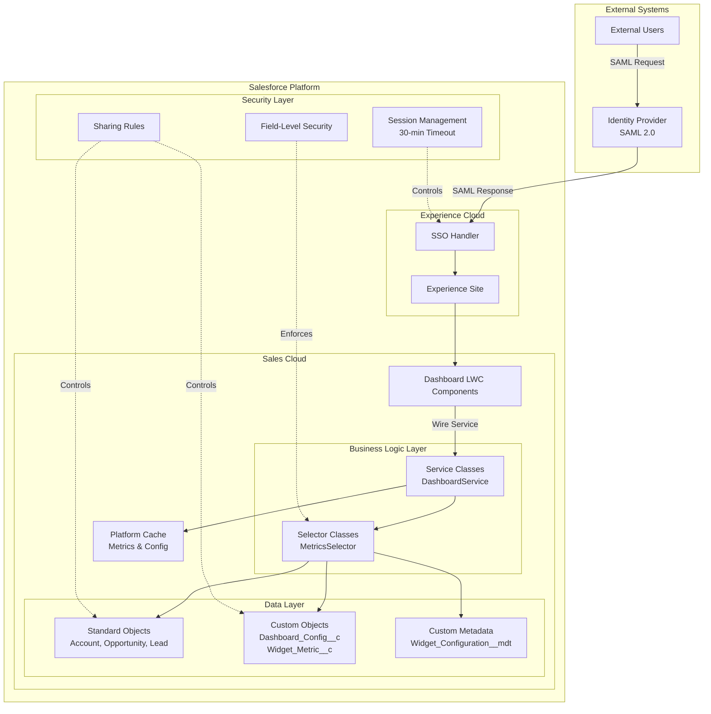
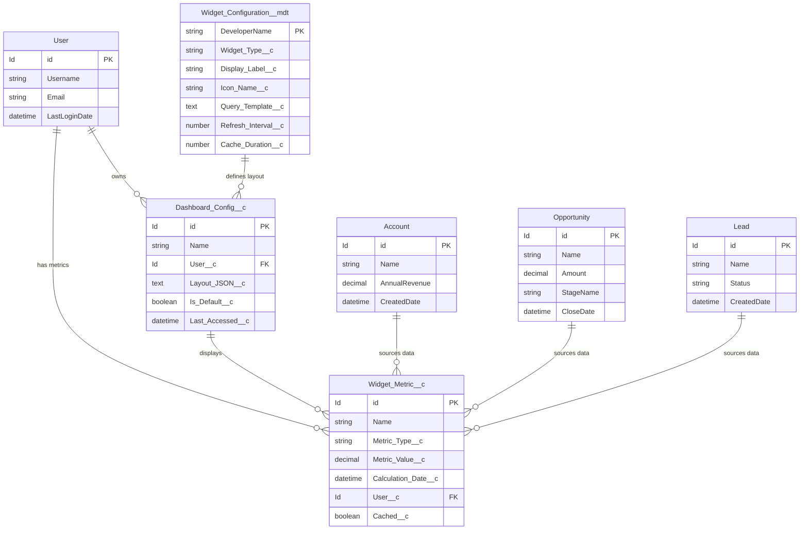
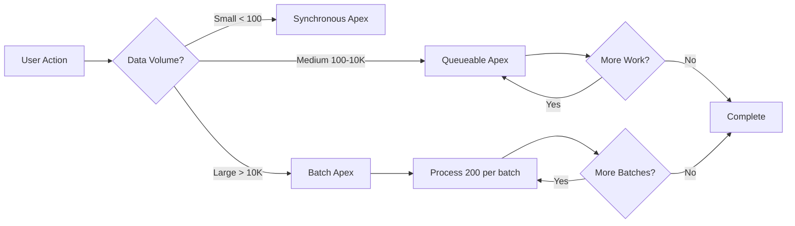
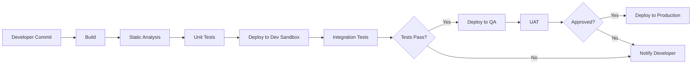

# Solution Design Document - Sales Cloud Implementation
**Version:** 1.0  
**Date:** 2026-03-01  
**Status:** Draft  
**Author:** Principal Salesforce Solution Architect AI

---

## 1. Executive Summary

### 1.1 Purpose
This Solution Design Document (SDD) provides the technical architecture and design specifications for implementing a Sales Cloud solution that addresses the functional and non-functional requirements outlined in the Business Requirements Document.

### 1.2 Scope
The solution encompasses:
- Single Sign-On (SSO) authentication with session management
- Real-time dashboard with customizable widgets
- Lightning Web Components (LWC) for UI
- Experience Cloud integration
- High-performance architecture meeting sub-2-second page loads

### 1.3 Key Architectural Decisions

| Decision ID | Decision | Rationale |
|-------------|----------|-----------|
| AD-001 | Use SAML 2.0 SSO with Identity Provider | Industry standard, supports 30-min session timeout, integrates with Salesforce natively |
| AD-002 | Lightning Web Components for Dashboard | Modern, performant, reusable components meeting <2s load requirement |
| AD-003 | Platform Cache for Dashboard Metrics | Reduces API calls, improves response time to <500ms |
| AD-004 | Custom Metadata Types for Widget Configuration | Declarative, deployable, user-customizable without code changes |
| AD-005 | Experience Cloud for External User Access | Seamless integration with Sales Cloud, supports SSO |

### 1.4 Technology Stack
- **Salesforce Edition:** Enterprise or Unlimited (for Platform Cache)
- **Clouds:** Sales Cloud, Experience Cloud
- **UI Framework:** Lightning Web Components (LWC)
- **Authentication:** SAML 2.0 SSO
- **Caching:** Platform Cache (Session/Org Cache)
- **Automation:** Flow Builder, Apex (where necessary)

---

## 2. High-Level Architecture

### 2.1 System Architecture Diagram



### 2.2 Component Overview

#### 2.2.1 Authentication Layer
- **Identity Provider Integration:** SAML 2.0 SSO configuration
- **Session Management:** Platform-level session timeout (30 minutes)
- **Experience Cloud SSO:** Seamless authentication for external users

#### 2.2.2 Presentation Layer
- **Dashboard LWC:** Primary dashboard component (`dashboardContainer`)
- **Widget LWCs:** Reusable widget components (`metricWidget`, `chartWidget`)
- **Configuration UI:** Admin interface for widget customization

#### 2.2.3 Business Logic Layer
- **Service Classes:** Business logic and orchestration
- **Selector Classes:** SOQL queries with FLS enforcement
- **Caching Strategy:** Platform Cache for frequently accessed data

#### 2.2.4 Data Layer
- **Standard Objects:** Leverage Account, Opportunity, Lead for metrics
- **Custom Objects:** Dashboard and widget configuration storage
- **Custom Metadata:** Deployable widget definitions

---

## 3. Data Model & Entity Relationship Diagram

### 3.1 Custom Objects

#### 3.1.1 Dashboard_Config__c
Stores user-specific dashboard configurations.

| Field API Name | Type | Description | Required |
|----------------|------|-------------|----------|
| Name | Text(80) | Auto-number: DC-{0000} | Yes |
| User__c | Lookup(User) | Dashboard owner | Yes |
| Layout_JSON__c | Long Text Area | Widget layout configuration | Yes |
| Is_Default__c | Checkbox | Default dashboard flag | No |
| Last_Accessed__c | DateTime | Last access timestamp | No |

**Sharing Model:** Private (Controlled by Owner)

#### 3.1.2 Widget_Metric__c
Stores calculated metrics and historical data for dashboard widgets.

| Field API Name | Type | Description | Required |
|----------------|------|-------------|----------|
| Name | Text(80) | Auto-number: WM-{0000} | Yes |
| Metric_Type__c | Picklist | Type of metric (Revenue, Pipeline, Conversion) | Yes |
| Metric_Value__c | Number(18,2) | Calculated metric value | Yes |
| Calculation_Date__c | DateTime | When metric was calculated | Yes |
| User__c | Lookup(User) | Associated user | No |
| Cached__c | Checkbox | Indicates if cached | No |

**Sharing Model:** Private with Sharing Rules

### 3.2 Custom Metadata Types

#### 3.2.1 Widget_Configuration__mdt
Defines available widget types and their properties.

| Field API Name | Type | Description |
|----------------|------|-------------|
| Widget_Type__c | Text(50) | Widget type identifier |
| Display_Label__c | Text(80) | User-facing label |
| Icon_Name__c | Text(50) | SLDS icon name |
| Query_Template__c | Long Text | SOQL query template |
| Refresh_Interval__c | Number(5,0) | Refresh interval (seconds) |
| Cache_Duration__c | Number(5,0) | Cache duration (seconds) |

### 3.3 Entity Relationship Diagram



---

## 4. Business Logic Design

### 4.1 Declarative vs. Programmatic Matrix

| Requirement | Implementation | Approach | Justification |
|-------------|----------------|----------|---------------|
| FR-001: SSO Login | SAML SSO Config | Declarative | Native Salesforce capability |
| FR-001: Session Timeout | Session Settings | Declarative | Platform configuration |
| FR-002: Dashboard Display | Lightning Web Component | Programmatic | Complex UI requirements |
| FR-002: Widget Customization | Custom Metadata + Flow | Hybrid | Deployable config + dynamic UI |
| Metric Calculation | Apex Scheduled Batch | Programmatic | Bulk processing required |
| Metric Caching | Platform Cache API | Programmatic | Performance optimization |
| Dashboard Layout Save | Record-Triggered Flow | Declarative | Simple DML operations |

### 4.2 Apex Design Patterns

#### 4.2.1 Trigger Framework
**Pattern:** Single Trigger per Object with Handler Class

**Structure:**
```
Triggers/
├── Widget_Metric__c.trigger (calls WidgetMetricTriggerHandler)
└── Dashboard_Config__c.trigger (calls DashboardConfigTriggerHandler)

Classes/
├── TriggerHandler.cls (abstract base class)
├── WidgetMetricTriggerHandler.cls
└── DashboardConfigTriggerHandler.cls
```

**Key Features:**
- Context-specific methods (beforeInsert, afterUpdate, etc.)
- Recursion prevention
- Bulkified operations (200+ records)

#### 4.2.2 Service Layer
**Purpose:** Business logic orchestration and transaction management

**Classes:**
- `DashboardService.cls` - Dashboard operations
- `MetricCalculationService.cls` - Metric calculations
- `CacheService.cls` - Platform Cache management
- `WidgetConfigService.cls` - Widget configuration logic

**Example Service Method:**
```apex
public class DashboardService {
    public static List<MetricWrapper> getRealtimeMetrics(Id userId, List<String> metricTypes) {
        // 1. Check cache first
        // 2. Query if not cached
        // 3. Calculate if needed
        // 4. Update cache
        // 5. Return results
    }
}
```

#### 4.2.3 Selector Layer
**Purpose:** SOQL queries with FLS enforcement and bulkification

**Classes:**
- `WidgetMetricSelector.cls`
- `DashboardConfigSelector.cls`
- `OpportunitySelector.cls`

**Key Features:**
- WITH SECURITY_ENFORCED or Security.stripInaccessible()
- Query optimization with selective filters
- Bulkified queries (no SOQL in loops)

### 4.3 Asynchronous Processing Strategy

| Process | Method | Frequency | Governor Limit Consideration |
|---------|--------|-----------|------------------------------|
| Metric Calculation | Scheduled Batch Apex | Every 15 minutes | 50,000 DML rows per batch |
| Cache Refresh | Queueable Apex | On-demand | Chain queueables for large datasets |
| Historical Metrics | Batch Apex | Daily at 2 AM | 10,000 records per batch execution |

---

## 5. UI Component Specifications

### 5.1 Lightning Web Components

#### 5.1.1 dashboardContainer (Parent Component)
**Purpose:** Main dashboard container managing layout and widget orchestration

**Properties:**
- `@api userId` - Current user ID
- `@track widgets` - Array of widget configurations
- `@track layoutMode` - 'view' or 'edit'

**Wire Services:**
- `@wire(getDashboardConfig)` - Fetches user dashboard configuration
- `@wire(getMessageContext)` - Lightning Message Service for inter-component communication

**Key Methods:**
- `handleWidgetRefresh(event)` - Refresh individual widget
- `handleLayoutChange(event)` - Save layout changes
- `handleAddWidget(event)` - Add new widget to dashboard

**Performance Considerations:**
- Lazy loading for off-screen widgets
- Virtual scrolling for large widget lists
- Debounced auto-save (500ms)

#### 5.1.2 metricWidget (Child Component)
**Purpose:** Reusable widget displaying a single metric

**Properties:**
- `@api widgetConfig` - Widget configuration object
- `@api refreshInterval` - Auto-refresh interval (seconds)
- `@track metricData` - Current metric data
- `@track loading` - Loading state

**Wire Services:**
- `@wire(getMetricData)` - Fetches metric data with caching

**Key Methods:**
- `refreshData()` - Manual refresh
- `connectedCallback()` - Initialize auto-refresh
- `disconnectedCallback()` - Cleanup timers

**Events:**
- `widgetrefresh` - Emitted when widget refreshes
- `widgeterror` - Emitted on error

#### 5.1.3 chartWidget (Child Component)
**Purpose:** Chart visualization widget using Chart.js

**Properties:**
- `@api chartType` - 'bar', 'line', 'pie', 'donut'
- `@api chartData` - Chart data object
- `@api chartOptions` - Chart configuration

**Third-Party Library:**
- Chart.js (loaded via static resource)

### 5.2 Component Communication

**Lightning Message Service (LMS):**
- Channel: `DashboardMessageChannel__c`
- Messages:
  - `refreshAllWidgets` - Refresh all dashboard widgets
  - `widgetUpdated` - Notify widget configuration change
  - `metricCalculated` - Broadcast new metric calculation

---

## 6. Integration Architecture

### 6.1 SSO Integration

#### 6.1.1 SAML 2.0 Configuration
**Identity Provider:** External IdP (e.g., Okta, Azure AD, Ping Identity)

**Configuration Steps:**
1. Create Connected App with SAML enabled
2. Configure Entity ID and ACS URL
3. Map SAML attributes to Salesforce user fields
4. Enable Just-in-Time (JIT) provisioning (if needed)

**Attribute Mapping:**
- `User.Email` ← SAML `email`
- `User.FirstName` ← SAML `firstName`
- `User.LastName` ← SAML `lastName`
- `User.Username` ← SAML `username`

**Session Management:**
- Session timeout: 30 minutes (configured in Session Settings)
- Session security level: High Assurance
- Lock sessions to IP address: Enabled (recommended)

#### 6.1.2 Named Credentials
**Purpose:** Secure credential storage for external integrations

**Named Credential: External_IdP**
- URL: `https://idp.company.com`
- Identity Type: Named Principal
- Authentication Protocol: OAuth 2.0
- Scope: `openid profile email`

### 6.2 API Design

#### 6.2.1 Apex REST API for Metrics
**Purpose:** Expose metric data for external consumption

**Endpoint:** `/services/apexrest/dashboard/v1/metrics`

**Methods:**
- `GET /metrics?userId={userId}&types={metricTypes}` - Retrieve metrics
- `POST /metrics/calculate` - Trigger metric calculation

**Response Time Requirement:** <500ms (NFR-001)

**Optimization Strategies:**
- Platform Cache for frequently requested metrics
- Pagination (max 200 records per response)
- Field filtering (only return requested fields)

**Example Response:**
```json
{
  "success": true,
  "metrics": [
    {
      "id": "a001234567890ABC",
      "type": "Revenue",
      "value": 1250000.00,
      "calculatedDate": "2026-03-01T14:30:00Z",
      "cached": true
    }
  ],
  "responseTime": 245
}
```

### 6.3 Platform Events (Future Enhancement)
**Purpose:** Real-time metric updates

**Platform Event: Metric_Calculated__e**
- `User_Id__c` (Text)
- `Metric_Type__c` (Text)
- `Metric_Value__c` (Number)
- `Calculation_Timestamp__c` (DateTime)

---

## 7. Security Architecture

### 7.1 Authentication & Authorization

#### 7.1.1 User Profiles
**Sales Cloud User Profile:**
- Object Permissions: Read/Edit on Dashboard_Config__c, Widget_Metric__c
- Tab Access: Dashboard, Reports
- App Access: Sales Console

**Experience Cloud User Profile:**
- Object Permissions: Read on Dashboard_Config__c, Widget_Metric__c (own records)
- Tab Access: Dashboard
- App Access: Experience Site

#### 7.1.2 Permission Sets
**Permission Set: Dashboard_Administrator**
- Manage all Dashboard_Config__c records
- Manage Widget_Configuration__mdt
- Access to Apex classes: DashboardService, MetricCalculationService

**Permission Set: Dashboard_Power_User**
- Create/Edit own Dashboard_Config__c
- Read all Widget_Configuration__mdt
- Access to LWC components

### 7.2 Object & Field-Level Security

#### 7.2.1 Dashboard_Config__c
| Field | Sales User | Experience User | Admin |
|-------|------------|-----------------|-------|
| User__c | Read (Own) | Read (Own) | Read/Edit (All) |
| Layout_JSON__c | Read/Edit (Own) | Read/Edit (Own) | Read/Edit (All) |
| Is_Default__c | Read (Own) | Read (Own) | Read/Edit (All) |

#### 7.2.2 Widget_Metric__c
| Field | Sales User | Experience User | Admin |
|-------|------------|-----------------|-------|
| Metric_Type__c | Read (All) | Read (Own) | Read/Edit (All) |
| Metric_Value__c | Read (All) | Read (Own) | Read/Edit (All) |
| User__c | Read (All) | Read (Own) | Read/Edit (All) |

### 7.3 Sharing Rules

**Dashboard_Config__c Sharing Rule: Manager_Access**
- Share with: Role and Subordinates
- Access Level: Read Only
- Reason: Managers view team dashboards

**Widget_Metric__c Sharing Rule: Team_Metrics**
- Share with: Public Group "Sales Team"
- Access Level: Read Only
- Reason: Team-wide metric visibility

### 7.4 Data Security

#### 7.4.1 Platform Cache Partitions
**Session Cache Partition: DashboardCache (Org)**
- Capacity: 10 MB
- Purpose: Store user-specific metric data
- TTL: 300 seconds (5 minutes)

**Org Cache Partition: SharedMetricsCache**
- Capacity: 30 MB
- Purpose: Store shared/aggregated metrics
- TTL: 900 seconds (15 minutes)

#### 7.4.2 Apex Security Enforcement
All Selector classes use:
```apex
// Option 1: SOQL-level enforcement
SELECT Id, Name FROM Widget_Metric__c WITH SECURITY_ENFORCED

// Option 2: Post-query stripping
SObjectAccessDecision decision = Security.stripInaccessible(
    AccessType.READABLE, 
    [SELECT Id, Name FROM Widget_Metric__c]
);
```

### 7.5 Salesforce Shield (Optional Enhancement)
**Platform Encryption:**
- Encrypt `Layout_JSON__c` field (contains sensitive layout data)
- Encrypt `Metric_Value__c` field (contains business-critical metrics)

**Event Monitoring:**
- Track API usage for REST endpoints
- Monitor login patterns for SSO
- Alert on excessive query volume

---

## 8. Performance Optimization & Governor Limits

### 8.1 Performance Requirements

| Requirement | Target | Mitigation Strategy |
|-------------|--------|---------------------|
| Page Load Time | <2 seconds | LWC lazy loading, Platform Cache, CDN for static resources |
| API Response Time | <500ms | Platform Cache, indexed queries, selective SOQL |
| Dashboard Refresh | <1 second | Incremental refresh, cached metrics |
| Concurrent Users | 500+ | Asynchronous processing, queueable chains |

### 8.2 Governor Limit Strategy

#### 8.2.1 SOQL Queries (Limit: 100 per transaction)
**Mitigation:**
- Selector pattern with bulkified queries
- Aggregate parent-child data in single query
- Use Platform Cache to reduce query count
- Implement query result caching in service layer

**Example Bulkified Query:**
```apex
// BAD: Query in loop (100 queries for 100 users)
for (User u : users) {
    List<Widget_Metric__c> metrics = [SELECT Id FROM Widget_Metric__c WHERE User__c = :u.Id];
}

// GOOD: Single query with IN clause
Set<Id> userIds = new Map<Id, User>(users).keySet();
List<Widget_Metric__c> metrics = [
    SELECT Id, User__c 
    FROM Widget_Metric__c 
    WHERE User__c IN :userIds
];
```

#### 8.2.2 DML Statements (Limit: 150 per transaction)
**Mitigation:**
- Batch all DML operations
- Use Database.insert/update with allOrNone=false for partial success
- Implement upsert where appropriate

#### 8.2.3 Heap Size (Limit: 6 MB synchronous, 12 MB asynchronous)
**Mitigation:**
- Process large datasets in batches (Batch Apex)
- Clear large collections after processing
- Use iterators instead of lists for large queries

#### 8.2.4 CPU Time (Limit: 10,000ms synchronous, 60,000ms asynchronous)
**Mitigation:**
- Move complex calculations to Queueable/Batch Apex
- Optimize loops and algorithms
- Use aggregate SOQL instead of Apex calculations

### 8.3 Asynchronous Processing Architecture



**MetricCalculationBatch (Batch Apex):**
- Batch Size: 200 records
- Scope: All Widget_Metric__c records requiring recalculation
- Schedule: Every 15 minutes via Scheduled Apex

**CacheRefreshQueueable (Queueable Apex):**
- Purpose: Refresh Platform Cache for active users
- Chaining: Up to 50 chained jobs
- Trigger: On-demand or scheduled

### 8.4 Indexing Strategy

**Custom Indexes:**
1. `Widget_Metric__c.User__c` + `Widget_Metric__c.Calculation_Date__c` (Composite)
2. `Dashboard_Config__c.User__c` + `Dashboard_Config__c.Is_Default__c` (Composite)
3. `Widget_Metric__c.Metric_Type__c` (Single field)

**Skinny Tables (if needed):**
- Consider for Widget_Metric__c if query performance degrades with >1M records

---

## 9. DevOps & Deployment Strategy

### 9.1 Sandbox Strategy

| Sandbox Type | Purpose | Refresh Frequency | Data Volume |
|--------------|---------|-------------------|-------------|
| Developer Pro | Individual development | Weekly | Partial (10K records) |
| Partial Copy | Integration testing | Bi-weekly | Partial (100K records) |
| Full Sandbox | UAT & Performance testing | Monthly | Full production copy |

### 9.2 CI/CD Pipeline

**Tools:**
- Source Control: Git (GitHub/GitLab/Bitbucket)
- CI/CD Platform: Salesforce CLI + GitHub Actions / Jenkins
- Static Analysis: PMD, ESLint for LWC
- Testing: Apex Test Framework, Jest for LWC

**Pipeline Stages:**


### 9.3 Deployment Checklist

**Pre-Deployment:**
- [ ] All Apex tests pass (>75% code coverage)
- [ ] LWC Jest tests pass (>80% coverage)
- [ ] Static analysis shows no critical issues
- [ ] UAT sign-off received
- [ ] Rollback plan documented

**Deployment Order:**
1. Custom Metadata Types (Widget_Configuration__mdt)
2. Custom Objects (Dashboard_Config__c, Widget_Metric__c)
3. Apex Classes (Selectors → Services → Handlers)
4. Apex Triggers
5. Lightning Web Components
6. Profiles & Permission Sets
7. Sharing Rules
8. Experience Cloud Site configuration
9. SSO/SAML configuration
10. Data migration (if applicable)

**Post-Deployment:**
- [ ] Smoke tests executed
- [ ] Monitor debug logs for errors
- [ ] Validate SSO functionality
- [ ] Test dashboard load time (<2s)
- [ ] Test API response time (<500ms)
- [ ] Enable scheduled jobs

### 9.4 Version Control Strategy

**Branching Model:** GitFlow
- `main` - Production code
- `develop` - Integration branch
- `feature/*` - Feature development
- `release/*` - Release preparation
- `hotfix/*` - Production hotfixes

**Commit Standards:**
- Prefix: `[FEATURE]`, `[BUGFIX]`, `[HOTFIX]`, `[REFACTOR]`
- Include Jira ticket number
- Example: `[FEATURE] PROJ-123: Implement dashboard caching`

---

## 10. Module Breakdown (High-Level)

This section provides a rough breakdown of implementation modules. **Detailed Jira tickets will be created in Sprint Planning.**

### 10.1 Module 1: Authentication & Security Foundation
**Estimated Effort:** 2 weeks

**Components:**
- SSO/SAML configuration with Identity Provider
- Session management setup (30-min timeout)
- User profiles and permission sets
- Experience Cloud site setup with SSO
- Field-level security configuration

**Dependencies:** Identity Provider access and configuration details

---

### 10.2 Module 2: Data Model Implementation
**Estimated Effort:** 1.5 weeks

**Components:**
- Create Dashboard_Config__c custom object
- Create Widget_Metric__c custom object
- Create Widget_Configuration__mdt custom metadata type
- Configure sharing rules
- Create custom indexes
- Load initial Widget_Configuration__mdt records

**Dependencies:** None

---

### 10.3 Module 3: Business Logic Layer
**Estimated Effort:** 3 weeks

**Components:**
- Trigger framework (TriggerHandler base class)
- Widget_Metric__c trigger and handler
- Dashboard_Config__c trigger and handler
- Selector classes (WidgetMetricSelector, DashboardConfigSelector, OpportunitySelector)
- Service classes (DashboardService, MetricCalculationService, CacheService, WidgetConfigService)
- Platform Cache implementation
- Apex unit tests (>75% coverage)

**Dependencies:** Module 2 (Data Model)

---

### 10.4 Module 4: Asynchronous Processing
**Estimated Effort:** 2 weeks

**Components:**
- MetricCalculationBatch (Batch Apex)
- CacheRefreshQueueable (Queueable Apex)
- Scheduled Apex jobs
- Error handling and logging
- Batch monitoring dashboard

**Dependencies:** Module 3 (Business Logic)

---

### 10.5 Module 5: Lightning Web Components
**Estimated Effort:** 3 weeks

**Components:**
- dashboardContainer LWC
- metricWidget LWC
- chartWidget LWC
- widgetConfigurator LWC (admin tool)
- Lightning Message Service channel
- Static resources (Chart.js)
- LWC Jest tests (>80% coverage)

**Dependencies:** Module 3 (Business Logic)

---

### 10.6 Module 6: API & Integration Layer
**Estimated Effort:** 1.5 weeks

**Components:**
- Apex REST API for metrics endpoint
- Named Credential for external IdP
- API response caching
- API rate limiting
- API documentation
- Postman collection for testing

**Dependencies:** Module 3 (Business Logic)

---

### 10.7 Module 7: Performance Optimization
**Estimated Effort:** 1 week

**Components:**
- Platform Cache tuning
- Query optimization and indexing
- LWC lazy loading implementation
- API response time optimization
- Load testing (500+ concurrent users)
- Performance monitoring setup

**Dependencies:** Modules 3, 4, 5, 6

---

### 10.8 Module 8: UAT & Deployment
**Estimated Effort:** 2 weeks

**Components:**
- UAT environment setup
- Test data creation
- UAT test case execution
- Bug fixes
- Production deployment
- Post-deployment validation
- User training materials

**Dependencies:** All previous modules

---

## 11. Testing Strategy

### 11.1 Test Coverage Requirements

| Layer | Coverage Target | Tool |
|-------|----------------|------|
| Apex Classes | >75% (aim for 85%) | Apex Test Framework |
| Apex Triggers | 100% | Apex Test Framework |
| LWC Components | >80% | Jest |
| Integration APIs | 100% of endpoints | Postman / REST Assured |

### 11.2 Test Data Strategy

**Test Data Factory:**
- `TestDataFactory.cls` - Centralized test data creation
- Methods for each object type
- Bulkified data creation (200+ records for governor limit testing)

**Example:**
```apex
public class TestDataFactory {
    public static List<Widget_Metric__c> createWidgetMetrics(Integer count, Id userId) {
        List<Widget_Metric__c> metrics = new List<Widget_Metric__c>();
        for (Integer i = 0; i < count; i++) {
            metrics.add(new Widget_Metric__c(
                Metric_Type__c = 'Revenue',
                Metric_Value__c = 1000 * i,
                User__c = userId,
                Calculation_Date__c = System.now()
            ));
        }
        return metrics;
    }
}
```

### 11.3 Performance Testing

**Load Testing Scenarios:**
1. 500 concurrent users accessing dashboard
2. 1000 metric calculations per minute
3. 100 simultaneous API requests
4. Dashboard with 20+ widgets loading

**Tools:**
- Salesforce Event Monitoring
- Custom Apex performance logging
- Browser DevTools (for LWC performance)

---

## 12. Risks & Mitigation

| Risk ID | Risk Description | Impact | Probability | Mitigation Strategy |
|---------|------------------|--------|-------------|---------------------|
| R-001 | IdP integration delays | High | Medium | Start SSO configuration early; have fallback authentication |
| R-002 | Platform Cache limits exceeded | Medium | Low | Monitor cache usage; implement cache eviction strategy |
| R-003 | Governor limits on metric calculation | High | Medium | Implement batch processing; optimize queries |
| R-004 | <2s page load not achievable | High | Low | Implement lazy loading; use CDN; optimize LWC |
| R-005 | Experience Cloud license costs | Medium | Low | Confirm license allocation before development |
| R-006 | Data migration complexity | Medium | Medium | Plan migration strategy early; use Data Loader |

---

## 13. Assumptions & Dependencies

### 13.1 Assumptions
1. Identity Provider supports SAML 2.0
2. Salesforce Enterprise or Unlimited edition (for Platform Cache)
3. Experience Cloud licenses are available for external users
4. Users have modern browsers (Chrome, Firefox, Edge, Safari latest versions)
5. Initial data volume: <100K Widget_Metric__c records
6. Average of 10 widgets per dashboard

### 13.2 Dependencies
1. **External:** Identity Provider configuration access
2. **Internal:** Salesforce licenses provisioned
3. **Technical:** Experience Cloud site creation permissions
4. **Data:** Historical metrics data for migration (if applicable)
5. **Resources:** Access to Sales Cloud and Experience Cloud environments

---

## 14. Appendices

### 14.1 Glossary

| Term | Definition |
|------|------------|
| SSO | Single Sign-On - Authentication method allowing access with one set of credentials |
| SAML | Security Assertion Markup Language - XML-based authentication standard |
| LWC | Lightning Web Component - Salesforce's modern UI framework |
| FLS | Field-Level Security - Salesforce security controlling field access |
| IdP | Identity Provider - System that creates, maintains, and manages identity information |
| Platform Cache | Salesforce's in-memory caching layer for improved performance |

### 14.2 Reference Documents
- Business Requirements Document (test_brd.md)
- Architecture Guidelines (architecture_guidelines.md)
- Salesforce Lightning Web Components Developer Guide
- Salesforce Security Implementation Guide
- Salesforce Governor Limits Quick Reference

### 14.3 Document Version History

| Version | Date | Author | Changes |
|---------|------|--------|---------|
| 1.0 | 2026-03-01 | Principal SA AI | Initial draft |

---

## 15. Approval & Sign-Off

| Role | Name | Signature | Date |
|------|------|-----------|------|
| Solution Architect | [Pending] | | |
| Technical Lead | [Pending] | | |
| Product Owner | [Pending] | | |
| Security Architect | [Pending] | | |

---

**END OF SOLUTION DESIGN DOCUMENT**
