# Technical Architecture Diagrams - Sales Cloud Dashboard Solution
**Version:** 1.0  
**Date:** 2026-03-01  
**Related Documents:** solution_design_document_v1.md, entity_relationship_diagram.md

---

## 1. Overview

This document provides detailed technical architecture diagrams including component interactions, data flows, security architecture, and deployment topology for the Sales Cloud Dashboard implementation.

---

## 2. Component Architecture

### 2.1 Layered Architecture Diagram

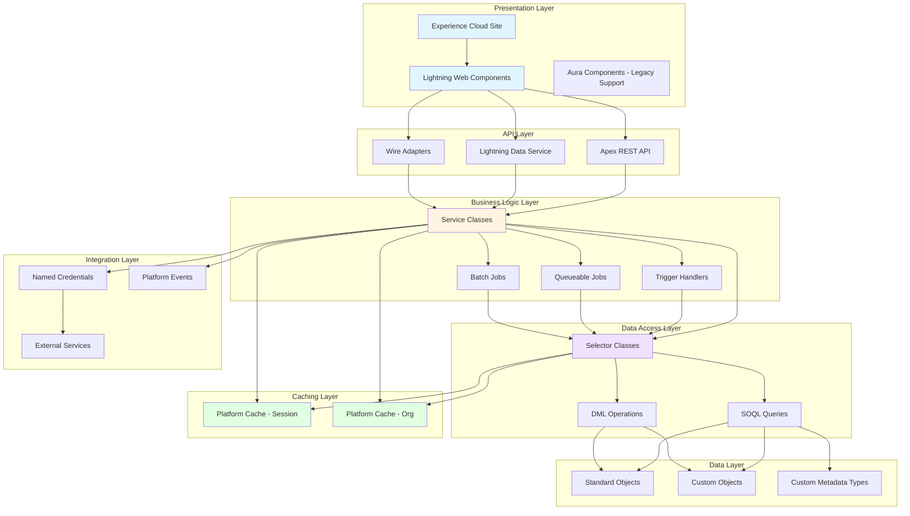
```mermaid
graph TB
    subgraph "Presentation Layer"
        A[Experience Cloud Site]
        B[Lightning Web Components]
        C[Aura Components - Legacy Support]
    end
    
    subgraph "API Layer"
        D[Apex REST API]
        E[Lightning Data Service]
        F[Wire Adapters]
    end
    
    subgraph "Business Logic Layer"
        G[Service Classes]
        H[Trigger Handlers]
        I[Queueable Jobs]
        J[Batch Jobs]
    end
    
    subgraph "Data Access Layer"
        K[Selector Classes]
        L[SOQL Queries]
        M[DML Operations]
    end
    
    subgraph "Caching Layer"
        N[Platform Cache - Session]
        O[Platform Cache - Org]
    end
    
    subgraph "Data Layer"
        P[Standard Objects]
        Q[Custom Objects]
        R[Custom Metadata Types]
    end
    
    subgraph "Integration Layer"
        S[Named Credentials]
        T[External Services]
        U[Platform Events]
    end
    
    A --> B
    B --> D
    B --> E
    B --> F
    
    D --> G
    E --> G
    F --> G
    
    G --> H
    G --> I
    G --> J
    G --> K
    
    H --> K
    I --> K
    J --> K
    
    K --> L
    K --> M
    
    G --> N
    G --> O
    K --> N
    K --> O
    
    L --> P
    L --> Q
    L --> R
    M --> P
    M --> Q
    
    G --> S
    S --> T
    G --> U
    
    style A fill:#e1f5ff
    style B fill:#e1f5ff
    style G fill:#fff4e1
    style K fill:#f0e1ff
    style N fill:#e1ffe1
    style O fill:#e1ffe1
```

### 2.2 Component Interaction Sequence

#### 2.2.1 Dashboard Load Sequence

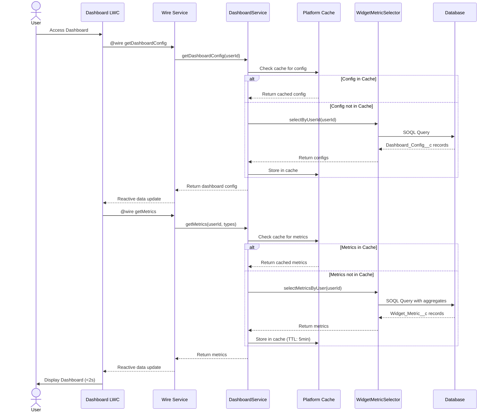
```mermaid
sequenceDiagram
    actor User
    participant LWC as Dashboard LWC
    participant Wire as Wire Service
    participant Service as DashboardService
    participant Cache as Platform Cache
    participant Selector as WidgetMetricSelector
    participant DB as Database
    
    User->>LWC: Access Dashboard
    LWC->>Wire: @wire getDashboardConfig
    Wire->>Service: getDashboardConfig(userId)
    Service->>Cache: Check cache for config
    
    alt Config in Cache
        Cache-->>Service: Return cached config
    else Config not in Cache
        Service->>Selector: selectByUserId(userId)
        Selector->>DB: SOQL Query
        DB-->>Selector: Dashboard_Config__c records
        Selector-->>Service: Return configs
        Service->>Cache: Store in cache
    end
    
    Service-->>Wire: Return dashboard config
    Wire-->>LWC: Reactive data update
    
    LWC->>Wire: @wire getMetrics
    Wire->>Service: getMetrics(userId, types)
    Service->>Cache: Check cache for metrics
    
    alt Metrics in Cache
        Cache-->>Service: Return cached metrics
    else Metrics not in Cache
        Service->>Selector: selectMetricsByUser(userId)
        Selector->>DB: SOQL Query with aggregates
        DB-->>Selector: Widget_Metric__c records
        Selector-->>Service: Return metrics
        Service->>Cache: Store in cache (TTL: 5min)
    end
    
    Service-->>Wire: Return metrics
    Wire-->>LWC: Reactive data update
    LWC->>User: Display Dashboard (<2s)
```

#### 2.2.2 Metric Calculation Sequence

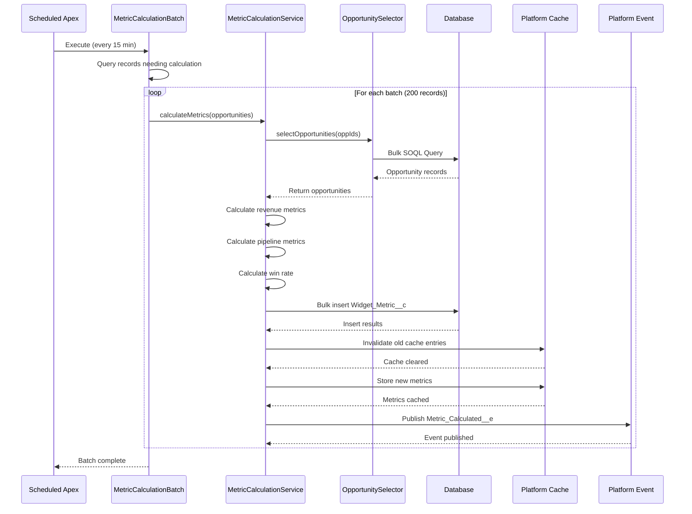
```mermaid
sequenceDiagram
    participant Scheduler as Scheduled Apex
    participant Batch as MetricCalculationBatch
    participant Service as MetricCalculationService
    participant Selector as OpportunitySelector
    participant DB as Database
    participant Cache as Platform Cache
    participant Event as Platform Event
    
    Scheduler->>Batch: Execute (every 15 min)
    Batch->>Batch: Query records needing calculation
    
    loop For each batch (200 records)
        Batch->>Service: calculateMetrics(opportunities)
        Service->>Selector: selectOpportunities(oppIds)
        Selector->>DB: Bulk SOQL Query
        DB-->>Selector: Opportunity records
        Selector-->>Service: Return opportunities
        
        Service->>Service: Calculate revenue metrics
        Service->>Service: Calculate pipeline metrics
        Service->>Service: Calculate win rate
        
        Service->>DB: Bulk insert Widget_Metric__c
        DB-->>Service: Insert results
        
        Service->>Cache: Invalidate old cache entries
        Cache-->>Service: Cache cleared
        
        Service->>Cache: Store new metrics
        Cache-->>Service: Metrics cached
        
        Service->>Event: Publish Metric_Calculated__e
        Event-->>Service: Event published
    end
    
    Batch-->>Scheduler: Batch complete
```

#### 2.2.3 SSO Authentication Flow

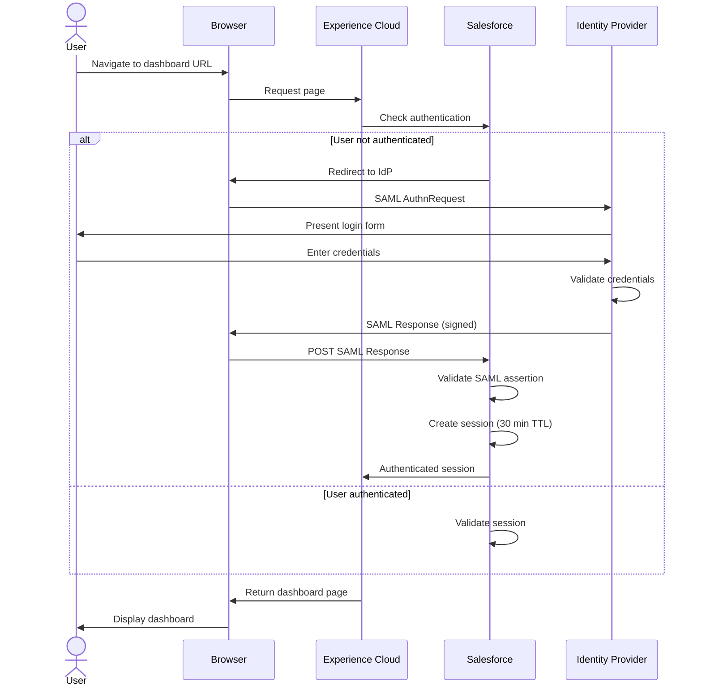
```mermaid
sequenceDiagram
    actor User
    participant Browser
    participant ExpCloud as Experience Cloud
    participant SFDC as Salesforce
    participant IDP as Identity Provider
    
    User->>Browser: Navigate to dashboard URL
    Browser->>ExpCloud: Request page
    ExpCloud->>SFDC: Check authentication
    
    alt User not authenticated
        SFDC->>Browser: Redirect to IdP
        Browser->>IDP: SAML AuthnRequest
        IDP->>User: Present login form
        User->>IDP: Enter credentials
        IDP->>IDP: Validate credentials
        IDP->>Browser: SAML Response (signed)
        Browser->>SFDC: POST SAML Response
        SFDC->>SFDC: Validate SAML assertion
        SFDC->>SFDC: Create session (30 min TTL)
        SFDC->>ExpCloud: Authenticated session
    else User authenticated
        SFDC->>SFDC: Validate session
    end
    
    ExpCloud->>Browser: Return dashboard page
    Browser->>User: Display dashboard
```

---

## 3. Data Flow Diagrams

### 3.1 Real-Time Metric Data Flow

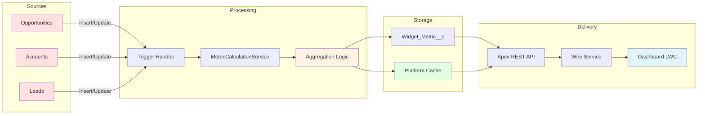
```mermaid
graph LR
    subgraph Sources
        A[Opportunities]
        B[Accounts]
        C[Leads]
    end
    
    subgraph Processing
        D[Trigger Handler]
        E[MetricCalculationService]
        F[Aggregation Logic]
    end
    
    subgraph Storage
        G[Widget_Metric__c]
        H[Platform Cache]
    end
    
    subgraph Delivery
        I[Apex REST API]
        J[Wire Service]
        K[Dashboard LWC]
    end
    
    A -->|Insert/Update| D
    B -->|Insert/Update| D
    C -->|Insert/Update| D
    
    D --> E
    E --> F
    F --> G
    F --> H
    
    G --> I
    H --> I
    I --> J
    J --> K
    
    style A fill:#ffe1e1
    style B fill:#ffe1e1
    style C fill:#ffe1e1
    style F fill:#fff4e1
    style H fill:#e1ffe1
    style K fill:#e1f5ff
```

### 3.2 Dashboard Configuration Data Flow

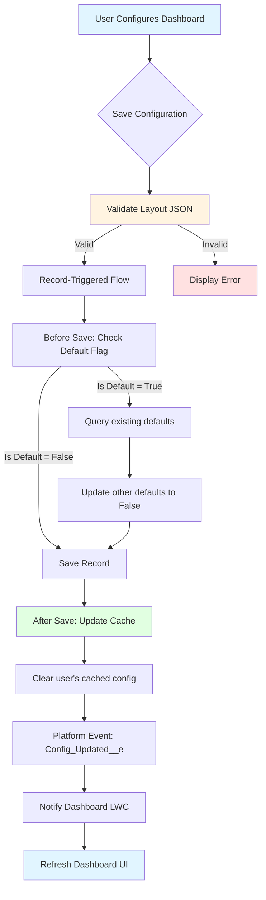
```mermaid
graph TD
    A[User Configures Dashboard] --> B{Save Configuration}
    B --> C[Validate Layout JSON]
    C -->|Valid| D[Record-Triggered Flow]
    C -->|Invalid| E[Display Error]
    
    D --> F[Before Save: Check Default Flag]
    F -->|Is Default = True| G[Query existing defaults]
    F -->|Is Default = False| I[Save Record]
    
    G --> H[Update other defaults to False]
    H --> I
    
    I --> J[After Save: Update Cache]
    J --> K[Clear user's cached config]
    K --> L[Platform Event: Config_Updated__e]
    L --> M[Notify Dashboard LWC]
    M --> N[Refresh Dashboard UI]
    
    style A fill:#e1f5ff
    style C fill:#fff4e1
    style E fill:#ffe1e1
    style J fill:#e1ffe1
    style N fill:#e1f5ff
```

---

## 4. Security Architecture

### 4.1 Security Layers Diagram

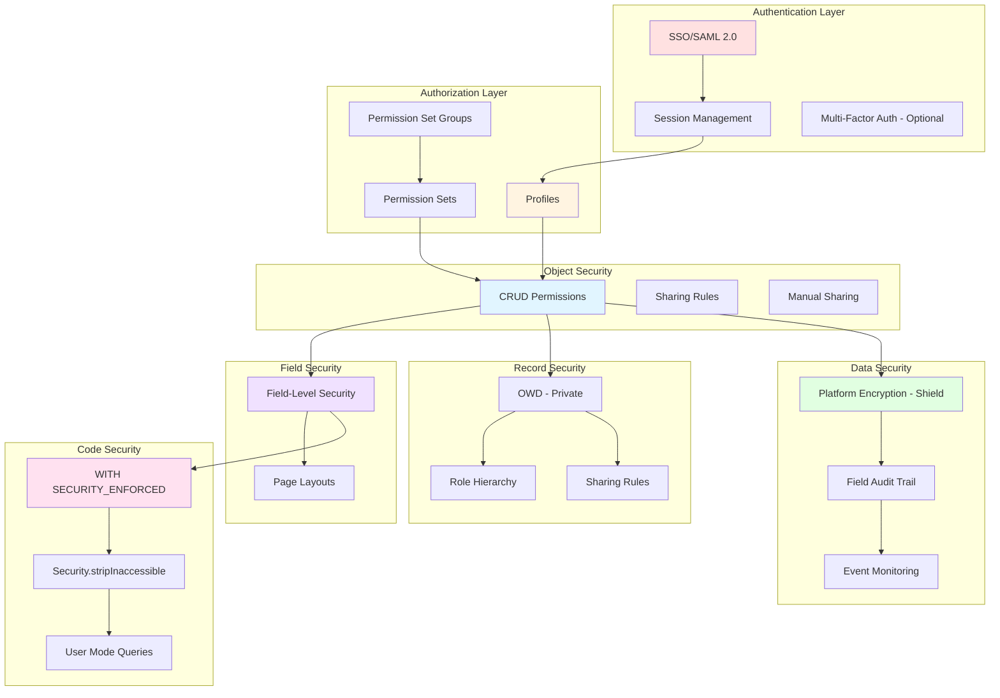
```mermaid
graph TB
    subgraph "Authentication Layer"
        A[SSO/SAML 2.0]
        B[Session Management]
        C[Multi-Factor Auth - Optional]
    end
    
    subgraph "Authorization Layer"
        D[Profiles]
        E[Permission Sets]
        F[Permission Set Groups]
    end
    
    subgraph "Object Security"
        G[CRUD Permissions]
        H[Sharing Rules]
        I[Manual Sharing]
    end
    
    subgraph "Field Security"
        J[Field-Level Security]
        K[Page Layouts]
    end
    
    subgraph "Record Security"
        L[OWD - Private]
        M[Role Hierarchy]
        N[Sharing Rules]
    end
    
    subgraph "Data Security"
        O[Platform Encryption - Shield]
        P[Field Audit Trail]
        Q[Event Monitoring]
    end
    
    subgraph "Code Security"
        R[WITH SECURITY_ENFORCED]
        S[Security.stripInaccessible]
        T[User Mode Queries]
    end
    
    A --> B
    B --> D
    D --> G
    E --> G
    F --> E
    
    G --> J
    G --> L
    
    J --> K
    L --> M
    L --> N
    
    G --> O
    O --> P
    P --> Q
    
    J --> R
    R --> S
    S --> T
    
    style A fill:#ffe1e1
    style D fill:#fff4e1
    style G fill:#e1f5ff
    style J fill:#f0e1ff
    style O fill:#e1ffe1
    style R fill:#ffe1f0
```

### 4.2 Permission Model

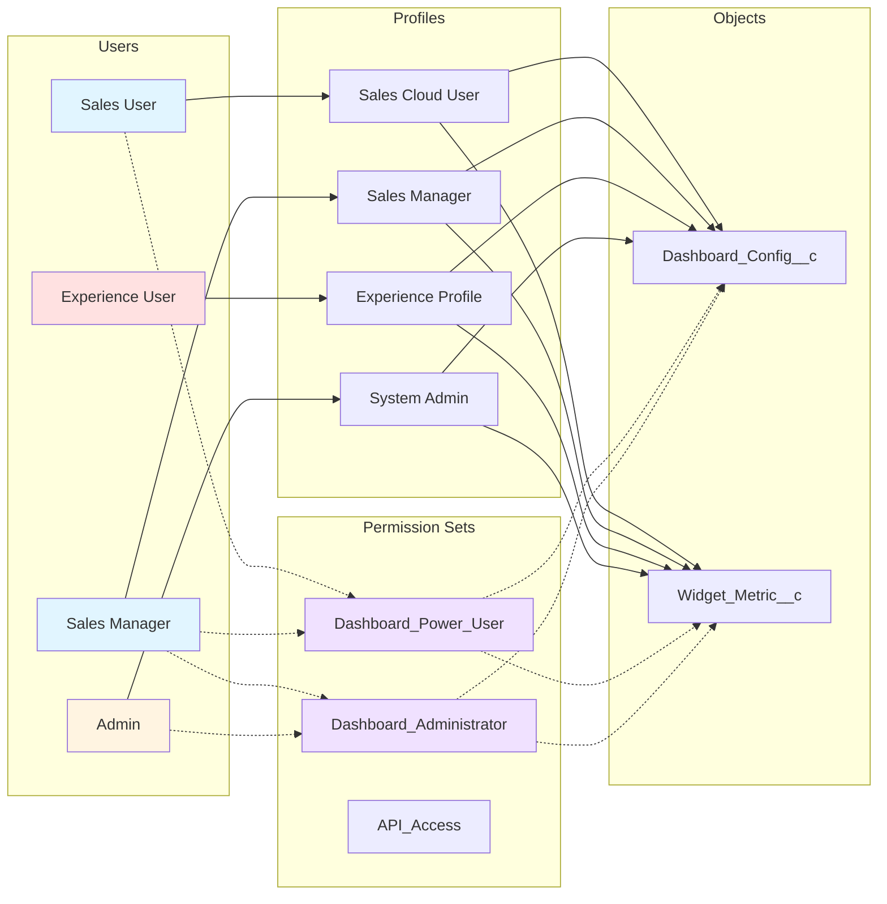
```mermaid
graph LR
    subgraph Users
        U1[Sales User]
        U2[Sales Manager]
        U3[Experience User]
        U4[Admin]
    end
    
    subgraph Profiles
        P1[Sales Cloud User]
        P2[Sales Manager]
        P3[Experience Profile]
        P4[System Admin]
    end
    
    subgraph Permission Sets
        PS1[Dashboard_Power_User]
        PS2[Dashboard_Administrator]
        PS3[API_Access]
    end
    
    subgraph Objects
        O1[Dashboard_Config__c]
        O2[Widget_Metric__c]
    end
    
    U1 --> P1
    U2 --> P2
    U3 --> P3
    U4 --> P4
    
    U1 -.-> PS1
    U2 -.-> PS1
    U2 -.-> PS2
    U4 -.-> PS2
    
    P1 --> O1
    P1 --> O2
    P2 --> O1
    P2 --> O2
    P3 --> O1
    P3 --> O2
    P4 --> O1
    P4 --> O2
    
    PS1 -.-> O1
    PS1 -.-> O2
    PS2 -.-> O1
    PS2 -.-> O2
    
    style U1 fill:#e1f5ff
    style U2 fill:#e1f5ff
    style U3 fill:#ffe1e1
    style U4 fill:#fff4e1
    style PS1 fill:#f0e1ff
    style PS2 fill:#f0e1ff
```

---

## 5. Deployment Architecture

### 5.1 Sandbox Strategy

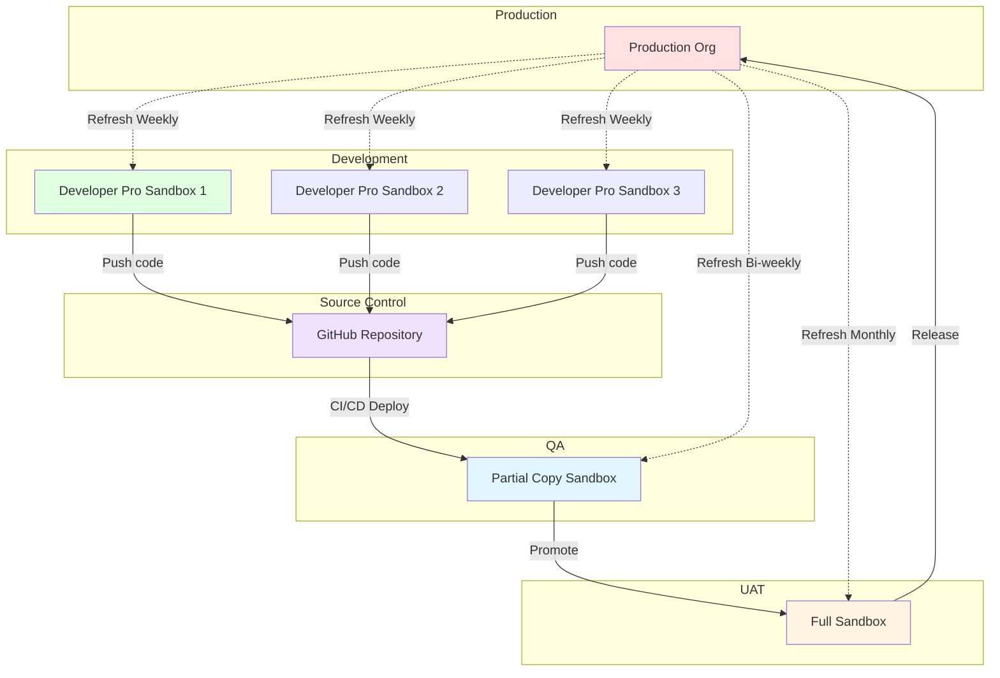
```mermaid
graph TB
    subgraph Production
        PROD[Production Org]
    end
    
    subgraph UAT
        UAT1[Full Sandbox]
    end
    
    subgraph QA
        QA1[Partial Copy Sandbox]
    end
    
    subgraph Development
        DEV1[Developer Pro Sandbox 1]
        DEV2[Developer Pro Sandbox 2]
        DEV3[Developer Pro Sandbox 3]
    end
    
    subgraph Source Control
        GIT[GitHub Repository]
    end
    
    DEV1 -->|Push code| GIT
    DEV2 -->|Push code| GIT
    DEV3 -->|Push code| GIT
    
    GIT -->|CI/CD Deploy| QA1
    QA1 -->|Promote| UAT1
    UAT1 -->|Release| PROD
    
    PROD -.->|Refresh Monthly| UAT1
    PROD -.->|Refresh Bi-weekly| QA1
    PROD -.->|Refresh Weekly| DEV1
    PROD -.->|Refresh Weekly| DEV2
    PROD -.->|Refresh Weekly| DEV3
    
    style PROD fill:#ffe1e1
    style UAT1 fill:#fff4e1
    style QA1 fill:#e1f5ff
    style DEV1 fill:#e1ffe1
    style GIT fill:#f0e1ff
```

### 5.2 CI/CD Pipeline

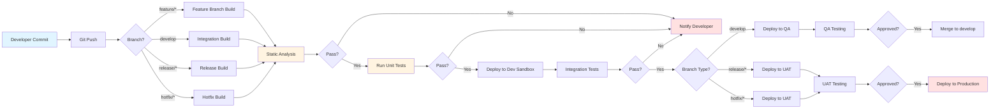
```mermaid
graph LR
    A[Developer Commit] --> B[Git Push]
    B --> C{Branch?}
    
    C -->|feature/*| D[Feature Branch Build]
    C -->|develop| E[Integration Build]
    C -->|release/*| F[Release Build]
    C -->|hotfix/*| G[Hotfix Build]
    
    D --> H[Static Analysis]
    E --> H
    F --> H
    G --> H
    
    H --> I{Pass?}
    I -->|No| J[Notify Developer]
    I -->|Yes| K[Run Unit Tests]
    
    K --> L{Pass?}
    L -->|No| J
    L -->|Yes| M[Deploy to Dev Sandbox]
    
    M --> N[Integration Tests]
    N --> O{Pass?}
    O -->|No| J
    O -->|Yes| P{Branch Type?}
    
    P -->|develop| Q[Deploy to QA]
    P -->|release/*| R[Deploy to UAT]
    P -->|hotfix/*| S[Deploy to UAT]
    
    Q --> T[QA Testing]
    R --> U[UAT Testing]
    S --> U
    
    T --> V{Approved?}
    U --> W{Approved?}
    
    V -->|Yes| X[Merge to develop]
    W -->|Yes| Y[Deploy to Production]
    
    style A fill:#e1f5ff
    style H fill:#fff4e1
    style K fill:#fff4e1
    style Y fill:#ffe1e1
    style J fill:#ffe1e1
```

---

## 6. Performance Architecture

### 6.1 Caching Strategy

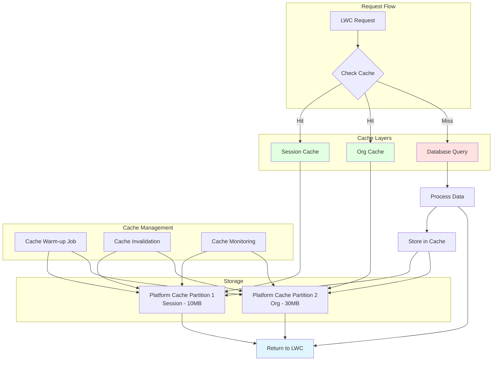
```mermaid
graph TB
    subgraph Request Flow
        A[LWC Request] --> B{Check Cache}
    end
    
    subgraph Cache Layers
        B -->|Hit| C[Session Cache]
        B -->|Hit| D[Org Cache]
        B -->|Miss| E[Database Query]
    end
    
    subgraph Cache Management
        F[Cache Warm-up Job]
        G[Cache Invalidation]
        H[Cache Monitoring]
    end
    
    subgraph Storage
        I[Platform Cache Partition 1<br/>Session - 10MB]
        J[Platform Cache Partition 2<br/>Org - 30MB]
    end
    
    C --> I
    D --> J
    
    E --> K[Process Data]
    K --> L[Store in Cache]
    L --> I
    L --> J
    
    F --> I
    F --> J
    
    G --> I
    G --> J
    
    H --> I
    H --> J
    
    I --> M[Return to LWC]
    J --> M
    K --> M
    
    style C fill:#e1ffe1
    style D fill:#e1ffe1
    style E fill:#ffe1e1
    style M fill:#e1f5ff
```

### 6.2 Async Processing Strategy

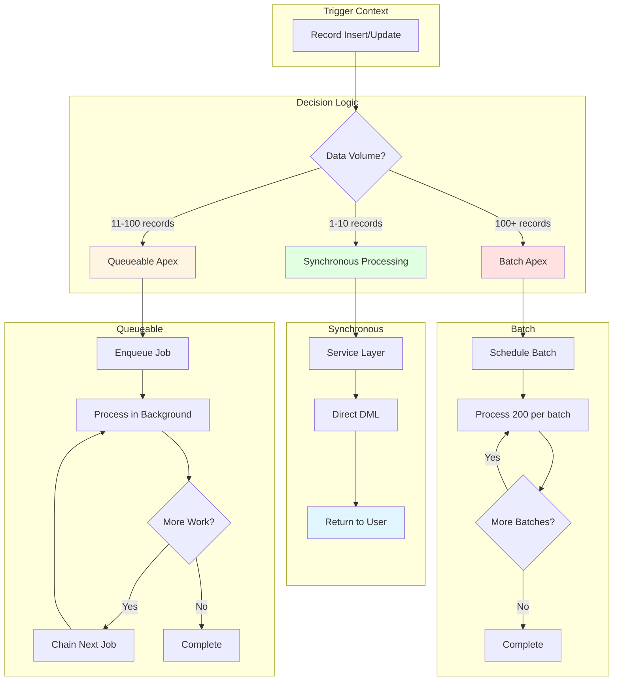
```mermaid
graph TB
    subgraph Trigger Context
        A[Record Insert/Update]
    end
    
    subgraph Decision Logic
        A --> B{Data Volume?}
        B -->|1-10 records| C[Synchronous Processing]
        B -->|11-100 records| D[Queueable Apex]
        B -->|100+ records| E[Batch Apex]
    end
    
    subgraph Synchronous
        C --> F[Service Layer]
        F --> G[Direct DML]
        G --> H[Return to User]
    end
    
    subgraph Queueable
        D --> I[Enqueue Job]
        I --> J[Process in Background]
        J --> K{More Work?}
        K -->|Yes| L[Chain Next Job]
        K -->|No| M[Complete]
        L --> J
    end
    
    subgraph Batch
        E --> N[Schedule Batch]
        N --> O[Process 200 per batch]
        O --> P{More Batches?}
        P -->|Yes| O
        P -->|No| Q[Complete]
    end
    
    style C fill:#e1ffe1
    style D fill:#fff4e1
    style E fill:#ffe1e1
    style H fill:#e1f5ff
```

---

## 7. Integration Architecture

### 7.1 SSO Integration Architecture

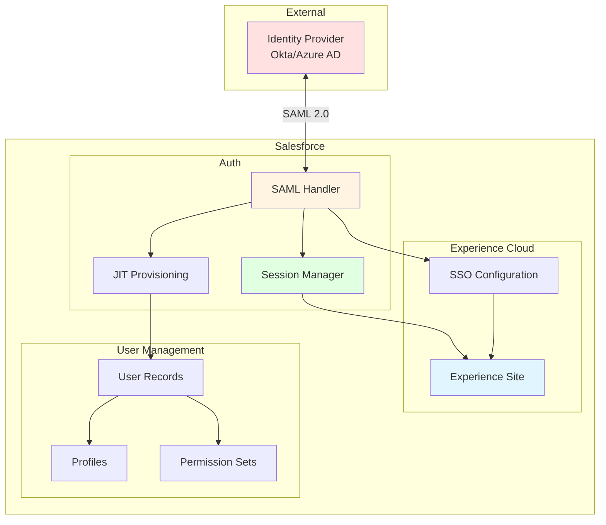
```mermaid
graph TB
    subgraph External
        IDP[Identity Provider<br/>Okta/Azure AD]
    end
    
    subgraph Salesforce
        subgraph Experience Cloud
            EC[Experience Site]
            SSO[SSO Configuration]
        end
        
        subgraph Auth
            SAML[SAML Handler]
            JIT[JIT Provisioning]
            SESSION[Session Manager]
        end
        
        subgraph User Management
            USER[User Records]
            PROFILE[Profiles]
            PERMSET[Permission Sets]
        end
    end
    
    IDP <-->|SAML 2.0| SAML
    SAML --> SSO
    SSO --> EC
    
    SAML --> JIT
    JIT --> USER
    
    SAML --> SESSION
    SESSION --> EC
    
    USER --> PROFILE
    USER --> PERMSET
    
    style IDP fill:#ffe1e1
    style EC fill:#e1f5ff
    style SAML fill:#fff4e1
    style SESSION fill:#e1ffe1
```

### 7.2 API Integration Architecture

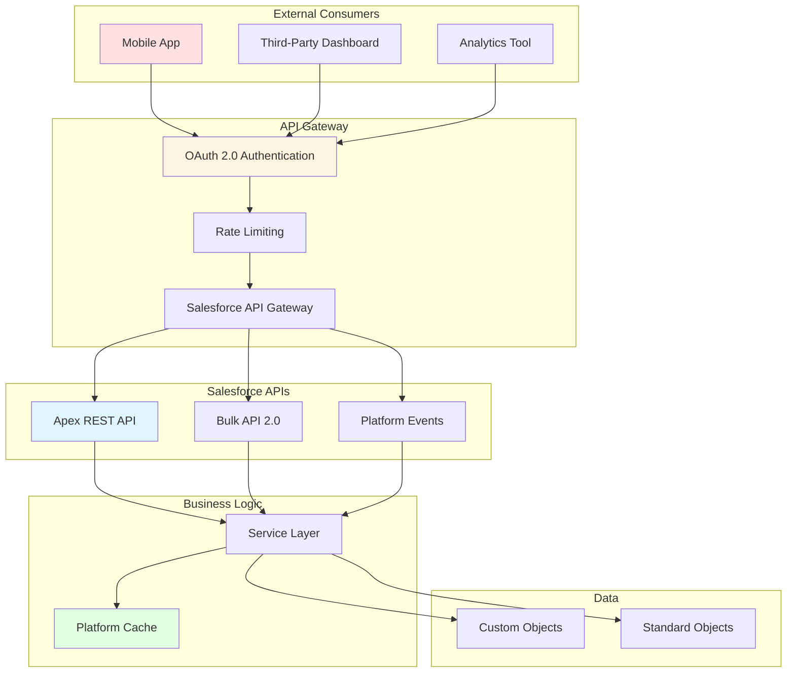
```mermaid
graph TB
    subgraph External Consumers
        EXT1[Mobile App]
        EXT2[Third-Party Dashboard]
        EXT3[Analytics Tool]
    end
    
    subgraph API Gateway
        APIG[Salesforce API Gateway]
        AUTH[OAuth 2.0 Authentication]
        LIMIT[Rate Limiting]
    end
    
    subgraph Salesforce APIs
        REST[Apex REST API]
        BULK[Bulk API 2.0]
        PLATFORM[Platform Events]
    end
    
    subgraph Business Logic
        SERVICE[Service Layer]
        CACHE[Platform Cache]
    end
    
    subgraph Data
        OBJECTS[Custom Objects]
        STANDARD[Standard Objects]
    end
    
    EXT1 --> AUTH
    EXT2 --> AUTH
    EXT3 --> AUTH
    
    AUTH --> LIMIT
    LIMIT --> APIG
    
    APIG --> REST
    APIG --> BULK
    APIG --> PLATFORM
    
    REST --> SERVICE
    BULK --> SERVICE
    PLATFORM --> SERVICE
    
    SERVICE --> CACHE
    SERVICE --> OBJECTS
    SERVICE --> STANDARD
    
    style EXT1 fill:#ffe1e1
    style AUTH fill:#fff4e1
    style REST fill:#e1f5ff
    style CACHE fill:#e1ffe1
```

---

## 8. Monitoring & Observability

### 8.1 Monitoring Architecture

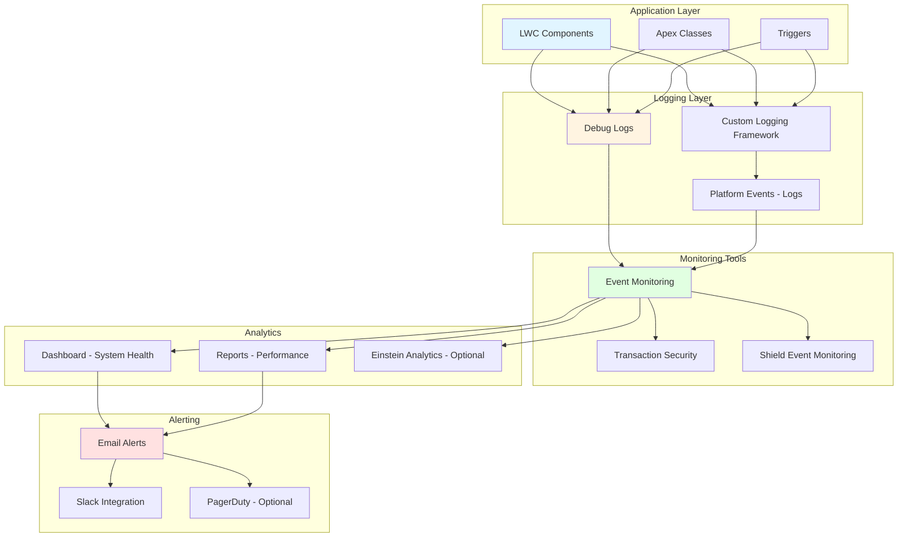
```mermaid
graph TB
    subgraph Application Layer
        A[LWC Components]
        B[Apex Classes]
        C[Triggers]
    end
    
    subgraph Logging Layer
        D[Debug Logs]
        E[Custom Logging Framework]
        F[Platform Events - Logs]
    end
    
    subgraph Monitoring Tools
        G[Event Monitoring]
        H[Transaction Security]
        I[Shield Event Monitoring]
    end
    
    subgraph Analytics
        J[Dashboard - System Health]
        K[Reports - Performance]
        L[Einstein Analytics - Optional]
    end
    
    subgraph Alerting
        M[Email Alerts]
        N[Slack Integration]
        O[PagerDuty - Optional]
    end
    
    A --> D
    B --> D
    C --> D
    
    A --> E
    B --> E
    C --> E
    
    E --> F
    
    D --> G
    F --> G
    
    G --> H
    G --> I
    
    G --> J
    G --> K
    G --> L
    
    J --> M
    K --> M
    
    M --> N
    M --> O
    
    style A fill:#e1f5ff
    style D fill:#fff4e1
    style G fill:#e1ffe1
    style M fill:#ffe1e1
```

### 8.2 Performance Monitoring Dashboard

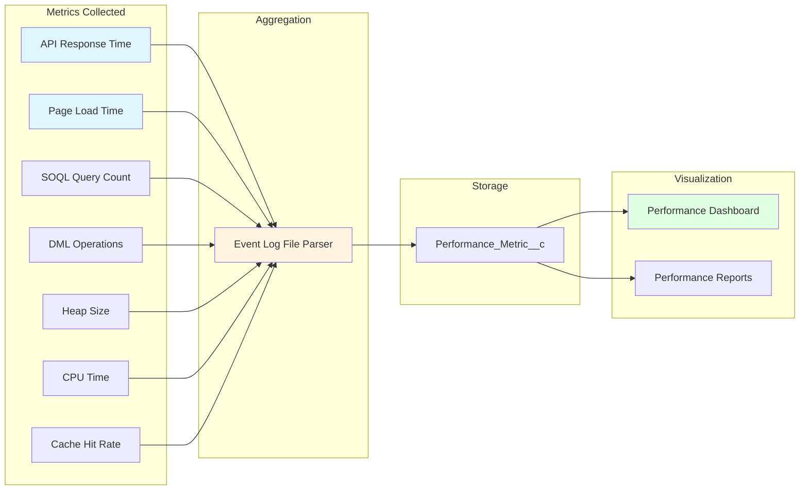
```mermaid
graph LR
    subgraph Metrics Collected
        M1[API Response Time]
        M2[Page Load Time]
        M3[SOQL Query Count]
        M4[DML Operations]
        M5[Heap Size]
        M6[CPU Time]
        M7[Cache Hit Rate]
    end
    
    subgraph Aggregation
        AGG[Event Log File Parser]
    end
    
    subgraph Storage
        OBJ[Performance_Metric__c]
    end
    
    subgraph Visualization
        DASH[Performance Dashboard]
        REPORT[Performance Reports]
    end
    
    M1 --> AGG
    M2 --> AGG
    M3 --> AGG
    M4 --> AGG
    M5 --> AGG
    M6 --> AGG
    M7 --> AGG
    
    AGG --> OBJ
    OBJ --> DASH
    OBJ --> REPORT
    
    style M1 fill:#e1f5ff
    style M2 fill:#e1f5ff
    style AGG fill:#fff4e1
    style DASH fill:#e1ffe1
```

---

## 9. Disaster Recovery & Business Continuity

### 9.1 Backup Strategy

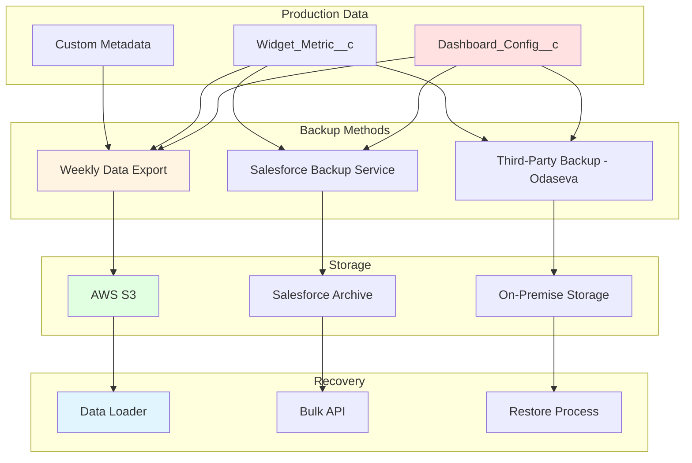
```mermaid
graph TB
    subgraph Production Data
        A[Dashboard_Config__c]
        B[Widget_Metric__c]
        C[Custom Metadata]
    end
    
    subgraph Backup Methods
        D[Weekly Data Export]
        E[Salesforce Backup Service]
        F[Third-Party Backup - Odaseva]
    end
    
    subgraph Storage
        G[AWS S3]
        H[Salesforce Archive]
        I[On-Premise Storage]
    end
    
    subgraph Recovery
        J[Data Loader]
        K[Bulk API]
        L[Restore Process]
    end
    
    A --> D
    B --> D
    C --> D
    
    A --> E
    B --> E
    
    A --> F
    B --> F
    
    D --> G
    E --> H
    F --> I
    
    G --> J
    H --> K
    I --> L
    
    style A fill:#ffe1e1
    style D fill:#fff4e1
    style G fill:#e1ffe1
    style J fill:#e1f5ff
```

---

## 10. Scalability Architecture

### 10.1 Horizontal Scalability

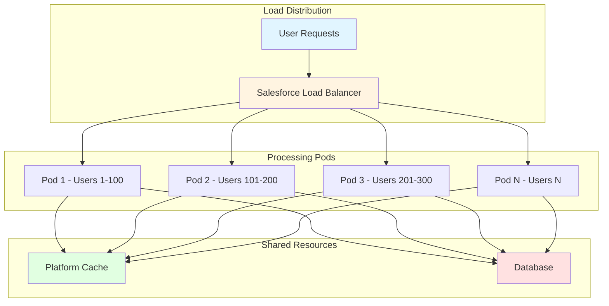
```mermaid
graph TB
    subgraph Load Distribution
        A[User Requests] --> B[Salesforce Load Balancer]
    end
    
    subgraph Processing Pods
        B --> C[Pod 1 - Users 1-100]
        B --> D[Pod 2 - Users 101-200]
        B --> E[Pod 3 - Users 201-300]
        B --> F[Pod N - Users N]
    end
    
    subgraph Shared Resources
        G[Platform Cache]
        H[Database]
    end
    
    C --> G
    D --> G
    E --> G
    F --> G
    
    C --> H
    D --> H
    E --> H
    F --> H
    
    style A fill:#e1f5ff
    style B fill:#fff4e1
    style G fill:#e1ffe1
    style H fill:#ffe1e1
```

### 10.2 Vertical Scalability (Async Processing)

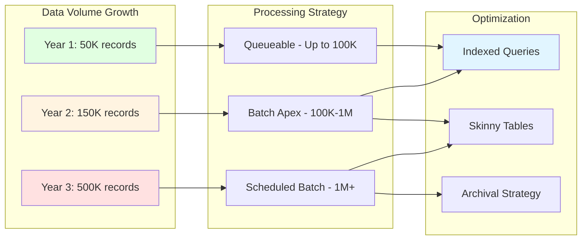
```mermaid
graph LR
    subgraph Data Volume Growth
        A[Year 1: 50K records]
        B[Year 2: 150K records]
        C[Year 3: 500K records]
    end
    
    subgraph Processing Strategy
        D[Queueable - Up to 100K]
        E[Batch Apex - 100K-1M]
        F[Scheduled Batch - 1M+]
    end
    
    subgraph Optimization
        G[Indexed Queries]
        H[Skinny Tables]
        I[Archival Strategy]
    end
    
    A --> D
    B --> E
    C --> F
    
    D --> G
    E --> G
    E --> H
    F --> H
    F --> I
    
    style A fill:#e1ffe1
    style B fill:#fff4e1
    style C fill:#ffe1e1
    style G fill:#e1f5ff
```

---

## 11. Component Dependency Matrix

| Component | Depends On | Used By | Critical Path |
|-----------|-----------|---------|---------------|
| Dashboard_Config__c | User | dashboardContainer LWC | Yes |
| Widget_Metric__c | User, Dashboard_Config__c | metricWidget LWC | Yes |
| Widget_Configuration__mdt | None | DashboardService | Yes |
| DashboardService | Selectors, Cache | LWC, API | Yes |
| MetricCalculationService | Selectors | Batch Apex | No |
| Platform Cache | None | All Services | Yes |
| SSO Configuration | Identity Provider | Experience Cloud | Yes |
| Experience Cloud | SSO, LWC | External Users | No |

---

## 12. Technology Stack Summary

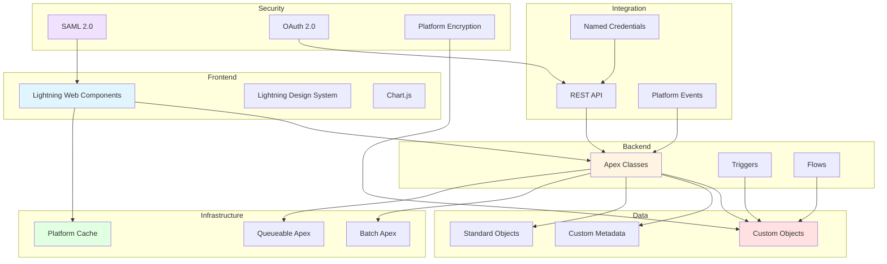
```mermaid
graph TB
    subgraph Frontend
        A[Lightning Web Components]
        B[Lightning Design System]
        C[Chart.js]
    end
    
    subgraph Backend
        D[Apex Classes]
        E[Triggers]
        F[Flows]
    end
    
    subgraph Data
        G[Custom Objects]
        H[Custom Metadata]
        I[Standard Objects]
    end
    
    subgraph Infrastructure
        J[Platform Cache]
        K[Batch Apex]
        L[Queueable Apex]
    end
    
    subgraph Security
        M[SAML 2.0]
        N[OAuth 2.0]
        O[Platform Encryption]
    end
    
    subgraph Integration
        P[REST API]
        Q[Platform Events]
        R[Named Credentials]
    end
    
    A --> D
    A --> J
    D --> G
    D --> H
    D --> I
    E --> G
    F --> G
    
    D --> K
    D --> L
    
    M --> A
    N --> P
    O --> G
    
    P --> D
    Q --> D
    R --> P
    
    style A fill:#e1f5ff
    style D fill:#fff4e1
    style G fill:#ffe1e1
    style J fill:#e1ffe1
    style M fill:#f0e1ff
```

---

## 13. Change Log

| Version | Date | Author | Changes |
|---------|------|--------|---------|
| 1.0 | 2026-03-01 | Principal SA AI | Initial architecture diagrams |

---

**END OF TECHNICAL ARCHITECTURE DIAGRAMS DOCUMENT**
